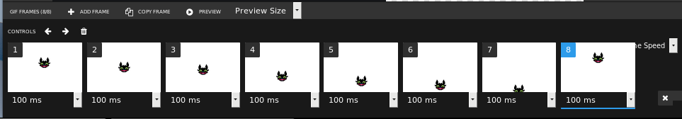

# Qu'est ce que le pixel art?

Nous allons maintenant nous intéresser à une branche récente des arts graphiques qui utilise des *images matricielles*: Le [pixel art](https://fr.wikipedia.org/wiki/Pixel_art).

En raison de sa source, les premiers jeux vidéos, cet art utilise une faible résolution ainsi qu'une palette de couleur réduite. Ceci permettait de réussir à charger les jeux vidéos sur des consoles avec très peu de mémoire et des capacités graphiques réduites.

 By <a href="//commons.wikimedia.org/wiki/User:Axel_Pixel" title="User:Axel Pixel">Axel Pixel</a> - <a class="external text" href="https://fr.wikipedia.org/wiki/Space_Invaders">Space Invaders</a> (le jeu vidéo d'arcade original, 1978 Taito Corporation par Tomohiro Nishikado)., <a href="https://creativecommons.org/licenses/by-sa/3.0" title="Creative Commons Attribution-Share Alike 3.0">CC BY-SA 3.0</a>, <a href="https://commons.wikimedia.org/w/index.php?curid=26855200">Link</a>

Bien que nos matériels informatiques aient énormément progressé, ce type de graphisme perdure et reste utilisé par exemple pour la réalisation d'avatars rétros.

Ou encore dans les jeux modernes qui essaient de reproduire les effets des premiers jeux vidéos: le [retrogaming](https://fr.wikipedia.org/wiki/Retrogaming).

 Par Powerhoof — David Lloyd of Powerhoof, via email (also <a rel="nofollow" class="external text" href="http://www.powerhoof.com/press/sheet.php?p=crawl">Crawl press kit</a>), <a href="https://creativecommons.org/licenses/by-sa/3.0" title="Creative Commons Attribution-Share Alike 3.0">CC BY-SA 3.0</a>, <a href="https://commons.wikimedia.org/w/index.php?curid=34589395">Lien</a>

# Comment créer du pixel art?

Il est possible de réaliser du pixel art sur n'importe quel logiciel de dessin matriciel tel que `paint` ou `Gimp`, cependant pour cette séance nous allons utiliser un éditeur d'images en ligne: <https://www.pixilart.com/>

Ce site web possède une [application en ligne](https://www.pixilart.com/draw) qui permet de créer, exporter des images de pixel art à partager sur la [galerie du site](https://www.pixilart.com/gallery) ou à exporter en `png` ou en `gif`.

On peut également créer des animations en ajoutant des frames*(images dans le domaine de l'animation)* à son image, qui devient alors une **image animée**.

## Exemple de rendu d'un gif animé de 100px x 100px constitué de 8 frames séparées de 100ms

An animated GIF of the Select2 Logo: 