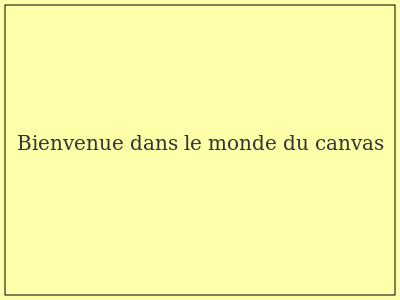
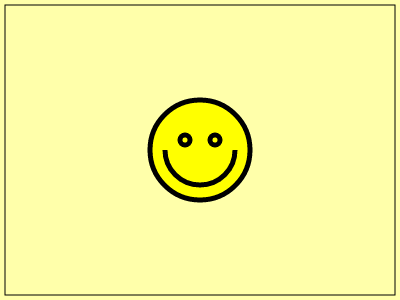

Comme nous l'avons vu [précédemment](./1-Numerisation-des-images), il existe deux grands types de formats d'images:

- les images matricielles,
- et les images vectorielles.

Ces deux types d'images peuvent être intégrées dans une page web grâce à la balise ``, mais elles peuvent être aussi codées directement dans la page grâce aux balises `<svg>` et `<canvas>`.

Nous nous intéressons ici au **dessin matriciel** dans la balise `canvas`.

## Comment dessiner dans le `canvas`?

<a title="By NET_Goblin ( http://netgoblin154.deviantart.com/ ) [Public domain], via Wikimedia Commons" href="https://commons.wikimedia.org/wiki/File%3AHtml5_canvas_logo.png"></a>

La balise `<canvas>` qui fait partie de la spécification **HTML5** du _W3C_ permet d'effectuer des rendus dynamiques d'images bitmap dans le navigateur grâce à des scripts `javascript`.

Comme souvent dans les images numériques, le système de coordonnée est défini avec **un axe des ordonnées (y) orienté vers le bas**.


### Code `html`

Pour utiliser les zones de dessin canvas, on ajoute un élément `<canvas>` vide dans le corps du document avec un id afin de pouvoir le modifier à partir du javascript.

```html
<canvas id="mon-canvas" width="500" height="400">
  <!-- Le texte suivant sera affiché si la balise canvas n'est pas supporté par son navigateur -->
  Votre navigateur ne  supporte pas la balise HTML5 Canvas.
</canvas>
```

### Code `javascript`

Nous allons maintenant dessiner dans ce `canvas` grâce à un script javascript qu'on intégrera comme n'importe quel code javascript(voir [Ajouter du dynamisme avec javascript](../3-Programmation-web/6-Ajouter-du-dynamisme-avec-javascript))

Pour cela, on séléctionne la balise `canvas`, puis on se place dans un contexte de
`canvas` à deux dimensions avec la méthode `getContext('2d')`

```js
// initialisation du contexte
var theCanvas = document.getElementById('mon-canvas')
var context = theCanvas.getContext('2d')
```

Un fois qu'on a récupéré le contexte, on dessine dedans avec des fonctions de dessin telles que:

- `strokeRect`: pour dessiner un rectangle,
- `fillRect`: pour colorier un rectangle,
- `filltext`: pour écrire du texte...

La liste complète des fonctions de dessin peut-être trouvée sur le [tutoriel canvas sur MDN](https://developer.mozilla.org/fr/docs/Tutoriel_canvas).

Voici par exemple quelques instructions qui permettent de dessiner un rectangle
avec écrit au milieu: _Bienvenue dans le monde du canvas_.



```js
// fond coloré
context.fillStyle = '#ffffaa'
context.fillRect(0, 0, 400, 300)
// texte centré
context.fillStyle = '#333333'
context.font = '20px Serif'
context.textAlign = 'center'
context.fillText('Bienvenue dans le monde du canvas', 200, 150)

// boite englobante
context.strokeStyle = '#000000'
context.strokeRect(5, 5, 390, 290)
```

**Vous pouvez vous familiariser avec ces méthodes dans l'exemple interactif ci-dessous.**

[Bienvenue dans le monde du canvas](embedded-codesandbox://bienvenue-dans-le-monde-du-canvas)

## Comment améliorer l'egonomie du code avec des fonctions?

Très souvent on englobe les instructions de dessin au sein de **fonctions**, pour mieux
organiser le code, le rendre plus lisible et plus ergonomique.

En javascript, les fonctions se définissent à l'aide du mot-clef `function`, et sont ensuite appelées en écrivant le nom de la fonction suivies de parenthèses contenant éventuellement les arguments passés à la fonction.

```js
// Définition de la fonction
function dessineUnCarré(x, y, cote, couleur) {
    context.fillStyle = couleur
    context.fillRect(x, y, cote, cote)
}

// appel de la fonction avec les arguments
// x = 10
// y = 100
// cote = 50
dessineUnCarré(10, 100, 50)
```

Voici un code `html` complet qui dessine un smiley dans le `canvas`:

`embed:/canvas-draw-smiley.html`

### RENDU



Essayez modifier certains des paramètres du code pour vous familiariser avec sa syntaxe, puis ajouter des éléments en utilisant cette page de référence de [w3schools](http://www.w3schools.com/tags/ref_canvas.asp)

## Comment créer des animations?

Pou animer un dessin canvas, nous allons utiliser la méthode `window.requestAnimationFrame()`, cette méthode permet d'éxecuter une fonction à chaque affichage de la fenêtre du navigateur(soit environ 60 images/seconde).

On crée ainsi une fonction `anime()` qui s'appelle elle-même à chaque rafraichissement de l'affichage.

```js
// Création de la fonction
function anime() {
  requestAnimationFrame(anime)
  // Commandes de dessin
}

// Appel de la fonction pour lancer l'animation
anime()
```

### Création d'un prototype `Smiley`

Nous allons créer un objet *prototype* `Smiley` qui stockera à la fois des variables de coordonées, de vitesses du Smiley, mais également des *méthodes* qui lui permettent de se déplacer, de se dessiner.

```js
function Smiley(x, y, vx, vy) {
    // initialisation de l'objet Smiley avec les coordonnées et vitesses
    this.x = x
    this.y = y
    this.vx = vx
    this.vy = vy
    
    // méthode de dessin du smiley
    this.dessineToi = function() {
        // code semblable à celui vu précédemment dans la fonction drawSmiley
        ...
    };

    // modifie les coordonnées du smiley pour le prochain rafrachissement
    this.deplaceToi = function() {
        
        this.x += this.vx
        this.y += this.vy
    }
}
```

Après initialisation du Smiley au début de l'animation, on pourra alors utiliser ce prototype la méthode deplaceToi de l'objet `Smiley` à chaque rafraichissement de la page dans la fonction `anime`.

### Initilisation de l'objet Smiley

On initialise l'objet `Smiley` au milieu de l'écran avec des vitesses aléatoires.

```js
var smiley = new Smiley(
  width / 2, // x
  height / 2, // y
  10 * Math.random() - 5, // vx
  10 * Math.random() - 5  // vy
)
```

### Animation

On ajoute les instructions à la fonction `anime`.

```js
function anime() {
  // On dessine le fond du canvas
  dessineFond()

  // On déplace le smiley
  smiley.deplaceToi()

  // On dessine le smiley
  smiley.dessineToi()

  // On demande une nouvelle frame d'animation
  window.requestAnimationFrame(anime)
}
```

Il ne reste maintenant plus qu'à gérer les collisions avec les parois pour modifier les vitesses du `Smiley` en cas de rebond, c'est ce qui est fait dans la fonction `checkWallCollision`.

### Exemple interactif

[Exemple d'animation en canvas](embedded-codesandbox://animation-en-canvas)

## Concours de monstre animé

Voici un concours proposé à ses étudiants par [Michel Buffa](http://users.polytech.unice.fr/~buffa/): **Animer un monstre et le rendre le plus...** _ce que vous voulez_. Un petit exemple pour commencer.

<http://jsbin.com/garagowe/14/edit>

A votre tour.
