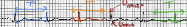
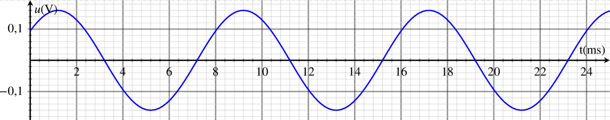
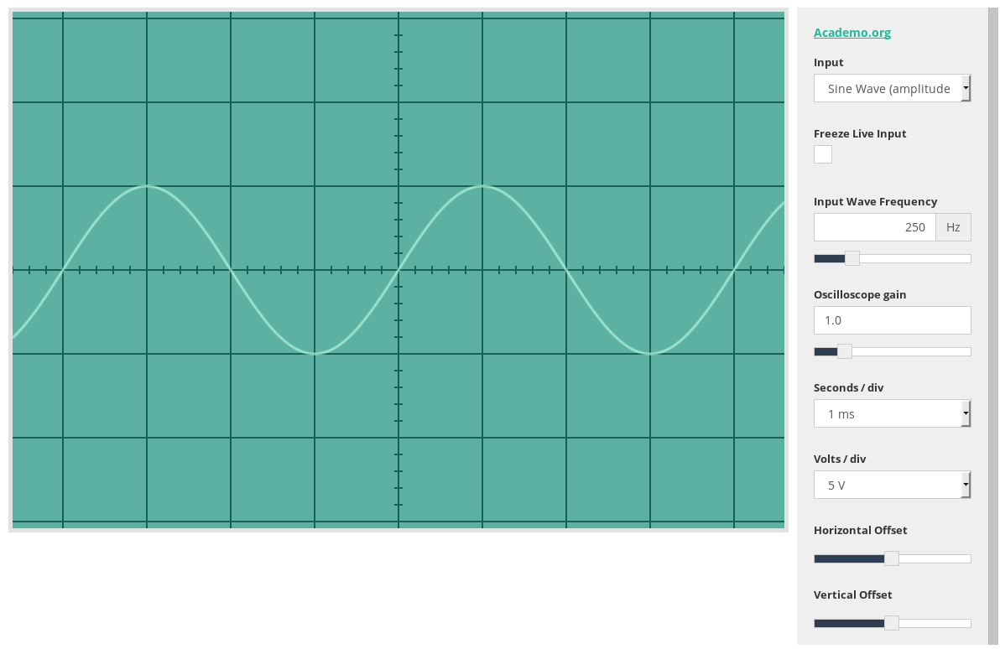

<!--
[notions]
Signaux périodiques : période, fréquence.
Signaux électriques : tension alternative, valeur maximale, valeur minimale, mesure de tensions.

[competences]
Connaître et utiliser les définitions de la période et de la fréquence d’un phénomène périodique.
*Identifier le caractère périodique d’un signal sur une durée donnée.*
*Déterminer les caractéristiques d’un signal périodique.*
*Analyser une tension électrique variable dans le temps à l’aide d’un oscilloscope ou d’un dispositif d’acquisition de signaux.*
⇄ Étude qualitative d’une fonction.
 -->

---

 <a href="http://creativecommons.org/licenses/by-sa/3.0/" title="Creative Commons Attribution-Share Alike 3.0">CC BY-SA 3.0</a>, <a href="https://commons.wikimedia.org/w/index.php?curid=160169">Link</a>

## Phénomène périodique

[[def | Phénomène périodique]]
|**Un phénomène périodique** est un phénomène qui se reproduit identique à lui-même à intervalles de temps égaux.

[[appli | Battements du cœur]]
|Quelle est la durée(ou période) d'une pulsation cardiaque pour un patient ayant un rythme cardiaque de 90 bpm(battements par minute) ?

## Caractéristiques d'une tension périodique

[[def | Période]]
|**La période T** d'un signal périodique est la durée du motif élémentaire qui se répète.

{.center}

**Notations**
- T: période en seconde(s)
- U~max~: tension maximale en volts(V)
- u~min~: tensions minimale en volts(V)

[[appli | Mesures]]
|Mesurer la période T ainsi que les tensions maximale U~max~ et minimale U~min~ de ce signal.
|

## La fréquence d'un phénomène périodique

[[def|Fréquence]]
|La fréquence $f$ est le nombre de périodes par seconde, elle se mesure en Hertz(Hz).

[[appli| Calcul]]
|Calculer la fréquence du signal étudié dans le 2.

[[plus| En plus]]
|Pour calculer une fréquence on peut utiliser un *tableau de proportionnalité* entre le nombre de périodes et la durée, ou utiliser *la formule de la fréquence*.
|$$
|f=\frac{1}{T}
|$$
|- T : période en seconde (s)
|- f : fréquence en Hertz(Hz)

## Utilisation d'un oscilloscope

Un oscilloscope permet de mesurer les caractéristiques d'une tension périodique.

{.center}

L'écran d'un oscilloscope est gradué en divisions :
- l'**axe horizontal permet de mesurer des durées** grâce au réglage de la sensibilité horizontale(ou base te temps) en *s/div*
- l'**axe vertical permet de mesurer les tensions** grâce au réglage de la sensibilité verticale en *V/div*.

[[appli| Mesure sur un oscilloscope]]
|Mesurer la tension maximale et la période du signal représenté sachant que la sensibilité horizontale est de 5 ms/div et la sensibilité verticale de 2 V/div.
|
|{.center}

<!--
## La technique d'échographie

----

Pour réaliser une échographie, on utilise une sonde contenant un
émetteur et un récepteur d'**ondes ultrasonores.**

----

Domaine de fréquences des ondes sonores :

----

**_Principe :_** L'onde ultrasonore émise par l'émetteur de la sonde
**se réfléchit** (« elle rebondit ») sur la peau du fœtus et revient
vers la sonde ou elle est captée par le récepteur. En mesurant **la
durée de l'aller-retour**, on peut déterminer la distance de l'obstacle.

----

[[prop]]
|La vitesse du son dans l'air est d'environ 340 m/s, et 1 500 m/s dans l'eau(à température ambiante).

[[appli|Mesure de distance lors d'une échographie]]
|Une sonde d'échographie mesure $\Delta t = 60 \mu s$ entre l'émission de l'onde et sa réception.
|Calculer la distance de la peau du fœtus en assimilant l'intérieur du corps de la mère à de l'eau.

Activité P74
 -->