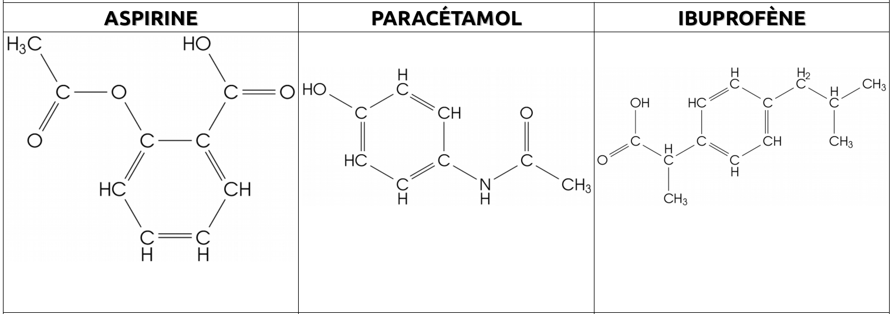

<!--
**BO 2010 : Les médicaments : **un médicament générique et un médicament
« princeps » contiennent un même principe actif mais se différencient
par leur formulation.

Analyser la formulation d'un médicament.

Pratiquer une démarche expérimentale pour montrer qu'une espèce active
interagit avec le milieu dans lequel elle se trouve (nature du solvant,
pH).

Représenter des formules développées et semi-développées correspondant à
des modèles moléculaires.

Utiliser des modèles moléculaires et des logiciels de représentation.

Repérer la présence d'un groupe caractéristique dans une formule
développée.
 -->

## Principe actif et excipients

Un médicament contient:

- au moins une substance thérapeutique active :**le principe actif**,
- les autres espèces chimiques présentes dans le médicament sont appelées des **excipients.**

[[prop]]
|Les **excipients** permettent d'obtenir la formulation souhaitée (comprimé, sirop, cachet effervescent...), mais n'ont pas d'*effet thérapeutique*.

## Représentation des molécules

[[def| molécule]]
|Une molécule est un ensemble d'atomes liés les uns aux autres par des liaisons chimiques.

[[prop]]
|Les atomes peuvent être liés par des liaisons simple, double ou triple.

[[examples]]
|

Les chimistes décrivent les molécules à l'aide de **formules** plus ou
moins détaillées.

- **La formule brute** indique uniquement le type et le nombre d'atomes présents dans la molécule.
- **La formule développée** indique les symboles des atomes présents dans la molécule, et toutes les liaisons sont représentées par des traits.
- **La formule semi-développée** est une formule développée dans laquelle les liaisons carbone-hydrogène ne sont pas représentées.

[[appli| Formules chimiques]]
|Donner les formules brute, développée, et semi-développées de l'éthanol, de l'acide éthanoïque et de l'anhydride éthanoïque.

## Groupes caractéristiques

[[def | Groupe caractéristique]]
|Une molécule possède un groupe caractéristique si elle possède au moins un atome qui n'est pas un atome de carbone ou d'hydrogène.

[[examples]]
|

[[appli | groupes caractéristiques l'aspirine, de l'ibuprofène et du paracétamol]]
|Entourer et nommer les groupes caractéristiques sur les formules suivantes.
|

## Obtention de principes actifs

Les principes actifs peuvent-être obtenus :

- soit par une **extraction d'un produit naturel**,
- soit par une **synthèse au laboratoire** en utilisant une réaction chimique.

### Synthèse

On réalise au laboratoire la synthèse dans un montage de **chauffage à reflux**.

- **le chauffage** permet d'accélérer la réaction de synthèse.
- **Le reflux** crée par le réfrigérant permet d'éviter les pertes de mélange réactionnel par évaporation.

### Extraction par solvant

On réalise au laboratoire l'extraction d'un mélange liquide à l'aide d'une **ampoule à décanter**.

Pour réaliser une extraction à partir d'une solution aqueuse, on utilise un **solvant organique non-miscible** avec l'eau.

[[prop]]
|Le solvant le moins dense se place au dessus.

Lors de l'agitation de l'ampoule à décanter, les espèces chimiques se dissolvent dans les phases dans lesquelles elles sont **le plus soluble**.

[[example]]
|Extraction du diiode du mélange vert par le cyclohexane.

<!--
## La chromatographie

La chromatographie permet de **séparer** les constituants d'un mélange
en fonction de leur solubilité dans un solvant(l'éluant).

[[example]]
|Chromatogramme de l'actron(M) comparé à l'aspirine(A), le paracétamol(P), et la Caféine(Ça).

Le chromatogramme obtenu permet :

- par** lecture verticale** de connaître le nombre de constituants
  présents dans le dépôt.
- Par **lecture horizontale** d'identifier les constituants du mélange
  par comparaison avec des espèces chimiques connues.

## Notion d'isomérie

[[def | Des molécules isomères sont des molécules qui ont la même formule brute mais pour lesquelles les atomes sont liées différemment entre eux.]]
|

[[example]]
|Exemple : Isomères de formule :[]{.image} -->
