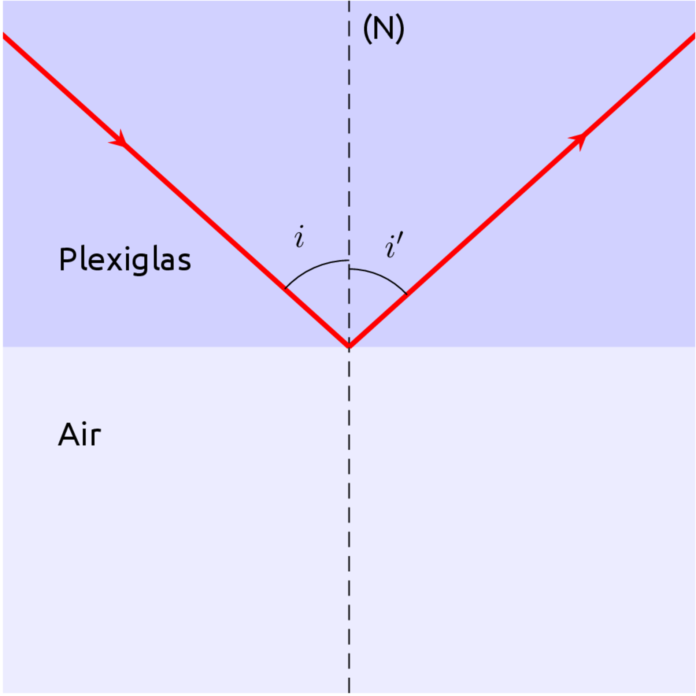

<!--
BO 2010 :

Extraire et exploiter des informations concernant la nature des ondes et
leurs fréquences en fonction de l'application médicale.

Connaître une valeur approchée de la vitesse du son dans l'air.

Connaître la valeur de la vitesse de la lumière dans le vide (ou dans
l'air).

Pratiquer une démarche expérimentale sur la réfraction et la réflexion
totale.

Pratiquer une démarche expérimentale pour comprendre le principe de
méthodes d'exploration et l'influence des propriétés des milieux de
propagation. -->

> Voir à l'intérieur d'un corps humain vivant est devenu possible avec les dernières techniques de l'imagerie médicale. Ce film replace ces techniques dans l'histoire de l'imagerie : des premières radiographies au début du XXe siècle aux dernières avancées du scanner spiralé ou de l'IRM fonctionnelle...
*[Universciences.tv](http://www.universcience.tv/video-interieur-corps-3736.html)*{.cite-source}

[{.center}](http://www.universcience.tv/video-interieur-corps-3736.html)

## Les ondes électromagnétiques

Les ondes électromagnétiques sont des ondes de nature semblable à la lumière mais qui différent par leur **fréquence**.

 Par <a href="//commons.wikimedia.org/wiki/User:Tatoute" title="User:Tatoute">Tatoute</a> and <a href="//commons.wikimedia.org/wiki/Special:Contributions/Phrood" title="Special:Contributions/Phrood">Phrood</a> — Inconnu, <a href="http://creativecommons.org/licenses/by-sa/3.0/" title="Creative Commons Attribution-Share Alike 3.0">CC BY-SA 3.0</a>, <a href="https://commons.wikimedia.org/w/index.php?curid=504689">Lien</a>

[[prop]]
|Dans le vide ou dans l'air, les ondes électromagnétiques se déplacent en ligne droite à **la vitesse de la lumière : 300 mille kilomètres par seconde.**
|$$
|c=3,00\times 10^{8}\ m.s^{-1}
|$$

## Applications en imagerie médicale

Les techniques d'imagerie médicales utilisent divers types d'ondes électromagnétiques.

| Technique d'imagerie | Type d'ondes | Phénomène physique utilisé |
| -------------------- | ------------ | -------------------------- |
| Scintigraphie        | rayons gamma |  Émission                  |
| Radiographie         |              |                            |
| Fibroscopie          |              |                            |
| Thermographie        |              |                            |
| IRM                  |              |                            |

*Hachette Physique-Chimie 2^de^ 2014*{.cite-source}

## Principe des fibres optiques : la fibroscopie

### La réfraction

[[def|Réfraction]]
|La réfraction est le changement de direction subit par une onde lorsqu'elle change de milieu.

[{.center}](https://phet.colorado.edu/sims/html/bending-light/latest/bending-light_fr.html)

Deux cas peuvent se produire:

[[prop]]
|Lorsque le rayon arrive perpendiculairement à la surface de séparation des milieux, il n'est pas dévié.

### Réflexion totale

Une réflexion totale a lieu lorsque le rayon est uniquement réfléchi sans être réfracté lors du changement de milieu.

[[prop]]
|Elle se produit dans le cas du passage d'**un milieu transparent vers l'air,** lorsque l'angle d'incidence dépasse une valeur appelée l'angle limite de réfraction noté i~lim~.

[[examples]]
|- pour le plexiglas : i~lim~ = 44°
|- pour l'eau : i~lim~ = 49°
|- pour le diamant : i~lim~ = 24°

### Les fibres optiques

Les fibres optiques utilisent le phénomène de réflexion totale pour guider la lumière sur de longues distances.

 Par <a href="https://fr.wikipedia.org/wiki/Utilisateur:Christophe.Finot" class="extiw" title="fr:Utilisateur:Christophe.Finot">Christophe.Finot</a> — Travail personnel, <a href="https://creativecommons.org/licenses/by-sa/2.5" title="Creative Commons Attribution-Share Alike 2.5">CC BY-SA 2.5</a>, <a href="https://commons.wikimedia.org/w/index.php?curid=5820900">Lien</a>

<!--
## La radiographie

Vidéo La main de Rotgen

La radiographie utilise des **rayons X** qui sont des ondes
électromagnétiques d'une fréquence d'environ 10^18^ Hz.

Ces rayons peuvent **traverser** les tissus peu denses comme la chaire,
mais sont **absorbés** pas les os.

 -->
