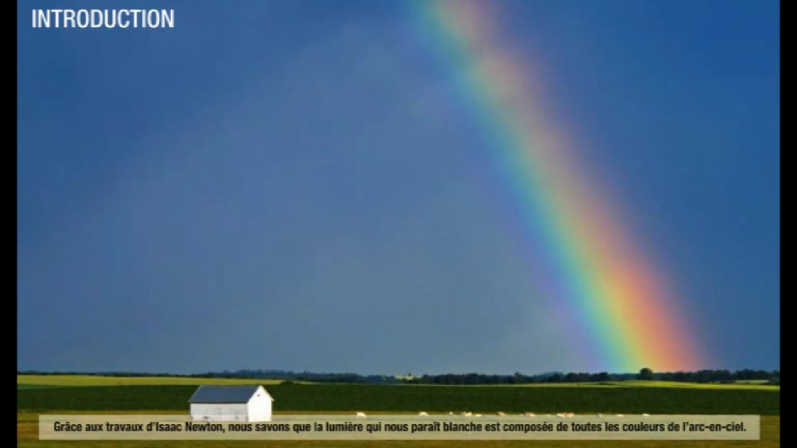

<!--
**BO 2010 **:

Savoir que le remplissage de l'espace par la matière est essentiellement
lacunaire, aussi bien au niveau de l'atome qu'à l'échelle cosmique.

Connaître la valeur de la vitesse de la lumière dans le vide (ou dans
l'air).

Connaître la définition de l'année de lumière et son intérêt.

Expliquer l'expression : « voir loin, c'est voir dans le passé ».

Utiliser les puissances de 10 dans l'évaluation des ordres de grandeur. -->

## Notation scientifique et ordre de grandeur

[[def|Notation scientifique]]
|La **notation scientifique** d'un nombre est l'écriture d'un nombre sous la forme:
|$$
|a \times 10 ^{n}\ avec \ a \in [1, 10[
|$$

Pour manipuler aisément de très grands ou petits nombres, on utilise les **préfixes du système international d'unités**(S.I.)

[[examples]]
|- la taille d'un atome est de 0,1 nm =..................
|- la distance Terre-Lune est de $3,84 \times 10^{8}m$ =..................

[[def| Ordre de grandeur]]
|L'ordre de grandeur d'un nombre **représente de façon simplifiée mais approximative** la mesure d'une grandeur physique.

On peut l'assimiler pour simplifier à la *valeur de la puissance de dix dans la notation scientifique*.
*[en.wikipedia](<https://en.wikipedia.org/wiki/Order_of_magnitude#Definition>
)*{.cite-source}

[[examples]]
|- longueur de la molécule d'eau : 0,16 nm =..................m $\approx$............... m
|- rayon de la Terre : 6&thinsp;380 km =..................m $\approx$ ............... m

## L'année lumière

`youtube: inhB66wxWp0`

[[def | Année lumière]]
|L'année-lumière est la **distance** parcourue par la lumière dans le vide en 1 an.

[[prop]]
|**Valeur approximative de l'année lumière**
|&nbsp;
|
|&nbsp;
|
|&nbsp;
|
|&nbsp;

[[examples]]
|- Sirius est située à 8,5 al quelle est sa distance en km ?
|&nbsp;
|&nbsp;
|- Rigel est située à environ 7.32×10^18^ m quelle est sa distance en
|  année-lumière ?
|&nbsp;
|&nbsp;

## Le spectre des étoiles

L'analyse du spectre de la lumière des étoiles nous permet de connaître:

- leur température,
- leur composition chimique.

Observer cette vidéo de la [médiathèque du cea](http://www.cea.fr/multimedia) qui explique comment
est déterminée la **composition du Soleil**.

### Température et couleur

Le surface de l'étoile dense et chaude émet une lumière ayant un **spectre continu**.

[[prop]]
|Plus le corps est chaud et plus son spectre s'enrichit de basses longueurs d'onde(bleu, violet).

[[appli|Observation des profils spectraux de corps chauds]]
|<https://phet.colorado.edu/fr/simulation/legacy/blackbody-spectrum>

Ainsi, les étoiles froides ont une couleur rougeâtre, et plus une étoile est
chaude et plus sa couleur devient bleutée.

 <a href="http://creativecommons.org/licenses/by-sa/3.0/" title="Creative Commons Attribution-Share Alike 3.0">CC BY-SA 3.0</a>, <a href="https://commons.wikimedia.org/w/index.php?curid=1141520">Link</a>

[[prop]]
|Le soleil a une température d'environ 6&nbsp;000 °C en surface(étoile de type G)

[[example]]
|Les étoiles de la constellation d'Orion.
|<https://en.wikipedia.org/wiki/Wien%27s_displacement_law#/media/File:Orion_3008_huge.jpg>

### Raies d'absorption et éléments chimiques

Les **raies d'absorption** présentes dans le spectre de l'étoile nous renseignent sur la composition
de son atmosphère*(appelée photosphère)*.

[[appli|Animation sur le spectre du Soleil]]
|[Lien vers l'animation sur ostralo.net](http://www.ostralo.net/3_animations/swf/spectres_soleil.swf)

[[prop]]
|**Composition du soleil en masse:**
|
|- Hydrogène 73 %,
|- Hélium 25 %,
|- Oxygène 0,77 %
|- Carbone 0,29 %...

*[article Wikipedia sur le Soleil](https://fr.wikipedia.org/wiki/Soleil)*{.cite-source}
<!--
Le spectre d'une source lumineuse peut-être obtenu avec un **prisme** ou un **réseau**.

[[prop]]
|Le spectre révèle l'ensemble des **radiations lumineuses**(couleurs) présentes dans la source.
|Chaque *radiation lumineuse* est repérée par sa **longueur d'onde** $\lambda$ qui s'exprime
|généralement en nanomètre(nm).
|&nbsp;
|
|&nbsp;
|

### Les divers types de spectres

### Spectre de raies d'un élément chimique

[[prop]]
|Chaque élément chimique possède un **spectre de raies** caractéristique.

{width="19.001cm"
height="7.541cm"}

####

[[prop]]
|Les **raies d'émission** d'un élément chimique ont les mêmes longueurs d'ondes que les **raies d'absorption**.

[[example]]
|**Exemples :**

- - - - - - - ####### **hydrogène : **657-556-486-434-410 nm

            - ####### **sodium : 589 nm**

####

### **Spectre des étoiles**

La lumière des étoiles présente un spectre continu entrecoupé des raies
d'absorption.

<http://www.cea.fr/multimedia/Mediatheque/animation/physique-chimie/spectre.swf>

[**http://www.ostralo.net/3_animations/swf/spectres_soleil.swf**](http://www.ostralo.net/3_animations/swf/spectres_soleil.swf)

####

####

[[prop]]
|Le fond continu du spectre nous renseigne sur sa température de surface, et les raies d'absorptions sur la composition de son atmosphère

####

## Regarder loin, c'est regarder tôt (P112)

{width="17cm"
height="18.501cm"}Activité P 109

## La gravitation

En étudiant le mouvement des planètes du système solaire, Isaac Newton a
établi la formule de la force d'attraction gravitationnelle s'exerçant
entre deux corps de masses m~1~ et m~2~ distants d'une distance d.

[]{.image}

- G est la constante gravitationnelle G=6,67×10^-11^ N.m^2^.kg^-2^
- La force s'exprime en newton (N), les masses en kilogramme et la
  distance en mètre.

Application à la pesanteur d'un astre :

L'intensité de la pesanteur d'un astre notée g~A~ mesure la valeur de la
force d'attraction gravitationnelle exercée par l'astre sur un objet de
1 kg situé à sa surface.

Elle dépend :

- De la masse de l'astre m~A~
- de son rayon R~A~

  Pour un astre quelconque :[]{.image}

+-------+------------+-----------+---------------------------+
| Astre | Masse(kg) | Rayon(km) | Intensité de la pesanteur |
| | | | |
| | | | (N/kg) |
+-------+------------+-----------+---------------------------+
| Terre | 6,0×10^24^ | 6,4×10^3^ | |
+-------+------------+-----------+---------------------------+
| Lune | 7,3×10^22^ | 1,7×10^3^ | |
+-------+------------+-----------+---------------------------+
| Mars | 6,4×10^23^ | 3,4×10^3^ | |
+-------+------------+-----------+---------------------------+

## Structure lacunaire de l'Univers (P 110)

####

####

+-----------------------------------+-----------------------------------+
| Échelle microscopique | Échelle macroscopique |
+-----------------------------------+-----------------------------------+
| {width="8.306cm" | 9.png){width="8.306cm" |
| height="5.269cm"} | height="10.948cm"} |
| | |
| _Si le noyau de l'atome | |
| d'hydrogène était représenté par | |
| une balle de ping-pong, | |
| l'électron devrait être | |
| représenté à environ **1 km** de | |
| cette balle pour respecter la | |
| même échelle, avec du vide entre | |
| les deux. La plus grande partie | |
| d'un atome est donc constituée de | |
| vide._ | |
+-----------------------------------+-----------------------------------+ -->
