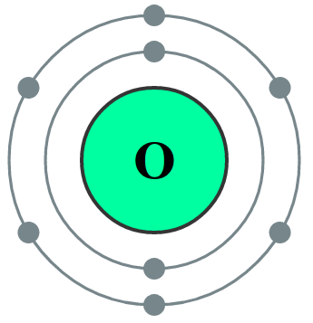
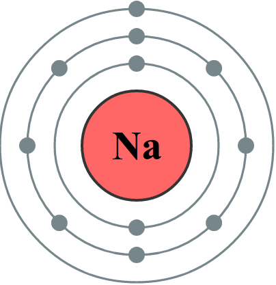

<!--
Connaître la constitution d'un atome et de son noyau.

Connaître et utiliser le symbole AZX

Savoir que l'atome est électriquement neutre.

Connaître le symbole de quelques éléments.

Savoir que la masse de l'atome est pratiquement égale à celle de son
noyau.

Savoir que le numéro atomique caractérise l'élément.

Dénombrer les électrons de la couche externe.

Connaître et appliquer les règles du « duet » et de l'octet pour rendre
compte des charges des ions monoatomiques usuels.

Utiliser la classification périodique pour retrouver la charge des ions
monoatomiques. -->

## Le modèle de l'atome

Un atome est constitué:

- un **noyau**($10^{-15}m$) chargé *positivement*,
- un nuage d'**électrons**($10^{-10}m$) chargés *négativement*.

 By <a href="//commons.wikimedia.org/wiki/User:Yzmo" title="User:Yzmo">User:Yzmo</a> - Own work, <a href="http://creativecommons.org/licenses/by-sa/3.0/" title="Creative Commons Attribution-Share Alike 3.0">CC BY-SA 3.0</a>, <a href="https://commons.wikimedia.org/w/index.php?curid=2246091">Link</a>

Le noyau est constitués de nucléons:

- les **protons** chargés *positivement,*
- les **neutrons** qui sont *électriquement neutres*.

## Propriétés de l'atome

Le **numéro atomique Z** d'un élément chimique **est le nombre de protons**, il définit **l'élément chimique.**

[[examples]]
|- Z=1: l'hydrogène
|- Z=6: le carbone
|- Z=29: le cuivre

[[prop]]
|Un **atome** est électriquement neutre, il *possède autant d'électrons que de protons*.

[[plus|La charge élémentaire]]
|Les protons et les électrons ont une charge électrique égale
|et opposée, cette valeur est appelée charge élémentaire :
|e = 1,6×10^_-19_^ C.*

[[example]]
|- l'atome de cuivre contient 29 protons et 29 électrons.

Par contre, **un ion est chargé**, il provient d'un atome ou un groupe d'atomes qui a *gagné ou perdu des électrons*.

[[example]]
|- l'ion cuivre II $Cu^{2+}$ contient 29 protons et 27 électrons.

## Les isotopes

Il existe dans la nature, différents noyaux pour un même élément chimique. On appelle ces noyaux des **isotopes.**

[{.center}](http://www.universcience-vod.fr/video-atomes-et-isotopes-560.html)

[[def|Isotopes]]
|Des noyaux sont **isotopes** s'ils possèdent le même nombre de protons, mais un nombre différent de neutrons.

[[examples]]
|
|- Isotopes de l'uranium
|- isotopes de l'hydrogène

**Notation du noyau de l'atome**

$$
{}_{Z}^{A}X
$$

- $X$: Symbole de l'élément chimique
- $Z$: Numéro atomique
- $A$: Nombre de nucléons(protons et neutrons)

[[examples]]
|
|- ${}_{6}^{12}C$
|- ${}_{6}^{14}C$
|- ${}_{29}^{63}Cu$
|- ${}_{29}^{65}Cu^{2+}$

## Structure électronique d'un atome

**Les électrons** de l'atome se répartissent sur des **couches
électroniques** de plus en plus éloignées du noyau.

- La **couche K** est la plus proche du noyau, elle ne peut accueillir que **2 électrons**.
- La **couche L** ensuite ne peut accueillir que **8 électrons**.
- La **couche M** ensuite ne peut accueillir que **18 électrons**.

[[prop]]
|Les électrons se placent préférentiellement sur les couches les plus proches du noyau.

*[Wikimedia Commons](https://commons.wikimedia.org/wiki/Category:Electron_shell_diagrams_(no_label))*{.cite-source}

[[examples]]
|- Atome d'oxygène(Z=8): K^2^L^6^
|
|- Atome de sodium(Z=11): K^2^L^8^M^1^
|

## Stabilité des atomes et ions

### Règles de stabilité

Les atomes « cherchent » à acquérir une structure électronique stable
semblable à celle du gaz noble(He, Ne, Ar...) le plus proche dans la
classification.

- He :
- Ne :
- Ar :

[[prop]]
|**Règle du duet :** les éléments proches de l'hélium(Z=2) cherchent à
|acquérir une structure électronique **K**^**2**^

[[prop]]
|**Règle de l'octet :** les éléments proches du néon ou de l'argon
|cherchent à acquérir une structure électronique à 8 électrons sur la
|couche externe : K^2^**L**^**8**^ ou K^2^L^8^**M**^**8**^**.**

### Cas des ions monoatomiques

Les atomes *instables* peuvent se stabiliser **en gagnant ou en perdant un
ou plusieurs électrons pour former des ions monoatomiques**.

[[examples]]
|- L'ion lithium :
|- L'ion berylium :
|- L'ion sodium :
|- L'ion oxyde :
|- L'ion chlorure :

<!--
### Formation des molécules

Les atomes instables peuvent aussi **mettre en commun des électrons
externes au sein de liaisons covalentes pour former des molécules**.

####

{width="17.501cm"
height="4.868cm"}

####

**Exemples** :

Les molécules H~2~O, CO~2~, O~2~, N~2~, CH~4~, C~2~H~6~O.

---

Atome C H N O
Z
 Structure électronique
 Nombre de liaisons formées

-->