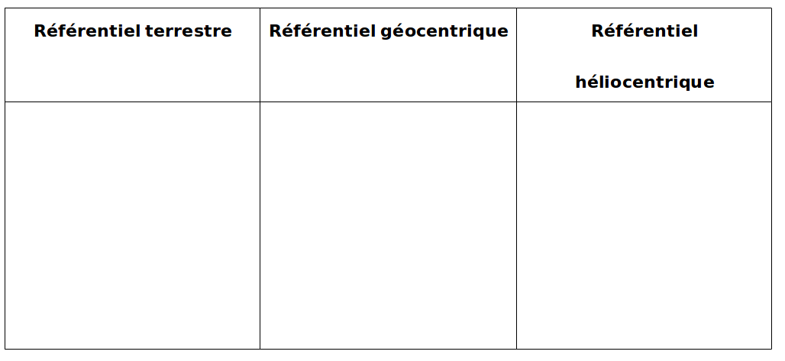

## Notion de référentiel

La nature d'un mouvement d'un objet dépend de la position de l'observateur.

La position et la direction d'observation définissent un **référentiel**. Suivant la nature du
mouvement observé, on utilise trois référentiels.

- le **référentiel terrestre** lié à la surface de la Terre,
- le **référentiel géocentrique** lié au centre de la Terre mais dont les axes ne tournent pas avec
  la surface terrestre,
- le **référentiel héliocentrique** lié au centre du Soleil dont les axes pointent vers des étoiles
  fixes.

[[example]]
|Mouvement de Mars dans différents référentiels
|

## La gravitation

### Lien entre poids et masse

À la surface d'un astre, le poids d'un objet est **proportionnel** à sa masse :

$$
P=mg
$$

**Notations**
- $P$: poids de l'objet en Newton($N$)
- $m$: masse de l'objet en kilogramme($kg$)
- $g$: intensité de la pesanteur en Newton par kilogramme($N/kg$)

[[examples]]
|- Sur la Terre : $g_{Terre}$
|- Sur la Lune : $g_{Lune}$

[[plus|Différence entre masse et poids]]
|- le **poids est une force** qui dépend du l'endroit ou l'on se trouve, il se mesure en Newton avec un dynamomètre.
|- la **masse** est liée à la quantité de matière contenue dans un objet, elle ne dépend pas du lieu ou l'on se trouve. Elle se mesure en kilogramme avec un balance.

### L'interaction gravitationnelle

Après la découverte par Copernic que les planètes tournent autour du Soleil au début du XVI^e^
siècle.

 Domaine public, <a href="https://commons.wikimedia.org/w/index.php?curid=232287">Lien</a>

<https://phet.colorado.edu/sims/html/gravity-and-orbits/latest/gravity-and-orbits_fr.html>

Newton propose en 1687, une explication de ce phénomène connu aujourd'hui sous le nom de la théorie
de la **gravitation universelle**.

Les corps s'attirent mutuellement. La gravitation augmente avec la masse des corps et diminue
rapidement avec la distance.

$$
Fg=\mathscr{G}\frac{m_A m_B}{d^2}
$$

[[appli|Calculer des forces gravitationnelles]]
|- calculer la force d'attraction entre vous et votre voisin situé à 1 m.
|- calculer la force d'attraction entre vous et la Terre dont la masse est m~T~ =5,97×10^24^ kg et
|  le rayon est 6380 km.

<!--
### Calcul de l'intensité de la pesanteur

L'intensité de la pesanteur d'un astre notée g~A~ mesure la valeur de la force d'attraction
gravitationnelle exercée par l'astre sur un objet de 1 kg situé à sa surface.

Pour un astre quelconque :

$$
g_{astre}=\mathscr{G} \frac{m_{astre}}{R_{astre}^2}
$$

**Notations:**
- $g_{astre}$: intensité de la pesanteur de l'astre en Newton par kilogramme($N/kg$)
- $m_{astre}$: masse de l'astre en kilogramme($kg$)
- $R_{astre}$: rayon de l'astre en mètre($m$)

+-------+------------+------------+---------------------------+
| Astre | Masse (kg) | Rayon (km) | Intensité de la pesanteur |
|       |            |            |                           |
|       |            |            | (N/kg)                    |
+-------+------------+------------+---------------------------+
| Terre | 6,0×10^24^ | 6,4×10^3^  |                           |
+-------+------------+------------+---------------------------+
| Lune  | 7,3×10^22^ | 1,7×10^3^  |                           |
+-------+------------+------------+---------------------------+
| Mars  | 6,4×10^23^ | 3,4×10^3^  |                           |
+-------+------------+------------+---------------------------+

## Caractéristiques du mouvement

Un mouvement dans un référentiel donné peut être décrit par **sa trajectoire** et l'évolution de
**sa vitesse.**

[]{.image}

####

{width="18.2cm" height="5.96cm"}
-->