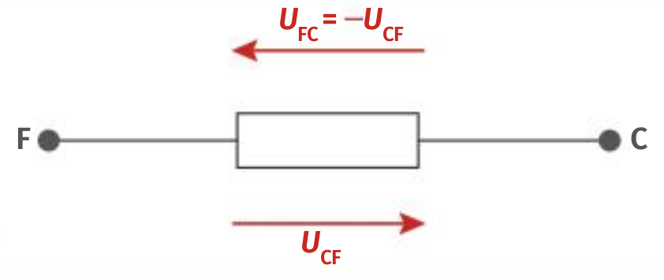
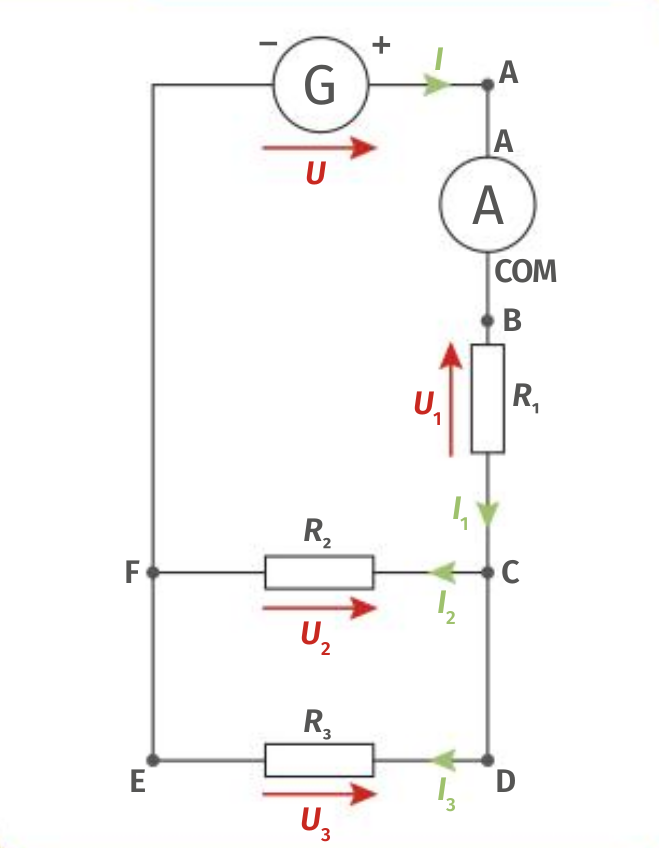

<!--
BO 2019
Loi des nœuds.
Loi des mailles.
Exploiter la loi des mailles et la loi des nœuds dans un circuit électrique comportant au plus deux mailles.
Mesurer une tension et une intensité.
Caractéristique tension-courant d’un dipôle.
Résistance et systèmes à comportement de type ohmique.
Loi d’Ohm.
Exploiter la caractéristique d’un dipôle électrique : point de fonctionnement,
modélisation par une relation U = f(I) ou I = g(U).
Utiliser la loi d’Ohm.
Représenter et exploiter
la caractéristique d’un dipôle.
Capacités numériques : représenter un nuage de points associé à la
caractéristique d’un dipôle et modéliser la caractéristique de ce dipôle à l’aide d’un langage de
programmation.
Capacité mathématique : identifier une situation de proportionnalité.
Capteurs
électriques.
Citer des exemples de capteurs présents dans les objets de la vie quotidienne.
Mesurer
une grandeur physique à l’aide d’un capteur électrique résistif.
Produire et utiliser une courbe
d’étalonnage reliant la résistance d’un système avec une grandeur d’intérêt (température, pression,
intensité lumineuse, etc.).
Utiliser un dispositif avec microcontrôleur et capteur.
 -->

## Tension électrique U

La tension électrique entre deux points A et B d'un circuit U~AB~ se mesure en volt(V) avec un
voltmètre branché en dérivation.

[[prop]]
|La tension est une grandeur **algébrique**: elle possède un _signe_.
|
|Les tensions sont notées avec des flèches.
|_Le [livre scolaire physique-chimie](https://www.lelivrescolaire.fr/lycee/physique-chimie) 2de CC-BY-NC_{.cite-source}

## Loi des mailles

Dans un circuit électrique, une maille est un circuit fermé. Par exemple, le circuit ci-dessous
possède trois mailles (ABCFA), (ABCDEFA), et (CDEFC)

_Le [livre scolaire physique-chimie](https://www.lelivrescolaire.fr/lycee/physique-chimie) 2de CC-BY-NC_{.cite-source}

[[prop]]
|**Loi des mailles:** La somme des tensions le long d'une maille est nulle.

[[examples]]
|Pour les trois mailles de notre circuit, on peut écrire:
|
|- maille (ABCFA): \_\_\_\_\_\_\_\_\_\_\_\_\_\_\_\_\_\_\_\_\_\_\_\_\_\_\_\_
|- maille (ABCDEFA): \_\_\_\_\_\_\_\_\_\_\_\_\_\_\_\_\_\_\_\_\_\_\_\_\_\_\_\_
|- maille (CDEFC): \_\_\_\_\_\_\_\_\_\_\_\_\_\_\_\_\_\_\_\_\_\_\_\_\_\_\_\_

## Intensité électrique I

L'intensité électrique I s'exprime en **ampère(A)** et se mesure avec un ampéremètre branché en série.

[[prop]]
|L'intensité électrique va de la borne + à la borne - du générateur.

## Loi des nœuds

Dans un circuit électrique, un nœud est un point ou sont reliés au moins trois dipôles entre eux.

[[prop]]
|**Loi des nœuds:** La somme des intensités arrivant à un nœud est égale à la somme des intensités qui en repartent.

[[examples]]
|Pour les deux nœuds de notre circuit, on peut écrire:
|
|- nœud C: \_\_\_\_\_\_\_\_\_\_\_\_\_\_\_\_\_\_\_\_\_\_\_\_\_\_\_\_
|- nœud F: \_\_\_\_\_\_\_\_\_\_\_\_\_\_\_\_\_\_\_\_\_\_\_\_\_\_\_\_

## Loi d'Ohm
{.half}

[[prop]]
|L'intensité traversant un conducteur ohmique est proportionnelle à la tension appliquée à ses bornes.
|$$
|U_{AB}=R\cdot I
|$$

[[appli|Loi d'Ohm]]
|1. Calculer la tension aux bornes d'un conducteur ohmique de résistance 100 Ω, traversé par un courant d'intensité 100 mA.
|2. Calculer l'intensité traversant un conducteur ohmique de résistance 1 kΩ, soumis à une tension de 6,0 V. Convertir le résultat en milliampère