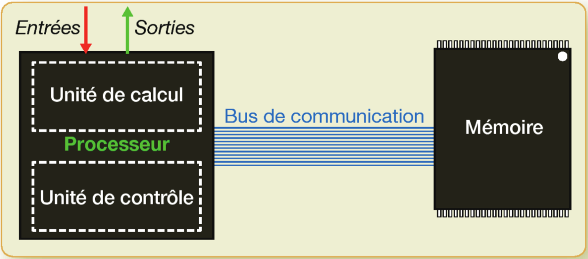

---
tags:
  [
    "histoire de l'informatique",
    'machine de Turing',
    'architecture de von Neumann',
  ]
---

Le développement de l'informatique a nécessité de nombreuses avancées dans des domaines variés tant *technologiques que théoriques*.

## Aspects technologiques

### Calculateurs mécaniques

En 1642, _Blaise Pascale_ est le premier à avoir conçu une machine à calculer **mécanique**, capable d'effectuer les quatre opérations élémentaires sur les entiers: addition, soustraction, multiplication, division.

 Par © 2005 <a href="//commons.wikimedia.org/wiki/User:David.Monniaux" title="User:David.Monniaux">David Monniaux</a>&nbsp;/&nbsp;, <a href="http://creativecommons.org/licenses/by-sa/3.0/" title="Creative Commons Attribution-Share Alike 3.0">CC BY-SA 3.0</a>, <a href="https://commons.wikimedia.org/w/index.php?curid=186079">Lien</a>

### Calculateurs électromécaniques

Au début du XX^e^ siècle, on commence à utiliser l'**électricité** pour réaliser des calculateurs.

D'abord des machine **électromécaniques** comme le **Z3** allemand achevé en 1941. On le dit électromécanique car il utilisait des relais électromécaniques fonctionnant à une fréquence de 5 à 10 Hz.(Source [Wikipedia](https://fr.wikipedia.org/wiki/Zuse_3))

 Par <a href="https://de.wikipedia.org/wiki/User:Venusianer" class="extiw" title="de:User:Venusianer">Venusianer</a>, <a href="http://creativecommons.org/licenses/by-sa/3.0/" title="Creative Commons Attribution-Share Alike 3.0">CC BY-SA 3.0</a>, <a href="https://commons.wikimedia.org/w/index.php?curid=3632073">Lien</a>

On remplace rapidement les relais électromécaniques par des tubes à vides comme dans l'[ENIAC](https://fr.wikipedia.org/wiki/ENIAC).

 Par <a rel="nofollow" class="external free" href="http://ftp.arl.army.mil/ftp/historic-computers/">http://ftp.arl.army.mil/ftp/historic-computers/</a>&nbsp;; Transféré de <a class="external text" href="//pl.wikipedia.org">pl.wikipedia</a> à Commons par <a href="//commons.wikimedia.org/wiki/User:Masur" title="User:Masur">Masur</a> utilisant <a href="https://tools.wmflabs.org/commonshelper/" class="extiw" title="toollabs:commonshelper/">CommonsHelper</a>., Domaine public, <a href="https://commons.wikimedia.org/w/index.php?curid=8813812">Lien</a>

### Le transistor et l'avènement de l'électronique

Ce n'est cependant qu'avec l'invention du transistor en 1947 que l'ère de l'électronique et de l'informatique va prendre son envol. Cette découverte vaudra à ses inventeurs américains William Shockley et Walter Brattain le prix Nobel de physique en 1956.

 By <a href="https://en.wikipedia.org/wiki/User:Transisto" class="extiw" title="wikipedia:User:Transisto">Transisto</a> at <a href="https://en.wikipedia.org/wiki/" class="extiw" title="wikipedia:">English Wikipedia</a> - Own work, <a href="http://creativecommons.org/licenses/by-sa/3.0/" title="Creative Commons Attribution-Share Alike 3.0">CC BY-SA 3.0</a>, <a href="https://commons.wikimedia.org/w/index.php?curid=11885148">Link</a>

>Le transistor est considéré comme un énorme progrès face au tube électronique : beaucoup plus petit, plus léger et plus robuste, fonctionnant avec des tensions faibles, autorisant une alimentation par piles, il fonctionne presque instantanément une fois mis sous tension, contrairement aux tubes électroniques qui demandaient une dizaine de secondes de chauffage, généraient une consommation importante et nécessitaient une source de tension élevée (plusieurs centaines de volts).
*[Wikipedia](https://fr.wikipedia.org/wiki/Transistor#Historique)*{.cite-source}

## Aspects théorique

### La machine de Turing

Au fur et à mesure que les machines évoluaient, on est venu à se poser beaucoup plus théorique: "Une machine peut-elle tout calculer?", "Existe-t-il une machine capable de décider si une proposition mathématique est vraie ou fausse?".

Pour répondre à ces question, Alan Turing propose en 1937 un modèle de machine appelé aujourd'hui _machine de Turing_. Cette machine a les caractéristiques suivantes:

Elle possède un ruban infini que lequel on dispose des données. La machine peut lire les données, les traiter et en écrire d'autres. Au bout d'un certain temps, il se peut qu'elle s'arrête, et on peut alors lire le résultat.

Turing démontre grâce à cette machine _théorique_ qu'il existe certains problèmes que la machine n'est pas capable de résoudre.

On considère aujourd'hui l'ordinateur comme une réalisation concrète d'une machine de Turing universelle, c'est à dire une machine traitant des informations et capable de prendre comme donnée n'importe quel algorithme et de l’exécuter.

### L'architecture de von Neumann

Le premier ordinateur électronique conçu pour être une machine de Turing est l'EINAC réalisé en 1943. Son architecture fut décrite par John von Neumann et sert de base, à quelques améliorations près, à l'architecture de tous les ordinateurs depuis.

{.center}

*[Informatique et sciences du numérique Spécialité ISN en terminale S - Avec des exercices corrigés et des idées de projets par Gilles Dowek](http://www.editions-eyrolles.com/Livre/9782212135435/)*{.cite-source}

Cette architecture est centrée autour de deux composants principaux:

- le **processeur**,
- et la **mémoire**.

Ces deux circuits sont reliés par des fils appelés _bus de communication_.

D'autres part, le processeur dispose de _bus d'entrée et de sortie_ qui le relient à d'autres parties de l'ordinateur appelées les _périphériques_ comme par exemple le disque dur, l'écran, le clavier...

Le processeur joue le rôle du _chef d'orchestre_, il donne des ordres aux périphériques et à la mémoire et est responsable de l'exécution du programme de l'ordinateur.

Au sein du processeur le traitement des tâches a été séparé en deux:

- l'**unité de contrôle** lit les instructions du programme en mémoire une à une, et commande à
- l'**unité de calcul** de réaliser ces opérations lorsque l'opération est terminée, l'unité de contrôle passe à l'instruction suivante du programme.

Le processeur possède également un très petit nombre de cases mémoires très rapides appelées des _registres_ dont la capacité dépasse rarement quelques dizaines d'octet pour des raisons de coût et de place. [Source Wikipedia](https://fr.wikipedia.org/wiki/Registre_de_processeur)

#### Quelques variations à l'architecture de von Neumann

La mémoire vive de l'ordinateur a besoin d'être alimentée en permanence pour garder les données, ainsi à chaque extinction de l'ordinateur, elle est perdue, on la qualifie de mémoire volatile.

Pour résoudre ce problème on recourt à deux types de mémoires non volatiles:

- **la mémoire morte** est une mémoire qui ne peut être que lue(ROM Read Only Memory), elle contient en général le _firmware_ de l'ordinateur (BIOS ou UEFI) qui est le programme qui se charge à chaque allumage de l'ordinateur.

- **la mémoire de masse**: Pour stocker les donnée et les programmes, on ajoute un périphérique appelé mémoire de masse: le disque dur de vos ordinateurs, ou une mémoire flash dans le cas des tablettes et smartphones. Cette mémoire est capable de stocker une grande quantité de données, mais à l'inconvénient d'être beaucoup moins rapides que la mémoire vive(RAM Random Access Memory), c'est pour cela que lors du lancement d'un programme les données nécessaire à son exécution sont généralement transférées vers la RAM pour une exécution plus rapide.

De plus, on délègue de plus en plus souvent les calculs onéreux d'affichage à la carte graphique pour soulager le processeur.

[[appli | &nbsp;]]
|Classer les diverses mémoires présentes dans un ordinateur par "rapidité", et expliquer leurs rôles respectifs.

#### L'ordinateur actuel

L'[animation](http://www.cea.fr/multimedia/Pages/animations/technologies/fonctionnement-ordinateur.aspx) suivante du CEA vous présente le fonctionnement général d'un ordinateur.
Si votre appareil ne supporte pas flash, vous pouvez consulter la version vidéo.
`youtube:cDnvRSIpNUQ`

[[appli | vue schématique d'un ordinateur]]
|Réaliser en _grand format_, une _vue schématique d'un ordinateur_ en indiquant le nom des diverses parties, leurs connexions, et leurs rôles.

## Références

- [Informatique et sciences du numérique Spécialité ISN en terminale S - Avec des exercices corrigés et des idées de projets par Gilles Dowek](http://www.editions-eyrolles.com/Livre/9782212135435/)
- [Informatique pour tous en classes préparatoires aux grandes écoles de Benjamin Wack](http://www.editions-eyrolles.com/Livre/9782212137002/informatique-pour-tous-en-classes-preparatoires-aux-grandes-ecoles)
