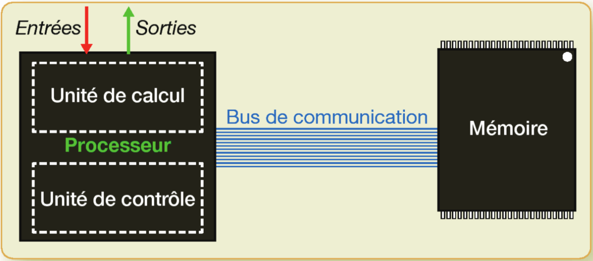

Maintenant que nous avons vu quelle était la structure générale d'un ordinateur, nous allons nous intéresser plus précisément au rôle du processeur et de la mémoire(vive), et voir comment peuvent être dictées les instructions à l'unité de contrôle du processeur.

{.center}
*[Informatique et sciences du numérique Spécialité ISN en terminale S - Avec des exercices corrigés et des idées de projets par Gilles Dowek](http://www.editions-eyrolles.com/Livre/9782212135435/)*{.cite-source}

## Communication entre le processeur et la mémoire

La mémoire contient plusieurs milliards de circuits mémoires un bit, qui sont organisés en *cases mémoires* de huit, seize, trente-deux, soixante-quatre bits. Chaque case a une *adresse* unique, leur nombre détermine la capacité de la mémoire vive de l'ordinateur.

Le processeur ne possède qu'un très petit nombre de cases mémoires très rapides appelées des *registres* dont la capacité dépasse rarement quelques dizaines d'octet pour des raisons de coût et de place. [Source Wikipedia](https://fr.wikipedia.org/wiki/Registre_de_processeur)

Ces registres peuvent stocker des données et des adresses de la mémoire.

Le processeur est composé de transistors assemblés de façon à lui permettre de réaliser un *petit nombre d'opérations simples, mais à réaliser ces opérations très rapidement*.

Par exemple pour échanger des données avec la mémoire, le processeur utilise deux instructions permettant de:

-   transférer l'état d'un registre dans une case mémoire: le **Stockage** (STORE),
-   transférer l'état d'une case mémoire dans un registre: le **Chargement**(LOAD).

## Jeu d'instructions simplifié du processeur

Nous allons étudier un processeur simplifié avec **deux registres** disposant d'un jeu d'instructions restreints:

-   **STX x**: stocke l'état du registre X dans la case mémoire d'adresse x.
-   **LDX x**: charge l'état de la case mémoire d'adresse x dans le registre X.
-   **ADD X**: additionne le contenu des registres et le stocke dans le registre X.
-   **DEC X**: décrémente la valeur contenue dans le registre X, c'est à dire soustrait 1.

[[appli | Écrire des suites d'instructions pour le processeur ]]
| 1.  Supposons que notre mémoire contienne quatre valeurs 2, 3, 5, 7 dans les cases mémoires d'adresse 1, 2, 3, 4. Écrire la suite d'instructions qui permettra d'additionner ces quatre nombres et de stocker le résultat de cette addition dans la case mémoire 5.
| 2.  Écrire une séquence d’instructions qui multiplie par 3 le nombre contenu dans la case mémoire d’adresse 5 et stocke le résultat dans la case mémoire d’adresse 6.

## Langage machine

Dans les premières machines, les opérations à effectuer étaient écrites sur des bandes perforées qui en défilant indiquaient au processeur la suite d'opérations à réaliser.

 "<a href="https://commons.wikimedia.org/wiki/File:DrehorgelLochkarte.jpg#mediaviewer/File:DrehorgelLochkarte.jpg">DrehorgelLochkarte</a>". Licensed under Public Domain via <a href="//commons.wikimedia.org/wiki/">Wikimedia Commons</a>.

Puis cette idée a été abandonnée au profit d'une autre: celle d'enregistrer le programme dans la mémoire avec les données. Il convient alors de stocker les instructions du programme sous forme électrique dans la mémoire, on parle alors de langage machine.

Par exemple, on va utiliser le codage suivant pour les instructions:

| instruction | codage |
| ----------- | ------ |
| LDA         | 0      |
| LDB         | 1      |
| STA         | 2      |
| STB         | 3      |
| ADD         | 4      |
| DEC         | 5      |

En ce qui concerne les **arguments** des instructions, cases mémoires sont codées par leur adresse numérique et les registres A at B sont codés par 0 et 1.

Si on désire additionner le contenu des valeurs contenues dans les cases mémoires 5 et 6, et les stocker dans la case mémoire 7, on réalise la suite d'instructions suivantes:

    LDA 5,LDB 6,ADD A,STA 7

soit:

        0 5,1 6,4 0,2 7

Il suffit maintenant d’ajouter au processeur un nouveau registre qui débute à 100, le *compteur de programme* ou *PC* (program counter), sur lequel on va stocker le programme à exécuter, et à chaque étape, le processeur :

-   charge le contenu des cases mémoires d’adresses PC et PC + 1,
-   décode le premier de ces nombres en une instruction (0 devient LDA , 1 LDB , etc.),
-   décode le deuxième de ces nombres comme un argument à l'instruction(p.ex: une adresse mémoire dans le cas des `LOAD`),
-   exécute l’instruction en question,
-   et ajoute 2 au registre PC pour passer à l'instruction suivante.

[[appli | Écrire un programme en langage machine]]
| 1.  Traduire les suites d'instructions des applications de la partie précédente en langage machine.
| 2.  Écrire ces programmes en binaire avec des mots de 4 bits.

## Vers des instructions plus évoluées

Si on désire réaliser des boucles et des tests, on ajoute trois instructions au processeur qui seront codées ainsi:

| instruction | codage | signification                                                      |
| ----------- | ------ | ------------------------------------------------------------------ |
| JMP         | 7      | Fait "sauter"(JUMP) le programme vers une ligne donnée en argument |
| JMPZ        | 8      | Comme JUMP, mais uniquement si le registre A est 0.                |
| END         | 9      | Termine le programme                                               |

Pour plus de détails voir le chapitre 15- L'organisation de l'ordinateur du [manuel](http://www.editions-eyrolles.com/Livre/9782212135435/).

[[appli | Exercices du manuel]]
| Faire les exercices 15.1, 15.2 et 15.3 du manuel.

## Références

-   Chapitre 15: L'organisation d'un ordinateur [Informatique et sciences du numérique Spécialité ISN en terminale S - Avec des exercices corrigés et des idées de projets par Gilles Dowek](http://www.editions-eyrolles.com/Livre/9782212135435/)
