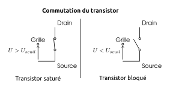

Comme nous l'avons vu, l'invention du transistor en 1947 a ouvert l'ère de l'électronique pour l'humanité et a permis à l'informatique de se miniaturiser et rentrer dans le grand public.

Nous allons voir maintenant, comment il est possible de réaliser des opérations logiques à l'aide de **transistors**. En effet, chaque processeur possède dans son [jeu d'instructions](https://fr.wikipedia.org/wiki/Assembleur#Instructions_machine) des opérations booléennes (ou opérations bit à bit).

Il existe des transistors de diverses technologies, pour plus de simplicité, nous étudierons dans ce chapitre qu'un seul type de transistor: les transistors **N-Mos**. Dont voici le symbole électrique

{.center .half}

Un transistor CMOS-N possèdent trois bornes nommées:

-   La grille **G** qui commande le fonctionnement du transistor.
-   Le drain **D**
-   et la source **S**

## Commutation du transistor

Pour réaliser des circuits logiques, nous utilisons le transistor en **interrupteur commandé**.

*En fonction de la tension appliquée* entre la grille et la source $U_{GS}$, le dipôle entre le drain et la source se comporte *soit comme un interrupteur ouvert soit comme un interrupteur fermé*.

[[plus| En plus]]
|La résistance entre le Drain et la Source dépend fortement de la tension appliquée entre la grille et la source: $U_{GS}$, c'est une particularité des matériaux semi-conducteurs utilisés dans les transistors.
|
 By Saumitra R Mehrotra &amp; Gerhard Klimeck, modified by <a href="//commons.wikimedia.org/wiki/User:Zephyris" title="User:Zephyris">Zephyris</a> - Own work, Public Domain, <a href="https://commons.wikimedia.org/w/index.php?curid=11299479">Link</a>

|Dans cette simulation, la tension de seuil se situe aux alentours de 0,45V, si bien que si:
|
|- $U_{GS} < 0,45 V$: $R_{DS} \to +\infty $, l'interrupteur commandé est **ouvert**.
|- $U_{GS} > 0,45 V$: $R_{DS} \to 0 $, l'interrupteur commandé est **fermé**.

http://www.labosim.net/semi-conducteurs/transistor

En utilisant des tensions de commandes $U_{GS}$ n'ayant que deux valeurs: 0, ou 5V, il est possible d'utiliser le transistor comme un **interrupteur** placé entre les bornes D et S et **commandé** par la tension $U_{GS}$.

{.center .full}

## Réalisation d'une porte `NON` (_not_)

La fonction booléenne non(x) associe à une valeur booléenne $x$ son "contraire".

Sa table de vérité est:

| x   | non(x) |
| --- | ------ |
| 0   | 1      |
| 1   | 0      |

{.center .full}

[[appli| Schémas équivalents]]
|Réaliser les deux schémas équivalents au circuit pour $U_{GS} = 0$ et $U_{GS} = 5V$ en remplaçant le transistor par un interrupteur.

## Réalisation d'une porte `ET` (_and_)

La fonction booléenne et(x, y) a la table de vérité suivante:

| x   | y   | et(x,y) |
| --- | --- | ------- |
| 0   | 0   | 0       |
| 0   | 1   | 0       |
| 1   | 0   | 0       |
| 1   | 1   | 1       |

{.center .full}

[[appli| Schémas équivalents]]
|Réaliser les quatre schémas équivalents au circuit en remplaçant les transistors par des interrupteurs.

## Réalisation d'une porte `OU` (_or_)

La fonction booléenne ou(x, y) a la table de vérité suivante:

| x   | y   | ou(x,y) |
| --- | --- | ------- |
| 0   | 0   | 0       |
| 0   | 1   | 1       |
| 1   | 0   | 1       |
| 1   | 1   | 1       |

{.center .full}

[[appli| Schémas équivalents]]
|Réaliser les quatre schémas équivalents au circuit en remplaçant les transistors par des interrupteurs.

## Autres portes booléennes

### La porte `NON-ET` (_nand_)

**Table de vérité**

| x   | y   | nand(x,y) |
| --- | --- | --------- |
| 0   | 0   | 1         |
| 0   | 1   | 1         |
| 1   | 0   | 1         |
| 1   | 1   | 0         |

**Schématisation**

{.center .full}

### La porte `NON-OU` (_nor_)

**Table de vérité**

| x   | y   | nor(x,y) |
| --- | --- | -------- |
| 0   | 0   | 1        |
| 0   | 1   | 0        |
| 1   | 0   | 0        |
| 1   | 1   | 0        |

**Schématisation**

{.center .full}

### La porte `OU eXclusif` (_xor_)

**Table de vérité**

| x   | y   | xor(x,y) |
| --- | --- | -------- |
| 0   | 0   | 0        |
| 0   | 1   | 1        |
| 1   | 0   | 1        |
| 1   | 1   | 0        |

**Schématisation**

{.center .full}

### La porte `ET inclusif` (_xnor_)

**Table de vérité**

| x   | y   | xnor(x,y) |
| --- | --- | --------- |
| 0   | 0   | 1         |
| 0   | 1   | 0         |
| 1   | 0   | 0         |
| 1   | 1   | 1         |

**Schématisation**
{.center .full}

[[appli | Exercices du manuel]]
| Faire les exercices du chapitre 13 du manuel.

## Références

-   Chapitre 13. Les Portes booléennes  [Informatique et sciences du numérique Spécialité ISN en terminale S - Avec des exercices corrigés et des idées de projets par Gilles Dowek](http://www.editions-eyrolles.com/Livre/9782212135435/)
