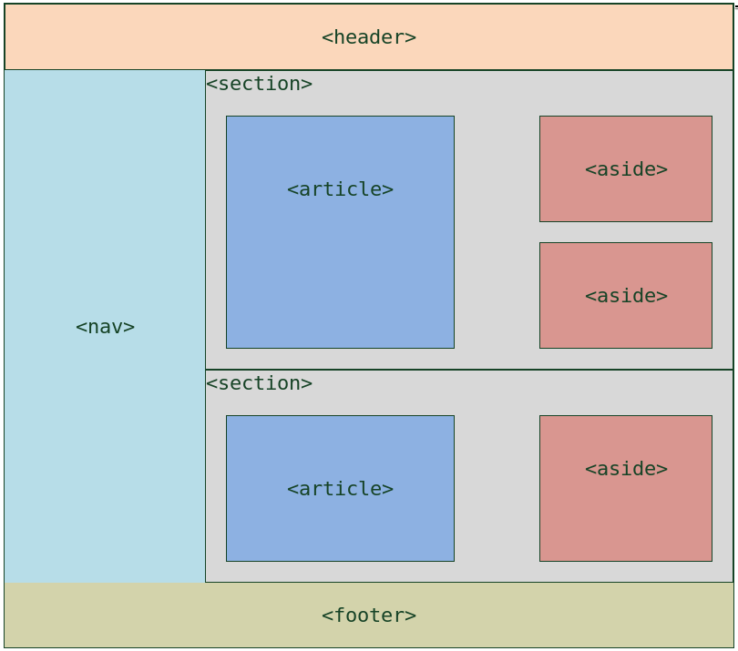

Maintenant que vous avez vu comment intégrer des règles de styles `css` à votre page `html`, nous allons voir comment **agencer de façon générale** notre page en utilisant des balises `html5`, ainsi que des propriétés `css` spécialement prévues à cet effet.

Voila à quoi peut ressembler notre page web une fois mise en forme.



*Source: [Openclassroom](https://openclassrooms.com/courses/apprenez-a-creer-votre-site-web-avec-html5-et-css3/structurer-sa-page#/id/r-1610878)*

## Les balises de contenu html5

Voici quelques balises introduites dans la version 5 de `html` qui permettent de structurer de façon moderne votre page.

[Résumé du cours d'Openclassroom](https://openclassrooms.com/courses/apprenez-a-creer-votre-site-web-avec-html5-et-css3/structurer-sa-page#/id/r-3210965)

> Plusieurs balises ont été introduites avec HTML5 pour délimiter les différentes zones qui constituent la page web:
>
> - `<header>`: en-tête;
> - `<footer>`: pied de page ;
> - `<nav>`: liens principaux de navigation ;
> - `<section>`: section de page ;
> - `<aside>`: informations complémentaires ;
> - `<article>`: article indépendant.
>
> Ces balises peuvent être imbriquées les unes dans les autres. Ainsi, une section peut avoir son propre en-tête.
>
> Ces balises ne s'occupent pas de la mise en page. Elles servent seulement à indiquer à l'ordinateur le sens du texte qu'elles contiennent. On pourrait très bien placer l'en-tête en bas de la page si on le souhaite.


Pour plus de détails, consulter directement la page du cours  sur [Openclassroom](https://openclassrooms.com/courses/apprenez-a-creer-votre-site-web-avec-html5-et-css3/structurer-sa-page)


## Positionnement en css

### `display: inline;` et `display:block;`

Il existe deux propriétés principales de positionnement en `css`:

- `display: block`: les éléments se placent les uns au dessus des autres et occupent toute la largeur disponible. C'est la propriété par défaut appliquée sur les balises `<heading>` ou `<p>`.

[[example]]
|```html
|<h1 style="background-color:yellow;">Titre de niveau 1</h1>
|<p style="background-color:lime;"> Un paragraphe avec un fond vert clair pour voir l'espace qu'il occupe à l'écran.</p>
|```
|
|**RENDU**
|<h1 style="background-color:yellow;">Titre de niveau 1</h1>
|<p style="background-color:lime;"> Un paragraphe avec un fond vert clair pour voir l'espace qu'il occupe à l'écran.</p>

- `display: inline`: les éléments se placent les uns à côté des autres, et occupent exactement la place dont ils ont besoin. C'est la propriété par défaut appliquée sur les balises `<strong>` ou `<span>`.

[[example]]
|```html
|<p style="background-color:lime;"> Un paragraphe avec un fond vert clair et des éléments inline <strong>strong</strong> et  <span style="background-color=ligthblue;">span</span> pour voir le positionnement à l'écran.</p>
|```
|
|**RENDU**
|<p style="background-color:lime;"> Un paragraphe avec un fond vert clair et des éléments inline <strong>strong</strong> et  <span style="background-color:lightblue;">span</span> pour voir leurs positionnement à l'écran.</p>

### Des positionnements plus évolués

Lorsqu'on laisse les éléments se placer naturellement à l'écran *(de haut en bas, ou de droite à gauche)*, on dit que les éléments sont **positionnés dans le flux**. Si l'on souhaite les positionner ailleurs, c'est à dire les sortir du flux, on utilise principalement les propriétés `css`:

- [`display`](https://developer.mozilla.org/fr/docs/Web/CSS/display): avec notamment les valeurs [`flex`](http://fr.learnlayout.com/flexbox.html) pour le positionnement 1D et `grid` pour le positionnement 2D.
- [`position`](https://developer.mozilla.org/fr/docs/Web/CSS/position): avec les valeurs `relative`, `absolute` ou `fixed`.
- [`float`](https://developer.mozilla.org/fr/docs/Web/CSS/float) avec les valeurs `left` ou `right`.

### Des sources pour apprendre

Si vous voulez maîtrisez les *bases du positionnement* suivez les étapes de ce tutoriel en ligne: [learnlayout.com](http://fr.learnlayout.com/).

Cependant, pour une approche plus complète et moderne, je vous conseille les chapitres suivant du cours d'OpenClassroom [ Apprenez à créer votre site web avec HTML5 et CSS3](https://openclassrooms.com/fr/courses/1603881-apprenez-a-creer-votre-site-web-avec-html5-et-css3):

- [Le modèle des boites](https://openclassrooms.com/fr/courses/1603881-apprenez-a-creer-votre-site-web-avec-html5-et-css3/1606168-le-modele-des-boites)
- [La mise en page avec flexbox](https://openclassrooms.com/fr/courses/1603881-apprenez-a-creer-votre-site-web-avec-html5-et-css3/3298561-la-mise-en-page-avec-flexbox)

## Exercice

Vous devriez maintenant être capable de créer une page avec une mise en page semblable à celle présentée au début de cette page.

*Conseil: utilisez `display: flex;` c'est plus moderne et facile.*