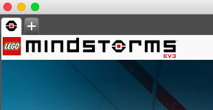
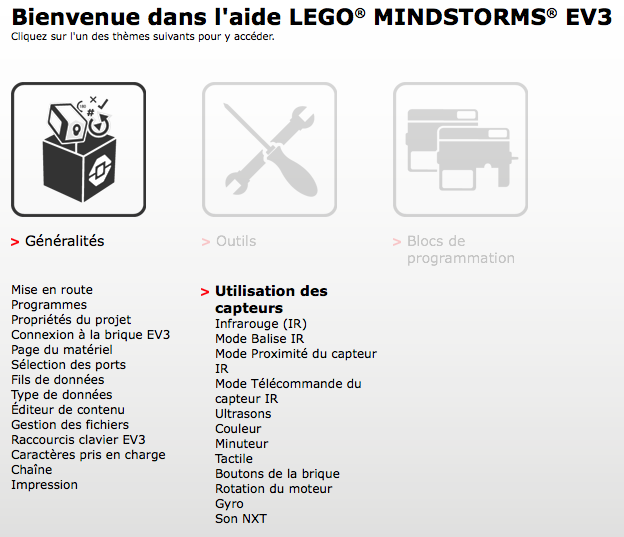

Vous allez apprendre à configurer un projet dans le logiciel EV3, puis réaliserez quelques tests
sur vos capteurs avant de créer votre premier programme dans le chapitre suivant: le très classique
suiveur de lignes.

N'oubliez pas de prendre des notes au fur et à mesure de vos avancées.

## Configuration du projet

- Lancer le logiciel EV3. Cliquer sur l'onglet + en haut à gauche pour démarrer un nouveau projet.

  

- Connecter le robot sur un port USB à l'aide d'un câble approprié. Démarrer le robot pour qu'il
  soit détecté par le logiciel

- Ouvrir l'aide EV3 et suivre le tutoriel sur les généralités.

  

- Sur la "Page du Matériel" : lire attentivement les explications pour renseigner les ports sur
  lesquels vous avez branchés les 2 moteurs (B et C), le gros moteur central (A), le capteur de
  contact (port 1 ou 2) et le capteur de couleur (port3)

  

  Configurez le projet dans la fenêtre matériel avec ces renseignements

## Réalisation des tests

- Réalisez alors des tests sur votre robot et lire les valeurs affichées pour le capteur de
  contact, lorsqu'il est :

-   enfoncé
-   relâché

- Réalisez les tests sur votre robot et lire les valeurs affichées pour le capteur de couleur
  lorsque l'on dispose sous le capteur un objet de couleur

-   bleu

-   vert

-   rouge

-   jaune

- Réalisez les tests sur ce même capteur de couleur, mais en mode "mesure d'intensité ambiante".
  Noter la valeur lorsque l'on dispose devant le capteur un objet :

-   Blanc

-   Noir

- Refaire le même test, mais cette fois ci en mode "mesure d'intensité réfléchie" (le capteur
  émettant de la lumière rouge)

- Consignez tous vos résultats par écrit dans votre cahier : capteurs, ports, conditions d'essais,
  résultats

- Sur la page de l'aide : Programmes : Familiarisez vous avec la programmation par "briques"

