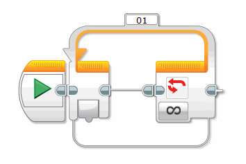
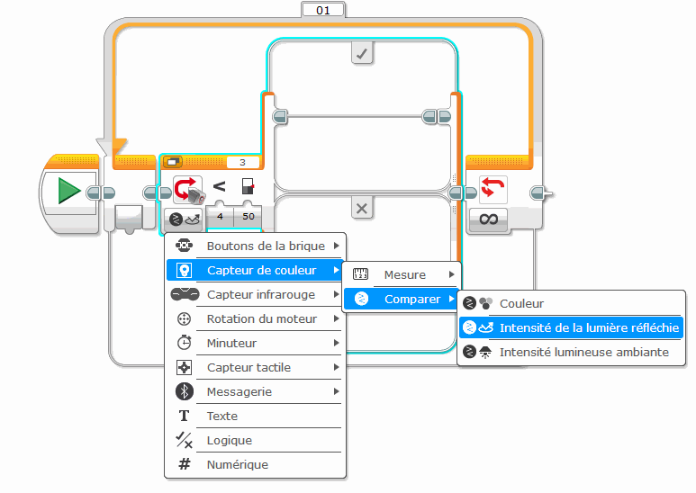
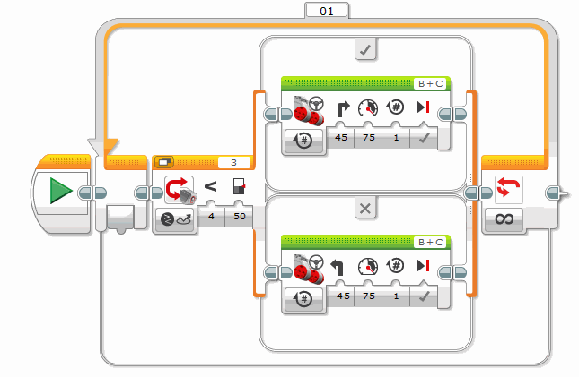

Le texte original du TP est à l'adresse suivante :

<http://www.sitedunxt.fr/articles/articles-4-9-3+faire-du-suivi-de-ligne.php>

Le TP proposé ici a été adapté pour le logiciel EV3, plus récent.

## Principe du programme

Le principe de notre programme sera le suivant. Initialement, le robot sera placé de telle sorte
qu'il soit centré sur la ligne noire. Le capteur de lumière se trouvant juste au dessus de
celle-ci.

Nous allons faire avancer notre robot tout en le faisant tourner d'un côté ou d'un autre.

Lorsqu'il détectera une couleur noire, il avancera en tournant vers la droite. De ce fait, ce léger
virage déplacera le capteur de lumière vers un côté de la ligne et il se retrouvera à un moment au
dessus de la couleur blanche.

Le robot aura tout simplement sorti de l'axe de la ligne.

Lorsqu'il détectera une autre couleur que le noir, comme par exemple la couleur blanche de la
planche de test, il avancera en tournant cette fois ci vers la gauche.

Ainsi, le robot reviendra vers l'axe de la ligne noire et il aura avancé car les deux roues auront
tournées dans le même sens sur une courte distance.

Le capteur repassant au dessus de la ligne noire, il aura donc fait un cycle complet, à savoir,
être sur la ligne puis s'en éloigner et enfin revenir vers cette même ligne.

Le cœur du programme est là. Il ne suffira plus qu'à faire effectuer ce cycle au robot de manière
permanente.

## Réalisation du programme

Commençons par placer une boucle infinie au début de notre programme. En effet, le suivi de ligne
va se faire en permanence :

Puis, placez à l'intérieur de cette boucle un bloc "Commutation" paramétré sur le capteur de
couleur et réglé sur la couleur noire :

Vous devez ici choisir l'option Capteur photosensible du paramètre Action et sélectionner le signe
\< (plus petit que) dans le paramètre Comparer, en sélectionnant le bouton de gauche représenté par
une lumière sombre, de manière à indiquer au bloc "Commutation" d'exécuter le rayon de séquence
supérieur (b) condition vrai[/b]) lorsque le capteur de lumière renverra une valeur de luminosité
inférieur à la valeur de déclenchement indiqué dans le champ de saisie situé à droite. Cette valeur
de déclenchement a une valeur de 50 par défaut. Vous pouvez changer ce réglage.

Si le capteur identifie devant lui une couleur noire, celle de la ligne, la condition est vrai et
le bloc "Commutation" exécutera le bloc placé sur le rayon de séquence supérieur.

Nous allons utiliser un bloc "Déplacement et direction" pour contrôler les deux moteurs de
propulsion et le configurer de tel manière que le robot tourne vers la droite : Dans la partie
supérieure du bloc de commutation, ajouter le bloc et paramétrer la direction (ici, j'ai choisi 30°
de sorte que le robot continue à avancer et ne fasse pas que virer)

Puis le déplacement vers la gauche : partie inférieure du bloc.

Comme il est là, le programme pourrait fonctionner correctement.

Si le capteur mesure une valeur inférieure à 50, c'est à dire qu'une couleur sombre comme la
couleur noire de la ligne se trouve en face de lui, le rayon de séquence supérieur est exécuté es
le robot avance en tournant vers la droite.

Si le capteur mesure une valeur supérieure à 50, c'est à dire qu'une couleur claire comme la
couleur blanche de la planche de test se trouve en face de lui, le rayon de séquence inférieur est
exécuté et le robot avance en tournant vers la gauche.

Toutes les valeurs renvoyées par le capteur de lumière se trouvant supérieure à ce seuil, c'est à
dire dans la plage de valeur allant de 50 à 100, sont considérées comme faisant parties de la
catégorie des couleurs claires. De même, toutes les valeurs inférieures à ce seuil allant de 0 à 49
sont considérées comme des couleurs sombres.