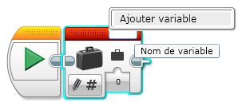
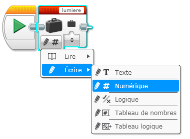
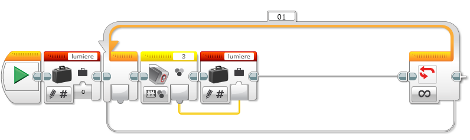
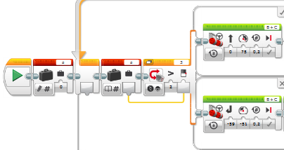

Texte adapté du site du NXT :

<http://www.sitedunxt.fr/articles/articles-4-25-2+les-variables-et-les-constantes.php>

Dans cette partie du tutoriel consacrée au NXT-G, nous allons aborder le sujet très important que
sont les variables et les constantes.

C'est grâce à ces variables notamment que vos programmes pourront être encore plus complexes et
intelligents.

## Comment utiliser des variables dans le logiciel EV3?

Contrairement au langage Python, dans EV3, la déclaration de variable est **obligatoire** et doit
être faite avant toutes utilisations des variables.

Si vous ne faites pas de déclaration de variable, vous ne pourrez tous simplement pas utiliser
cette variable dans votre programme.

> Pour déclarer une variable, il faut utiliser le bloc « Variable » (rouge), et cliquer dans le
> coin supérieur droit : Un menu affiche alors « Ajouter variable »

Renseigner alors le nom de la variable, par exemple « lumiere » pour notre exemple.

Le bouton en bas à gauche du bloc de configuration vous permet de préciser l'action :

-   "Lire" la valeur contenue dans celle-ci ou pour "Ecrire" une valeur dans cette même variable.
-   "Ecrire", le bloc "Variable" mémorise la valeur que vous entrez dans le champ nommé "Valeur"
    juste en dessous.

Ici, vous sélectionnerez « écrire » et choisirez le type : « Numérique »

> Ajouter un bloc « boucle » avec répétition infinie.
>
>Ajouter un bloc de mesure de couleur (capteur de couleur)
>
>Ajouter à nouveau le bloc variable « lumiere ». Si un fil de données est connecté au bloc
>"Variable", la valeur transporté par ce fil de données est mémorisé dans la variable : connectez
>alors les 2 derniers blocs comme sur le schéma suivant :

Lorsque vous choisissez l'option "Lire", le bloc "Variable" vous restitue la valeur de cette
variable par l'intermédiaire d'un fil de données que vous pouvez utiliser dans votre programme.

Ici, la valeur mesurée par le capteur est mise dans la variable `lumiere`

> Modifier ensuite le bloc capteur de couleur pour réaliser une mesure de l'intensité ambiante. Il
> faudra refaire le fil de données qui se sera effacé.

Compléter alors le programme avec les blocs :

> « attendre ». Paramétrer sur 5s.
>
>« Variable » : Paramétrer pour lire la valeur « numérique » de la variable « lumiere »
>
>« Texte » : prolonger le fil de données depuis le bloc variable précédent et le relier à A.
>
>« Afficher » : Le texte à afficher est dans le coin supérieur droit. Choisissez "Relié" comme
>valeur d'entrée Texte dans le coin supérieur droit du bloc pour afficher une valeur d'entrée Texte
>acceptant un fil de données. Relier ce fil de données dans la partie inférieure du bloc comme sur
>le schéma suivant.
>
>« Attendre » : paramétrer sur 10s

## Pour aller plus loin

Utiliser le fil de variable avec un selecteur :

rappel : pour utiliser une variable : il faut d'abord la déclarer (bloc de variable : écrire)

Puis lire son contenu

Et enfin, créer un fil de variable depuis le bloc lecture vers le bloc sélecteur, comme sur le
schéma ci dessous :

On peut utiliser ce morceau de programme pour un projet : détection et recherche de la lumière par
exemple : le robot devra retrouver la source de lumière à l'aide de conditions tests que vous
devrez établir.
