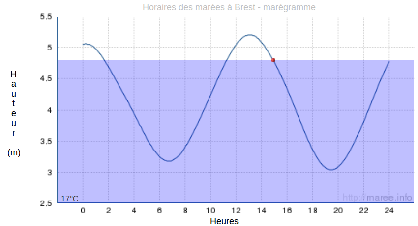
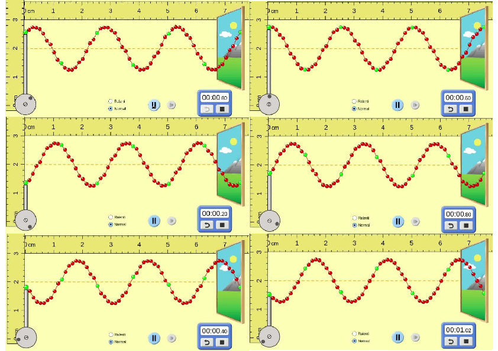

<!--
BO 2012
Ondes et particules : Les ondes dans la matière

- Connaître et exploiter la relation liant le niveau d’intensité sonore à l’intensité sonore.

Caractéristiques et propriétés des ondes: Caractéristiques des ondes.
- Définir, pour une onde progressive sinusoïdale, la période, la fréquence et la longueur d’onde.
- Connaître et exploiter la relation entre la période ou la fréquence, la longueur d’onde et la célérité.
- *Pratiquer une démarche expérimentale pour déterminer la période, la fréquence, la longueur d’onde et la célérité d’une onde progressive sinusoïdale.*
 -->

## Rappels sur les phénomènes périodiques

[[def|Phénomène périodique]]
|Un phénomène est périodique s'il se reproduit identique à lui-même au bout d'une **durée T, appelée période.**

[[examples]]
|- Les marées
|
|- Phases de la lune
|
|

[[def| Fréquence]]
|**La fréquence f** est le nombre de périodes par seconde.
|L'unité de fréquence est le Hertz ($Hz$ ou $s^{-1}$)
|$$
|f=\frac{1}{T}
|$$

## Qu'est-ce qu'une onde progressive périodique ?

Une **onde mécanique progressive est périodique** si elle est émise par une source animée d'un mouvement périodique.

[{.center}](https://phet.colorado.edu/sims/html/wave-on-a-string/latest/wave-on-a-string_fr.html)

[[prop]]
| Une onde progressive périodique(OPP) présente une double périodicité:
|- Une **périodicité temporelle, la période T**: tout point du milieu atteint par la propagation vibre avec la même **période T que la source**.
|- Une **périodicité spatiale, la longueur d'onde** $\lambda$: les points du milieu distants d'une longueur d'onde sont dans le *même état vibratoire* on dit qu'ils sont **en phase**.

 By <a href="//commons.wikimedia.org/wiki/User:Brews_ohare" title="User:Brews ohare">Brews ohare</a> - Own work, <a href="https://creativecommons.org/licenses/by-sa/3.0" title="Creative Commons Attribution-Share Alike 3.0">CC BY-SA 3.0</a>, <a href="https://commons.wikimedia.org/w/index.php?curid=18974623">Link</a>

## La longueur d'onde

[[def | &nbsp;]]
|La longueur d'onde λ est la distance parcourue par l'onde pendant une période T.

**Formule de la longueur d'onde**

$$
\lambda=c \cdot T
$$

ou

$$
\lambda= \frac{c}{f}
$$

**Notations**

- λ : longueur d'onde($m$)
- c : célérité de l'onde($m\cdot s^{-1}$)
- T : période($s$)
- f : fréquence($Hz$)

[[appli| Retrouver une fréquence]]
|Montrer que la fréquence de l'onde ci-dessous est de 1,5Hz.
|

<!--
## Analyse spectrale d'un son

Un **son complexe **est périodique mais non sinusoïdal. Il peut être
décomposé en une **somme de signaux sinusoïdaux** de fréquence f~n ~.

<http://www.lerepairedessciences.fr/terminale_S/1ondes/chap2/acoustique%20musicale%20harmoniques.swf>

La fréquence la plus basse f~1~ est appelée **fréquence fondamentale.**

Les autres fréquences f~n~ multiple de f~1\ ~sont appelées des
**harmoniques**.

**L'analyse spectrale** d'un son consiste à représenter l'amplitude de
ses composantes sinusoïdales en fonction de la fréquence.

Correction du TP

### La perception des ondes sonores

Les ondes sonores sont des ondes mécaniques longitudinales de dilatation
compression.

<https://www.youtube.com/watch?v=T1ICxWAOtgk>

<http://www.lovethisgif.com/uploaded_images/55554-Animation-Adapted-From-Sound-Waves-Institute-Of-Sound-And.gif>

L'oreille humaine moyenne perçoit des ondes sonores dont les fréquences
sont comprises entre 20 Hz et 20 kHz.

## Intensité d'une onde

### Élongation

Lorsque un point « voit » passer une onde, on appelle **élongation** :sa
position par rapport à sa position de repos. On la note y.

**Définition** : L'élongation maximale de l'onde est appelée
**amplitude**, et notée y~max~.

### Niveau d'intensité sonore $L$

Dans le cas des ondes sonores on définit le **niveau d'intensité sonore
L** en décibel en utilisant une **échelle logarithmique.**

- $L$ : intensité sonore en $dB$

- $I$ : intensité du son mesuré en $W·m^{-2}$

- $I_0$: intensité minimale perceptible par l'oreille : $I_0 = 1,0×10^{-12} W·m^{-2}$

**Application** : Calculer l'intensité sonore correspondant :

- à une conversation normale : $I = 1×10^{-7} W·m^{-2}$.
- Moto : $I = 5×10^{-4} W·m^{-2}$.
 -->
