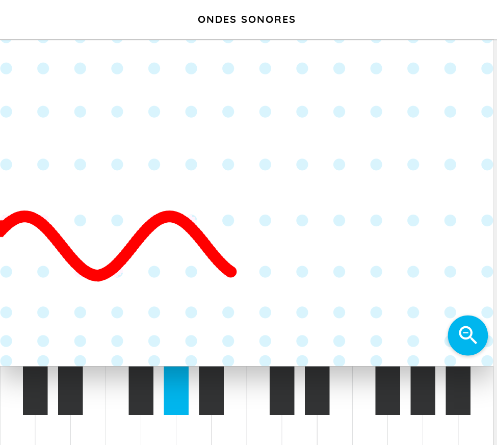
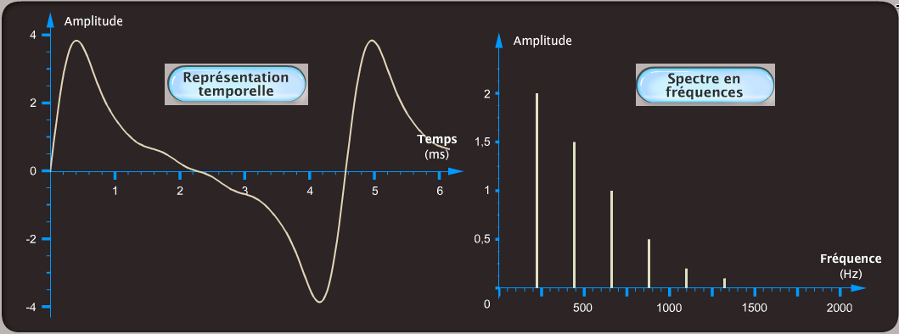
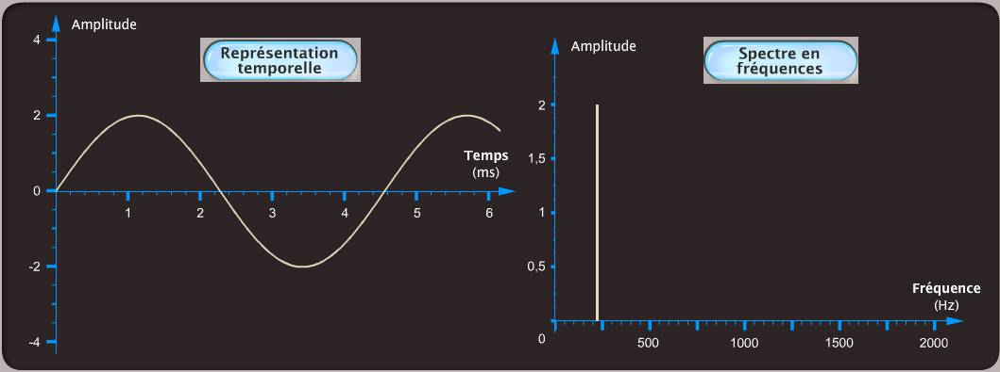
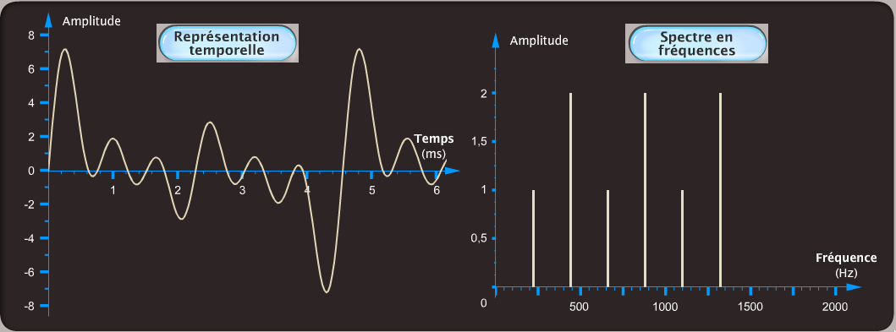

<!--
BO 2012
Ondes et particules : Les ondes dans la matière

- Connaître et exploiter la relation liant le niveau d’intensité sonore à l’intensité sonore.

Ondes sonores et ultrasonores.
Analyse spectrale. Hauteur et timbre.

Réaliser l’analyse spectrale d’un son musical et l’exploiter
pour en caractériser la hauteur et le timbre.
 -->

## Propriétés des ondes sonores

[[def|Onde sonore]]
|Une onde sonore est une onde mécanique longitudinale de compression-dilatation du milieu à trois dimensions.

`youtube: T1ICxWAOtgk`

 Par <a href="//commons.wikimedia.org/wiki/User:Thierry_Dugnolle" title="User:Thierry Dugnolle">Thierry Dugnolle</a> — Travail personnel, <a href="http://creativecommons.org/publicdomain/zero/1.0/deed.en" title="Creative Commons Zero, Public Domain Dedication">CC0</a>, <a href="https://commons.wikimedia.org/w/index.php?curid=18812489">Lien</a>

[[prop]]
|L'oreille humaine moyenne perçoit des ondes sonores dont les fréquences sont comprises entre 20 Hz et 20 kHz.

## Hauteur d'un son

Au contraire d'un bruit, un son a un caractère *périodique*.

[[def|Hauteur d'un son]]
|La hauteur d'un son caractérise le caractère grave ou aigu d'un son.

[[prop]]
|Un son est:
|- **grave** si sa fréquence est faible,
|- **aigu** si sa fréquence est élevée.

## Niveau d'intensité sonore $L$

Dans le cas des ondes sonores on définit le **niveau d'intensité sonore** $L$ en *décibel* en utilisant une *échelle logarithmique*.

$$
L=10 \log{\frac{I}{I_0}}
$$

**Notations**

- $L$ : intensité sonore en $dB$

- $I$ : intensité sonore mesurée en $W·m^{-2}$

- $I_0$: intensité minimale perceptible par l'oreille : $I_0 = 1,0×10^{-12} W·m^{-2}$

[[appli| Utiliser une échelle logarithmique]]
|1. Calculer le niveau d'intensité sonore correspondant à:
|    - une conversation normale : $I = 1×10^{-7} W·m^{-2}$.
|    - une moto : $I = 5×10^{-4} W·m^{-2}$.
|    - deux motos : $I = 10^{-3} W·m^{-2}$.
|2. Combien de motos faut-il pour atteindre un niveau d'intensité sonore de 100dB?

[[plus| Diagramme de Fletcher]]
|Notre oreille n'a pas la même sensibilité pour toutes les fréquences, le diagramme de Fletcher est une représentation de la sensibilité de l'oreille humaine en fonction de la fréquence.
|

## Timbre d'un son

[[def | Timbre d'un son]]
|Le timbre désigne l'ensemble des caractéristiques sonores qui permettent d'identifier un instrument ou une voix.

[[examples]]
|Voici des exemples d'instruments jouant tous un son de **même hauteur**, un *La* :
|- guitare acoustique
|
|<audio controls="controls">
|<source src="./sounds/acoustic_guitar_nylon-A3.mp3" type="audio/mpeg"/>Votre navigateur ne supporte pas l'élément <code>audio</code>.
|</audio>
|
|- guitare électrique avec distorsion
|
|<audio controls="controls">
|<source src="./sounds/distortion_guitar-A3.mp3" type="audio/mpeg"/>Votre navigateur ne supporte pas l'élément <code>audio</code>.
|</audio>
|
|- orgue
|
|<audio controls="controls">
|<source src="./sounds/percussive_organ-A3.mp3" type="audio/mpeg"/>Votre navigateur ne supporte pas l'élément <code>audio</code>.
|</audio>
|
|- orgue rock
|
|<audio controls="controls">
|<source src="./sounds/rock_organ-A3.mp3" type="audio/mpeg"/>Votre navigateur ne supporte pas l'élément <code>audio</code>.
|</audio>
|
|*Les sons sont issus de [MuseScore 2](https://musescore.org/fr) sous licence libre [MIT](https://github.com/musescore/MuseScore/blob/master/share/sound/FluidR3Mono_License.md)*{.cite-source}

## Analyse spectrale

L'analyse spectrale d'un son permet de déterminer l'amplitude des diverses vibrations sinusoïdales présentes dans un son.

On peut distinguer deux types de sons:

- les sons purs qui sont constitués d'**une seule fréquence**. Leur représentation temporelle est une sinusoïde.

- les sons complexes qui peuvent être décomposés en une **somme de signaux sinusoïdaux** de fréquence f~n~.

[[def| Fondamentale]]
|La fréquence la plus basse f~1~ est appelée **fréquence fondamentale**, elle est liée à la **hauteur** du son.

[[def|Harmoniques]]
|Les autres fréquences f~n~ multiples de f~1~ sont appelées des **harmoniques**, leurs amplitudes sont caractéristiques du **timbre** de l'instrument.

$$
f_{n}=n f_{1}
$$

**Notations**

- $f_{n}$: fréquence de l'harmonique n en Hertz(Hz)
- $n$: entier non nul
- $f_{1}$: fréquence fondamentale en Hertz(Hz)