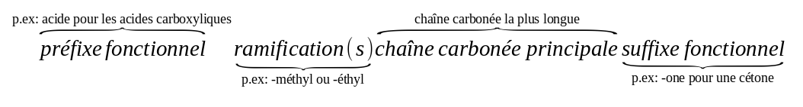

<!--
BO
[[Notions]]
Spectres UV-visible
Lien entre couleur perçue et longueur d’onde au
maximum d’absorption de substances organiques ou
inorganiques.
Spectres IR
Identification de liaisons à l’aide du nombre d’onde
correspondant ; détermination de groupes
caractéristiques.
Mise en évidence de la liaison hydrogène.
Spectres RMN du proton
Identification de molécules organiques à l’aide :
- du déplacement chimique ;
- de l’intégration ;
- de la multiplicité du signal : règle des (n+1)-uplets.

[[competences]]
Mettre en œuvre un protocole expérimental pour
caractériser une espèce colorée.
Exploiter des spectres UV-visible.
Exploiter un spectre IR pour déterminer des groupes
caractéristiques à l’aide de tables de données ou de
logiciels.
Associer un groupe caractéristique à une fonction dans le
cas des alcool, aldéhyde, cétone, acide carboxylique,
ester, amine, amide.
Connaître les règles de nomenclature de ces composés
ainsi que celles des alcanes et des alcènes.
Relier un spectre RMN simple à une molécule organique
donnée, à l’aide de tables de données ou de logiciels.
Identifier les protons équivalents. Relier la multiplicité du
signal au nombre de voisins.
Extraire et exploiter des informations sur différents types
de spectres et sur leurs utilisations.-->

La spectroscopie consiste à **déterminer la structure des molécules** en observant le spectre obtenu lorsque elles interagissent
avec les ondes électromagnétiques.

*[Wikipedia article sur la spectroscopie](https://fr.wikipedia.org/wiki/Spectroscopie#Typologie)*{.cite-source}

Voici une vidéo du site <http://www.universcience.tv> intitulée [La nature au labo](http://www.universcience.tv/video-la-nature-au-labo-4885.html) qui montre les étapes du travail de laboratoire de l'Institut de Chimie des Substances Naturelles qui:

1.  recherche des molécules thérapeutiques dans les plantes,
2.  puis les isole,
3.  les **identifie grâce aux techniques de spectroscopie**,
4.  et enfin recherche les méthode de synthèse.

`youtube:_1A48mLGKSk`

## Nomenclature des composés organiques

La nomenclature permet d'associer un nom à une molécule.

<!-- Activité Nomenclature 1 P 110 -->

L'écriture générale d'un composé monofonctionnel s'effectue dans l'ordre suivant :

**La chaîne principale** est la plus longue chaîne carbonée de la molécule qui porte le **groupe caractéristique**.

La chaîne principale est **numérotée** en attribuant un chiffre minimal au **groupe caractéristique**.

[[examples]]
| -   butan-1-ol
| -   acide 2-méthylpropanoïque

Les **ramifications** doivent être numérotées également, s'il y a plusieurs ramifications de même type, on fait précéder leur nom d'un préfixe *di*, *tri*, *tétra*...

[[examples]]
| -   4-éthyl-3-méthylhexan-2-one
| -   2,2-diméthylpentanal

Dans le cas des **composés azotés : amine et amide**, on utilise un **N** si l'atome d'azote fonctionnel porte des ramifications.

[[examples]]
| -   butan-1-amine
| -   N-méthyl-butan-2-amine
| -   N,N-diméthyl propanamide

Les **esters** portent deux chaînes carbonées, le nom est de la forme *alcanoate d'alkyle*. La première partie du nom correspond à la chaîne carbonée liée au carbone fonctionnel, et la deuxième partie au nom de celle liée l'oxygène du groupe ester.

[[examples]]
| -   éthanoate d'éthyle
| -   éthanoate de butyle
| -   butanoate d'éthyle

## La spectroscopie UV-visible

Vous avez vu en première S que les molécules colorées absorbent dans le
domaine visible en raison de la présence de **liaisons doubles
conjuguées**. Les autres molécules, incolores absorbent dans l'UV.

Un **spectrophotomètre** permet de mesurer l'absorbance d'une solution
en fonction de la longueur d'onde.

[[example]]
| Spectres d'absorption UV-vis des [colorants alimentaires](https://fr.wikipedia.org/wiki/Colorant_alimentaire#Liste_des_colorants_alimentaires_affect%C3%A9s_d'un_num%C3%A9ro_E) :
|
| -   [Colorant E103](https://fr.wikipedia.org/wiki/Alkannine)
|     
| -   [Colorant E131](https://fr.wikipedia.org/wiki/Bleu_patent%C3%A9_V)
|     

### Spectre d'absorption et couleur

[[prop]]
|Si la solution n'absorbe que dans un seul domaine de longueurs d'onde, sa couleur est **complémentaire** de celle des radiations absorbées.

[[appli | Couleur des colorants alimentaires ]]
| Donner les couleurs des deux colorants alimentaires E103 et E131.

### Absorbance et concentration: loi de Beer-Lambert

Pour des solutions suffisamment diluées, l'absorbance est proportionnelle à la concentration de l'espèce chimique colorée. C'est la loi de **Beer-Lambert.**

$$
A=\epsilon\ l\ c
$$

**Notations**

-   $A$: Absorbance de la solution (sans unité)
-   $\epsilon$: Coefficient d'extinction molaire ($L\cdot mol^{-1}\cdot cm^{-1}$)
-   $l$: largeur de la cuve ($cm$)
-   $c$: concentration molaire de l'espèce colorée $mol \cdot L^{-1}$

<!--
[[appli | Dosage par étalonnage d'une espèce chimique colorée]]
|
 -->
## La spectroscopie infrarouge (IR)

La spectroscopie IR permet de mettre en évidence les **types de liaisons** présentes, et ainsi les **groupes fonctionnels** de la molécule.

Un spectre IR représente:

- en ordonnée la **transmittance**, ou parfois l'absorbance. *(Une faible transmittance correspond à une grande absorbance)*
- en abscisse le **nombre d'onde** $\sigma$, exprimé usuellement en $cm^{-1}$. L'axe est généralement **orienté vers la gauche**.

$$
\sigma = \frac{1}{\lambda}
$$

<!-- Activité Hachette 2012 -->

{.center}

[[plus| Spectroscopie IR et vibrations]]
|Les bandes d'absorption d'un spectre sont dues au fait que les molécules de l'échantillon se mettent en vibration sous l'effet des ondes IR, il existe divers types de vibrations possibles.
|{.center}
|*[Wikipedia article sur la spectroscopie infra-rouge](https://fr.wikipedia.org/wiki/Spectroscopie_infrarouge)*{.cite-source}

Un spectre IR communément décomposé en deux zones :

{.center}

-   $\sigma \geq 1500\ cm^{-1}$ : **Zone des groupes fonctionnels**

Elle permet de déterminer les types de liaisons présentes, et ainsi les **groupes fonctionnels** de la molécule.

[[plus | Valeurs approximatives des bandes d'absorption IR]]
|

-   $\sigma < 1500\ cm^{-1}$ : **Empreinte digitale de la molécule**

Cette zone contient un grand nombre de bandes d'absorption qui permet d'identifier une molécule à partir d'un spectre de référence.

### Mise en évidence de liaisons hydrogène

La position, l'intensité et la forme des bandes d'absorption dépend également de l'environnement de la molécule. Il est ainsi possible de mettre en évidence des liaisons hydrogène sur un spectre IR.

Par exemple, la bande de la liaison **-OH** est fortement modifiée en présence de liaison hydrogène( en phase condensée). Cette bande est:

- **fine** à 3600-3700 $cm^{-1}$ en **phase gazeuse**,
- **large** à 2500-3400 $cm^{-1}$ en **phase condensée**.

{.center}

{.center}

## Spectroscopie RMN du proton

Voici une vidéo de la maison de la chimie montrant comment les méthodes de spectroscopie IR et RMN peuvent être utilisées pour **identifier** de façon complète une molécule.

`youtube: swvc0fQL5RQ`

- La spectroscopie **IR** permet d'identifier les **groupes caractéristiques** de la molécule.
- La spectroscopie **RMN** du proton permet de déterminer l'environnement des atomes d'hydrogène de la molécule, et donc indirectement la **structure de sa chaîne carbonée**.

<!-- RMN predict <http://www.nmrdb.org/new_predictor/index.shtml?v=v2.95.0>
 -->

### Signaux et courbe d'intégration

Un spectre RMN présente des signaux correspondant aux **atomes
d'hydrogène** de la molécule.

Chaque **signal**, est caractérisé par son **déplacement chimique δ**,
exprimé en ppm(parties par million).

[[prop]]
|Plus un atome d'hydrogène est proche d'un atome électronégatif, et plus son déplacement chimique est élevé.

*BAC 2013 Pondichéry*{.cite-source}

[[def| Protons équivalents]]
|Des protons qui ont le **même environnement chimique** dans une molécule sont **équivalents**.

[[examples]]
|- $\sf CH_{3}-CH_{2}-OH$ a 3 groupes de protons équivalents.
|- $\sf CH_{3}-CO_{2}H$: 2
|- $\sf CH_{3}-CO-CH_{3}$: 1

[[plus| Prédictions de spectres]]
|L'école polytechnique fédérale de Lausanne propose un service de prédictions de spectre RMN à l'adresse suivante:
|<http://www.nmrdb.org/new_predictor/index.shtml?v=v2.95.0>

Parfois les spectres présentent une courbe d'intégration formée de paliers. La hauteur du saut créé par un signal est proportionnelle au nombre de protons présents dans ce signal.

[[example]]
|Le méthanoate d'éthyle $\sf HCO_{2}-CH_{3}$ présente deux signaux dont les hauteurs relatives sont 1-3 sur la courbe d'intégration.

### Multiplicité du signal

Le signal n'est pas toujours un pic fin et unique, il peut comporter plusieurs pics et est alors appelé **multiplet**.

Le nombre de pics du signal dépend du nombre de protons voisins.

[[prop]]
|**Règle des (n+1)-uplets:**
|
|Un groupe de protons équivalents ayant **n protons voisins** présente un signal sous la forme d'un **multiplet de (n+1) pics**.

[[def| Protons voisins]]
|Des protons sont voisins s'ils sont portés par des atomes voisins.