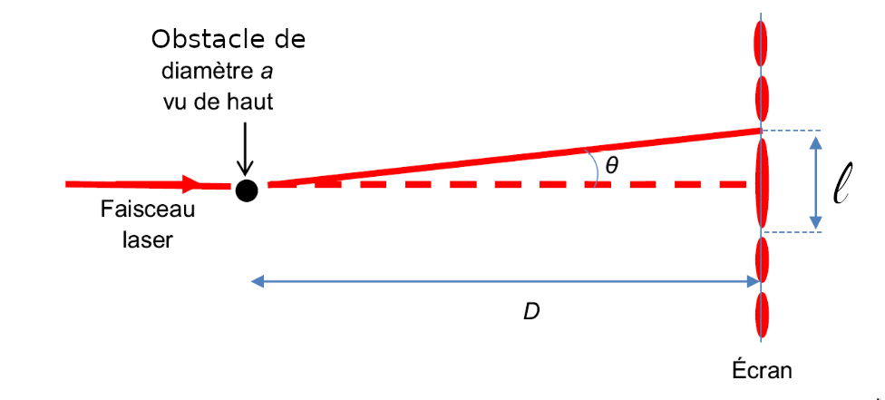
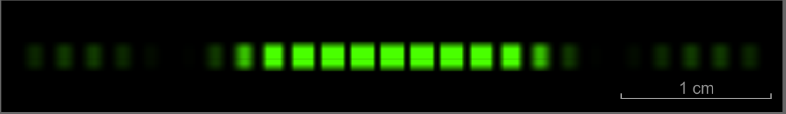

<!--
**BO 2012 **:

~**Ca\*\***r\***\*a\*\***ctér\***\*i\*\***sti\***\*q\*\***ues\***\*\ \*\***et\***\*\ \*\***p\***\*r\*\***op\***\*r\*\***i\***\*étés\*\***\ \***\*d\*\***e\***\*s\*\***\ \***\*o\*\***n\***\*des**~

+-----------------------------------+-----------------------------------+
| **Notions et contenus** | **Compétences exigibles** |
+-----------------------------------+-----------------------------------+
| **Propriétés des ondes** | Savoir que l'importance du |
| | phénomène de diffraction est liée |
| Diffraction. | au rapport de la longueur d'onde |
| | aux dimensions de l'ouverture ou |
| Influence relative de la taille | de l'obstacle. |
| de l'ouverture ou de l'obstacle | |
| et de la longueur d'onde sur le | Connaître et exploiter la |
| phénomène de diffraction. | relation  *= **/a*. |
| | |
| Cas des ondes lumineuses | Identifier les situations |
| monochromatiques, cas de la | physiques où il est pertinent de |
| lumière blanche. | prendre en compte le phénomène de |
| | diffraction. |
| Interférences. | |
| | _Pratiquer une démarche |
| Cas des ondes lumineuses | expérimentale visant à étudier ou |
| monochromatiques, cas de la | utiliser le phénomène de |
| lumière blanche. Couleurs | diffraction dans le cas des ondes |
| interférentielles. | lumineuses._ |
| | |
| Effet Doppler. | Connaître et exploiter les |
| | conditions d'interférences |
| | constructives et destructives |
| | pour des ondes monochromatiques. |
| | |
| | _Pratiquer une démarche |
| | expérimentale visant à étudier |
| | quantitativement le phénomène |
| | d'interférence dans le cas des |
| | ondes lumineuses._ |
| | |
| | *Mettre en œuvre une démarche |
| | expérimentale pour mesurer une |
| | vitesse en utilisant l'effet |
| | Doppler. *Exploiter l'expression |
| | du décalage Doppler de la |
| | fréquence dans le cas des faibles |
| | vitesses. |
| | |
| | Utiliser des données spectrales |
| | et un logiciel de |
| | |
| | traitement d'images pour |
| | illustrer l'utilisation de |
| | l'effet |
| | |
| | Doppler comme moyen |
| | d'investigation en |
| | astrophysique*.* |
+-----------------------------------+-----------------------------------+
 -->

## Qu'est ce que la diffraction ?

La **diffraction** d'une onde a lieu lorsque celle-ci rencontre une ouverture ou un obstacle de dimension $a$ *inférieure ou de même ordre de grandeur* que la longueur d'onde $\lambda$ de l'onde.

$$
a \lessapprox \lambda
$$

[[examples]]
|- $a > \lambda$: La diffraction est peu marquée.
|
 By <a href="//commons.wikimedia.org/wiki/User:L3erdnik" title="User:L3erdnik">L3erdnik</a> - Own work, <a href="http://creativecommons.org/publicdomain/zero/1.0/deed.en" title="Creative Commons Zero, Public Domain Dedication">CC0</a>, <a href="https://commons.wikimedia.org/w/index.php?curid=66559365">Link</a>

|- $a < \lambda$: La diffraction est importante.
|
 By <a href="//commons.wikimedia.org/wiki/User:L3erdnik" title="User:L3erdnik">L3erdnik</a> - Own work, <a href="http://creativecommons.org/publicdomain/zero/1.0/deed.en" title="Creative Commons Zero, Public Domain Dedication">CC0</a>, <a href="https://commons.wikimedia.org/w/index.php?curid=66559360">Link</a>

L'importance du phénomène de diffraction est mesuré par le demi-angle de diffraction θ (demi-largeur angulaire de la tâche centrale)

[[prop]]
|Le demi-angle de diffraction est d'autant plus important que a est faible et λ élevé :

$$
\theta = \frac{\lambda}{a}
$$

**Notations**
- $\theta$: demi-angle de diffraction.
- $\lambda$: longueur d'onde de l'onde.
- $a$: largeur de la fente.

En pratique, la distance **D** est très supérieure à **a** on a alors :

$$
\theta \approx \tan \theta = \frac{l}{2D}
$$

## Que sont les interférences ?

Le phénomène d'interférences se manifeste lorsque deux ondes se superposent.

Pour que les ondes puissent interférer, les ondes doivent être sinusoïdales, de même fréquence, avec un déphasage constant. On appelle ces ondes des ondes **cohérentes**.

### Interférences constructives et destructives

Il y a des interférences:

- **constructives** en un point ou les deux ondes qui interférent sont **en phase**.
- **destructives** en un point ou les deux ondes qui interférent sont **en opposition de phase**.

 By original version: <a href="//commons.wikimedia.org/wiki/User:Haade" title="User:Haade">Haade</a>;
vectorization: <a href="//commons.wikimedia.org/wiki/User:Wjh31" title="User:Wjh31">Wjh31</a>, <a href="//commons.wikimedia.org/wiki/User:Quibik" title="User:Quibik">Quibik</a> - Vecorized from <a href="//commons.wikimedia.org/wiki/File:Interference_of_two_waves.png" title="File:Interference of two waves.png">File:Interference of two waves.png</a>, <a href="https://creativecommons.org/licenses/by-sa/3.0" title="Creative Commons Attribution-Share Alike 3.0">CC BY-SA 3.0</a>, <a href="https://commons.wikimedia.org/w/index.php?curid=10073387">Link</a>

[Lien vers une animation sur ostralo.net](http://www.ostralo.net/3_animations/swf/interferences.swf)

### Relation entre retard et période

On appelle **différence de retard Δτ** en un point M la différence entre
les retards des ondes issues des sources 1 et 2 :τ~1 ~et  τ~2~.

$$
\Delta \tau = \tau_1 - \tau_2
$$

Les interférences sont:

- **constructives** si $\Delta \tau  =  kT\ avec\ k\ \in \mathbb{Z} $
- **destructives** si $\Delta \tau  =  (k + \frac{1}{2})T\ avec\ k\ \in \mathbb{Z}$

### Relation entre différence de marche et longueur d'onde

On appelle **différence de marche δ** en un point M la différence entre
les distances parcourues par les ondes issues des sources 1 et 2 :
d~1~ et d~2~.

$$
\delta = d_1 - d_2
$$

Les interférences sont:

- **constructives** si $\delta  =  k \lambda\ avec\ k\ \in \mathbb{Z} $
- **destructives** si $\delta  =  (k + \frac{1}{2}) \lambda\ avec\ k\ \in \mathbb{Z}$

[[example]]
|Illustration des interférences dans le cas des fentes d'Young.
|
 Par Pas d’auteur lisible par la machine identifié. <a href="//commons.wikimedia.org/wiki/User:Tatoute" title="User:Tatoute">Tatoute</a> supposé (étant donné la revendication de droit d’auteur). — Aucune source lisible par la machine fournie. «&nbsp;Travail personnel&nbsp;» supposé (étant donné la revendication de droit d’auteur)., <a href="http://creativecommons.org/licenses/by-sa/3.0/" title="Creative Commons Attribution-Share Alike 3.0">CC BY-SA 3.0</a>, <a href="https://commons.wikimedia.org/w/index.php?curid=578952">Lien</a>

|
|[Lien vers une animation sur scphysiques.free.fr](http://scphysiques.free.fr/TS/physiqueTS/interferences.swf)

[[plus | Interférences en lumière blanche]]
|La lumière blanche étant une superposition de radiations monochromatiques, les figures d'interférences en lumière blanche font apparaitre des couleurs interférentielles en raison du fait que chaque radiation ne subit pas des intérférences constructives dans les mes conditions.
|
 By <a rel="nofollow" class="external text" href="https://sites.google.com/site/thebrockeninglory/">Brocken Inaglory</a> - Own work, <a href="http://creativecommons.org/licenses/by-sa/3.0/" title="Creative Commons Attribution-Share Alike 3.0">CC BY-SA 3.0</a>, <a href="https://commons.wikimedia.org/w/index.php?curid=2109768">Link</a>

## Effet Doppler
### Aspects qualitatifs

`youtube: V2cyYa07j4I`

Une onde émise avec une fréquence f~E~ est perçue avec une fréquence
f~R~ différente lorsque la source de l\'onde et le récepteur sont en
déplacement relatif : c'est l'**effet Doppler**.

[[plus |Interprétation]]
|Une interprétation qualitative de ce phénomène est donnée dans cette [animation](https://sirius.nathan.fr/9782091719634/asset/171963_C03_054_anim_doppler/index.html) sur le site de l'éditeur Nathan.

 Par <a href="//commons.wikimedia.org/w/index.php?title=User:Doleron&amp;action=edit&amp;redlink=1" class="new" title="User:Doleron (page does not exist)">Doleron</a> — Travail personnel, <a href="https://creativecommons.org/licenses/by-sa/3.0" title="Creative Commons Attribution-Share Alike 3.0">CC BY-SA 3.0</a>, <a href="https://commons.wikimedia.org/w/index.php?curid=20419614">Lien</a>

Dans le cas d'un récepteur immobile et d'une source sonore en mouvement:

- si la source **s'approche**: f~R~ > f~E~: le son reçu est plus **aigu**.
- si la source **s'éloigne**: f~R~ < f~E~: le son reçu est plus **grave**.
- si la source est **immobile** également: f~R~ = f~E~: il n'y a **pas d'effet Doppler**.

### Application à l'astronomie : L'effet Doppler-Fizeau

Lorsqu'une étoile est en mouvement par rapport à la Terre, les raies d'absorption de son spectre se décalent:

- vers les **basses longueurs d'ondes** si l'étoile **s'approche**(*Redshift* en anglais),
- vers les **hautes longueurs d'ondes** si l'étoile **s'éloigne**(*Blueshift* en anglais).

 By Georg Wiora (<a href="//commons.wikimedia.org/wiki/User:Xorx" title="User:Xorx">Dr. Schorsch</a>) created this image from the original JPG.
Derivative work:<a href="//commons.wikimedia.org/wiki/User:KES47" class="mw-redirect" title="User:KES47">Kes47</a> (<a href="//commons.wikimedia.org/wiki/User_talk:KES47" class="mw-redirect" title="User talk:KES47">talk</a>) - <a href="//commons.wikimedia.org/wiki/File:Redshift.png" title="File:Redshift.png">File:Redshift.png</a>, <a href="http://creativecommons.org/licenses/by-sa/3.0/" title="Creative Commons Attribution-Share Alike 3.0">CC BY-SA 3.0</a>, <a href="https://commons.wikimedia.org/w/index.php?curid=12881381">Link</a>

[[plus|expansion de l'Univers]]
|La mesure de ce décalage permet de mesurer la vitesse des étoiles et a été à l'origine de la théorie de l'expansion de l'Univers, découverte par [Edwin Hubble](https://fr.wikipedia.org/wiki/Edwin_Hubble), qui débouchera sur la théorie du Big-Bang.
