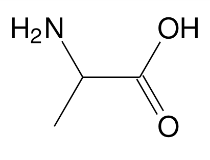

<!-- 
**BO 2012 **:

**Énergie, matière et rayonnement**

+-----------------------------------+-----------------------------------+
| **Notions et contenus** | **Compétences exigibles** |
+-----------------------------------+-----------------------------------+
| **Réaction chimique par échange | \*Mesurer le pH d\'une solution |
| de proton** | aqueuse.* |
| | |
| Le pH : définition, mesure. | Reconnaître un acide, une base |
| | dans la théorie de |
| Théorie de Brönsted : acides | |
| faibles, bases faibles ; notion | Brönsted. |
| d'équilibre ; couple acide-base ; | |
| constante d'acidité K~a~. Échelle | Utiliser les symbolismes →, ← |
| des pK~a\ ~dans l'eau, produit | etdans l'écriture des réactions |
| ionique de l'eau ; domaines de | chimiques pour rendre compte des |
| prédominance (cas des acides | situations observées. |
| carboxyliques, des amines, des | |
| acides α-aminés). | Identifier l'espèce prédominante |
| | d'un couple acide-base |
| Réactions quasi-totales en faveur | connaissant le pH du milieu et le |
| des produits : | pK~a\ ~du couple. |
| | |
| \- acide fort, base forte dans | *Mettre en œuvre une démarche |
| l'eau ; | expérimentale pour* |
| | |
| \- mélange d'un acide fort et | *déterminer une constante |
| d'une base forte dans l'eau. | d'acidité.* |
| | |
| Réaction entre un acide fort et | Calculer le pH d'une solution |
| une base forte : aspect thermique | aqueuse d'acide fort ou de base |
| de la réaction. Sécurité. | forte de concentration usuelle. |
| | |
| Contrôle du pH : solution tampon | *Mettre en évidence l\'influence |
| ; rôle en milieu biologique. | des quantités de matière mises en |
| | jeu sur l'élévation de |
| | température observée.\* |
| | |
| | Extraire et exploiter des |
| | informations pour montrer |
| | |
| | ~l'importance\ du\ contrôle\ du\ |
| | pH\ dans\ un\ milieu\ biologique. |
| | ~ |
+-----------------------------------+-----------------------------------+
 -->

[{.center}](https://phet.colorado.edu/sims/html/acid-base-solutions/latest/acid-base-solutions_fr.html)

## Le pH

### Relation de Sørensen

Le **caractère acide** ou basique d'une solution est mesuré par le
**pH**, une grandeur sans unité.

Le pH est lié à la concentration des ions oxonium $H_3 O^+$ par la relation:

$$
pH=-\log[H_3 O^+]
$$

[[plus|Incertitudes lors des mesures de pH]]
|Une mesure de pH avec un pH-mètre de lycée s'effectue avec une incertitude absolue de 0,05 unité de pH.
|&nbsp;
|La concentration en ions oxonium calculée à partir du pH ne peut contenir au mieux deux chiffres significatifs.

### Contrôle du pH : solution tampon

Pour contrôler le pH d'un milieu, on utilise une solution tampon.

[[prop]]
|Une solution tampon est une solution dont le pH varie peu par ajout de petites quantités d'acide, de base ou d'eau.

Le contrôle du pH joue un grand rôle en milieu biologique.

[[plus|pH du sang]]
|Le pH du sang doit être compris entre 7,38 et 7,42.
|
|- Si le pH devient inférieur à 7,38, on parle d'acidose.
|
<a href="https://commons.wikimedia.org/wiki/File:Symptoms_of_acidosis.png#/media/File:Symptoms_of_acidosis.png"> By <a href="https://en.wikipedia.org/wiki/User:Mikael_H%C3%A4ggstr%C3%B6m" class="extiw" title="en:User:Mikael Häggström">Mikael Häggström Domaine public</a>.

## Solutions acide et basique

Toute solution aqueuse contient des ions oxonium $H_3O^{+}$ et $HO^{-}$ en raison de l'équilibre d'autoprotolyse de l'eau.

$$
\mathrm{2~H_2O_{(l)} \rightleftharpoons H_3O^{+}_{(aq)} + HO^{-}_{(aq)}}
$$

### Produit ionique de l'eau

On constate expérimentalement que le produit [H~3~O^+^].[HO^-^] est une **constante**, on l'appelle produit ionique de l'eau noté K~e~.

A 25°C, K~e~ = 1,0 x 10^-14^

[[appli|Utiliser le produit ionique de l'eau]]
|1. Calculer les concentrations [H~3~O^+^] et [HO^-^] d'un solution de pH=2,0
|2. Calculer les concentrations [H~3~O^+^] et [HO^-^] d'un solution de pH=7,0
|3. Calculer les concentrations [H~3~O^+^] et [HO^-^] d'un solution de pH=10,0

### Solutions acides et basiques

Une solution est:

- acide si:
- basique si:
- neutre si:

## Couples acide/base

À la différence des couples d'oxydoréduction qui échangent des électrons, **les couples acide/base
échangent des ions hydrogène H^+^** *(ou protons)*.

### Acide et base au sens de Brönsted

[[def|Acide de Brönsted]]
|Un **acide** est une espèce chimique capable de **céder** un ou plusieurs **ions hydrogène H^+^**.

[[examples]]
|- acide carboxylique
|- eau

[[def|Base de Brönsted]]
|Une **base** est une espèce chimique capable de **capter** un ou plusieurs **ions hydrogène H^+^**.

[[examples]]
|- amine
|- eau

### Demi-équation acide-base

On associe à un couple acide-base une demi-équation d'échange de proton sous une des forme suivante:

- acide/base : acide = base + H^+^
- AH/A^-^ : AH = A^-^ + H^+^
- BH^+^/B : BH^+^ = B + H^+^

[[examples]]
|- Couple de l'acide éthanoique
|- Couple de la base méthanamine
|- Couples de l'eau

## Acide et bases fortes : réactions totales

Les acides et bases fortes réagissent de façon **totale** avec l'eau *(ou entre eux)*.

[[def|réaction totale]]
|Une réaction est totale si les réactifs réagissent entièrement jusqu'à la **disparition du réactif
|limitant.**
|
|On utilise une simple flèche pour l'écriture de ce type de réactions:
|$$
|r\acute{e}actif(s) \longrightarrow produit(s)
|$$

[[examples]]
|- acides forts: chlorure d'hydrogène : HCl(g), acide nitrique : HNO~3~(l).
|- bases fortes: l'hydroxyde de sodium NaOH(s), éthanolate de sodium : NaC~2~H~5~O.

[[appli|Calcul du pH ]]
|- cas d'un acide fort de concentration c:
|- cas d'une base forte de concentration c:

[[plus|Réaction entre un acide fort et une base forte]]
|Ce type de réaction est totale et libère une grande énergie thermique.
|
|*Exemple* : réaction entre l'acide chloryhydrique et la soude.
|`youtube:K6btETvO6gk`
|
|Equation de réaction :
|
|Calcul de l'élévation de température.(Qréaction = -55 kJmol^-1^)

## Acides et bases faibles : notion d'équilibre chimique

Les acides et bases faibles réagissent de façon **équilibrée** avec l'eau *(ou entre eux)*.

[[def|Equilibre chimique]]
|Un équilibre chimique est une réaction non totale. **Dans l'état final**, le réactif limitant 
|n'est pas entièrement consommé et **les réactifs et les produits coexistent.**
|
|On utilise une double flèche pour l'écriture de ce type de réactions:
|$$
|r\acute{e}actif(s) \leftrightarrows produit(s)
|$$

[[examples]]
|- acide faible: l'acide éthanoïque
|- base faible: l'ammoniac

## Constante d'acidité K~A~ et pK~A~

La force d'un acide est mesurée par sa constante d'acidité K~A~.

 By OpenStax - <a rel="nofollow" class="external free" href="https://cnx.org/contents/havxkyvS">https://cnx.org/contents/havxkyvS</a>
ZIP Download:<a rel="nofollow" class="external free" href="https://cnx.org/exports/85abf193-2bd2-4908-8563-90b8a7ac8df6@9.524.zip/chemistry-9.524.zip">https://cnx.org/exports/85abf193-2bd2-4908-8563-90b8a7ac8df6@9.524.zip/chemistry-9.524.zip</a>, <a href="https://creativecommons.org/licenses/by/4.0" title="Creative Commons Attribution 4.0">CC BY 4.0</a>, <a href="https://commons.wikimedia.org/w/index.php?curid=64300435">Link</a>

Pour un couple acide/base:
$$
K_A=\frac{[base][H_3O^+]}{[acide]}
$$

On utilise souvent le pK~A~:
$$
pK_A = - \log(K_A)
$$

## Diagrammes de prédominance 

Un **diagramme de prédominance** indique quelles espèces chimiques acides ou basiques sont
**majoritaires** en fonction du pH.

On peut démontrer que:

$$
pH=pK_A+\log\left(\frac{[base]}{[acide]}\right)
$$

Donc:

- si pH=pK~A~:
- si pH<pK~A~:
- si pH>pK~A~:

### Diagramme de prédominance des acides carboxylique

|          Couple          |            pK~A~             |
| ------------------------ | ---------------------------- |
| $\sf R-CO_2H/R-CO_2^{-}$ | $2 \lesssim pK_A \lesssim 5$ |

### Diagramme de prédominance des amines 

|        Couple         |             pK~A~             |
| --------------------- | ----------------------------- |
| $\sf R-NH_3^+/R-NH_2$ | $9 \lesssim pK_A \lesssim 11$ |

### Diagramme de prédominance des acides aminés

Composés bifonctionnels contenant des groupes fonctionnels carboxyle et amine et possédant ainsi
deux pK~A~.

[[example]]
|l'alanine : pKa~1~=2,33, pKa~2~=9,71 à 25 °C
|
