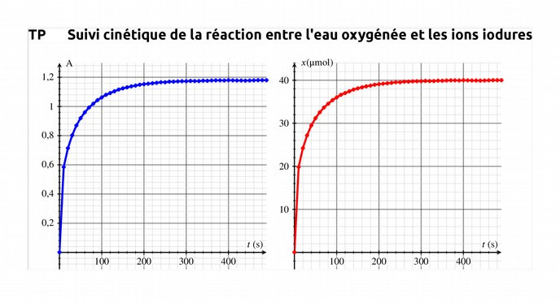

<!--
**BO 2012 **:

+-----------------------------------+-----------------------------------+
| **Temps et évolution chimique : | \*Mettre en œuvre une démarche |
| cinétique et catalyse** | expérimentale pour* |
| | |
| Réactions lentes, rapides ; durée | *suivre dans le temps une |
| d'une réaction chimique**.** | synthèse organique par CCM et en |
| | estimer la durée.* |
| Facteurs cinétiques. Évolution | |
| d'une quantité de matière au | *Mettre en œuvre une démarche |
| cours du temps. | expérimentale pour mettre en |
| | évidence quelques paramètres |
| Temps de demi-réaction. | influençant l'évolution |
| | temporelle d'une réaction |
| Catalyse homogène, hétérogène et | chimique : concentration, |
| enzymatique. | température, solvant.* |
| | |
| | Déterminer un temps de |
| | demi-réaction. |
| | |
| | *Mettre en œuvre une démarche |
| | expérimentale pour mettre en |
| | évidence le rôle d'un |
| | catalyseur.\* |
| | |
| | Extraire et exploiter des |
| | informations sur la catalyse, |
| | notamment en milieu biologique et |
| | dans le domaine industriel, pour |
| | en dégager l'intérêt. |
+-----------------------------------+-----------------------------------+
 -->

La cinétique chimique est l'étude du déroulement temporel des réactions
chimiques.

## Réactions lentes, réactions rapides

`youtube: p60_wV4T110`

### Réactions rapides

Une **réaction** est **_rapide_** si l'état final est atteint dès que les réactifs sont mis en contact.

[[examples]]
|- *réaction de précipitation* de $\sf AgCl(s)$ lors du contact entre les solutions de nitrate d'argent $\sf (Ag^{+}+NO_{3}^{-})$ et le chlorure de sodium $\sf (Na^{+}+Cl^{-})$:
|* * *
|* * *
|* * *
|- *réaction acido-basique* entre l'acide chlorhydrique $\sf (H_{3}O^{+}+Cl^{-})$ et la soude $\sf (Na^{+}+HO^{-})$:
|* * *
|* * *
|* * *
|- *réaction d'oxydoréduction* entre l'ion permanganate $\sf MnO_{4}^{-}$ et l'ion fer(II) $\sf Fe^{2+}$ sachant que les couples mis en jeu sont : $\sf MnO_{4}^{-}/Mn^{2+}$ et $\sf Fe^{3+}/Fe^{2+}$
|* * *
|* * *
|* * *
|* * *
|* * *
|* * *

### Réactions lentes

Une **réaction** est **_lente_** si elle dure plus de quelques secondes.

[[examples]]
|- _réaction d'oxydoréduction_ de l'ion thiosulfate $\sf S_{2}O_{3}^{2-}$ en milieu acide  sachant que les demi équation redox sont:
|$$
|\begin{aligned}
|\sf S_{2}O_{3}^{2-}&/S & &: & S_{2}O_{3}^{2-} + 6 H^{+} + 4 e^{-} &= 2 S + 3 H_{2}O \\[1ex]
|\sf SO_{2}&/S_{2}O_{3}^{2-}& &: & 2 SO_{2} + 2 H^{+} + 4 e^{-} &= S_{2}O_{3}^{2-} + H_ {2}O \\[1ex]
|\end{aligned}
|$$
|* * *
|* * *
|* * *
|* * *
|* * *
|* * *
|- *réaction en chimie organique* entre l'acide propanoïque et l'éthanol qui aboutit au propanoate d'éthyle.
|* * *
|* * *
|* * *

## Comment suivre l'évolution d'un système chimique ?

On peut suivre l'évolution d'une réaction chimique par une **méthode
physique** si un des réactifs ou produit de la réaction est :

- *coloré* : suivi
  \_\_\_\_\_\_\_\_\_\_\_\_\_\_\_\_\_\_\_\_\_\_\_\_\_\_\_\_\_\_\_\_
- *ionique* : suivi
  \_\_\_\_\_\_\_\_\_\_\_\_\_\_\_\_\_\_\_\_\_\_\_\_\_\_\_\_\_\_\_\_
- *gazeux* : suivi
  \_\_\_\_\_\_\_\_\_\_\_\_\_\_\_\_\_\_\_\_\_\_\_\_\_\_\_\_\_\_\_

[[example]]
|suivi spectrophotométrique de la réaction entre les ions iodure et l'eau oxygénée
|

[[plus|Méthode chimique]]
|Si la réaction est suffisamment lente, on peut utiliser une méthode
|chimique qui consiste à doser _un échantillon du mélange réactionnel à
|divers instants._
|
|*Remarque* : Lorsque l'échantillon est prélevé, il est plongé dans un bain
|de glace afin de bloquer l'évolution du système, cette opération est
|appelée **trempe**.

## Temps de demi-réaction t~1/2~

[[def|Temps de demi-réaction]]
|**Le temps de demi-réaction, noté t**~**1/2**~, est la durée nécessaire
|pour que la moitié de l'avancement final $x_f$ soit atteint.

$$
x(t_{1/2}) = \frac{x_f}{2}
$$

## Quels sont les facteurs cinétiques d'une réaction ?

La vitesse d'évolution d'un système chimique augmente avec :

- les **concentrations des réactifs**,
- la **température** du système,
- et dans le cas d'un solide, la **surface de contact du réactif solide**
  avec les autres réactifs.

[[plus|Illustrations expérimentales]]
|Cette [playlist](https://www.youtube.com/playlist?list=PLNiZc9jgZ2W6QWTx5Mr2n7xAGntROa0s8) illustre les divers facteurs cinétiques:
|
|- **Exp 1-Réactions rapides et lentes:** La réduction de l'ion permanganate est rapide en présence d'ions fer(II), mais lente en présence d'acide oxalique.
|- **Exp 2-Influence de la concentration des réactifs:** Dans  trois  béchers  posés  sur  un  repère,  on  place  20  mL  d’acide  chlorhydrique  molaire; on ajoute dans chaque bécher 20 mL d’une solution de thiosulfate de sodium de concentrations 0,05 mol/L ; 0,1 mol/L et 0,2 mol/L.
|- **Exp 3- Influence de la température:** Réduction de l'ion permanganate par l'acide oxalique à trois températures différentes.
|- **Exp 4-Influence de la présence de catalyseurs:** Décomposition de l'eau oxygénée: bécher 1: sans catalyseur, bécher 2: catalyse hétérogène avec un fil de cuivre, bécher 3: catalyse homogène avec des ions fer(III), bécher 4: catalyse enzymatique avec de la catalase.

## Qu'est-ce qu'un catalyseur ?

[[def|Catalyseur]]
|Un **catalyseur** est une espèce chimique qui **accélère une réaction
|chimique** sans être consommée par celle-ci ; sa formule n'apparaît donc
|pas dans l'équation de réaction.

Il existe trois types de catalyses:

- **catalyse homogène** lorsque le catalyseur et tous les réactifs sont dans la même phase,
- **catalyse hétérogène** si le catalyseur est dans une autre phase que les réactifs.(Par exemple un catalyseur solide dans une solution réactionnelle)
- **catalyse enzymatique** si le catalyseur est une enzyme.

[[plus|Les enzymes en biochimie]]
|Une enzyme est une [protéine](https://fr.wikipedia.org/wiki/Prot%C3%A9ine) dotée de propriétés catalytiques.
|Ci dessous est représentée l'enzyme PDB1OBB qui permet, dans l'organisme, d'accelérer la réaction de décomposition du maltose en deux molécules de glucose.
|
 Par <a href="//commons.wikimedia.org/wiki/User:Evolution_and_evolvability" title="User:Evolution and evolvability">Thomas Shafee</a> — Travail personnel, <a href="https://creativecommons.org/licenses/by-sa/4.0" title="Creative Commons Attribution-Share Alike 4.0">CC BY-SA 4.0</a>, <a href="https://commons.wikimedia.org/w/index.php?curid=38738689">Lien</a>

|
|La représentation en ruban est utilisée pour représenter les structures en hélices des protéines qui sont construites autour de la liaison peptidique $\sf -CO-NH-$.
|
 Par <a href="//commons.wikimedia.org/wiki/User:Chemistry-grad-student" class="mw-redirect" title="User:Chemistry-grad-student">Chemistry-grad-student</a> — Travail personnel, <a href="https://creativecommons.org/licenses/by-sa/3.0" title="Creative Commons Attribution-Share Alike 3.0">CC BY-SA 3.0</a>, <a href="https://commons.wikimedia.org/w/index.php?curid=16345656">Lien</a>
