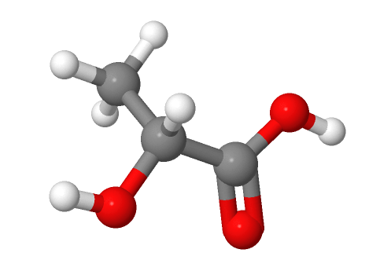
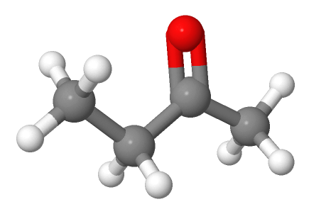
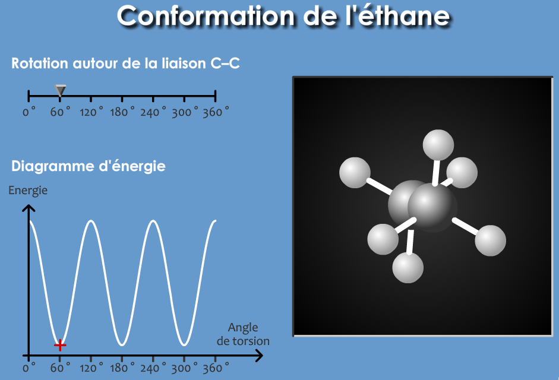
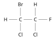

<!--
**BO 2012 **:

+-----------------------------------+-----------------------------------+
| **Notions et contenus** | **Compétences exigibles** |
+-----------------------------------+-----------------------------------+
| **Représentation spatiale des | Reconnaître des espèces chirales |
| molécules** | à partir de leur représentation. |
| | |
| Chiralité : définition, approche | Utiliser la représentation de |
| historique. | Cram. |
| | |
| Représentation de Cram. Carbone | Identifier les atomes de carbone |
| asymétrique. | asymétrique d'une |
| | |
| Chiralité des acides α-aminés. | molécule donnée. |
| | |
| Énantiomérie, mélange racémique, | À partir d'un modèle moléculaire |
| diastéréoisomérie | ou d'une représentation, |
| | reconnaître si des molécules sont |
| (_Z/E_, deux atomes de carbone | identiques, énantiomères ou |
| asymétriques). | diastéréoisomères. |
| | |
| Conformation : rotation autour | _Pratiquer une démarche |
| d'une liaison simple ; | expérimentale pour mettre en |
| | évidence des propriétés |
| conformation la plus stable. | différentes de |
| | diastéréoisomères._ |
| Formule topologique des molécules | |
| organiques. Propriétés | _Visualiser, à partir d'un modèle |
| biologiques et stéréoisomérie. | moléculaire ou d'un logiciel de |
| | simulation, les différentes |
| | conformations d'une molécule._ |
| | |
| | Utiliser la représentation |
| | topologique des molécules |
| | organiques. |
| | |
| | Extraire et exploiter des |
| | informations sur : |
| | |
| | --- les propriétés biologiques de |
| | stéréoisomères, |
| | |
| | --- les conformations de |
| | molécules biologiques, |
| | |
| | pour mettre en évidence |
| | l'importance de la stéréoisomérie |
| | |
| | dans la nature. |
+-----------------------------------+-----------------------------------+ -->

## Comment reconnaître une molécule chirale ?

[[def|molécule chirale]]
|Une molécule est **chirale** si elle **n'est pas superposable à son
|image dans un miroir**.

[[example]]
|la molécule CHIBrCl
|
 Par Calvero. — Selfmade with ChemDraw., Domaine public, <a href="https://commons.wikimedia.org/w/index.php?curid=1299969">Lien</a>

[[prop]]
|Une molécule chirale ne présente pas de plan ou de centre de symétrie.

## Molécules avec un atome de carbone asymétrique

[[def|carbone asymétrique]]
|Un atome de **carbone asymétrique** est un atome de carbone tétraédrique lié à quatre atomes ou
|groupes d'atomes tous différents. On le note habituellement $C^{*}$.

[[prop]]
|Une molécule possédant un atome de carbone asymétrique est toujours chirale.

[[examples]]
|- l'acide lactique
|C(%3DO)O)
|- le butan-2-ol
|

[[appli|Représentation topologique]]
|Donner la représentation topologique de ces molécules en indiquant par une étoile le carbone
|asymétrique.

## Quelles sont les différentes relations de stéréoisomérie ?

**Rappel**: deux molécules sont **isomères** si elles ont la **même
formule brute**, mais une formule développée différente.

[[def|stéréoisomères]]
|Deux molécules sont **stéréoisomères** si elles ont la même **formule plane**, mais une
|**organisation spatiale** des atomes différente.

On distingue **deux types** de stéréoisomères :

- Les stéréoisomères de **conformation**,
- les stéréoisomères de **configuration**

### Stéréoisomères de conformation

On passe d'un stéréoisomère de conformation à un autre par **rotation autour d'une liaison simple**(sans rupture de liaison).

[[example]]
|Les conformères de l'éthane:
|

### Stéréoisomères de configuration

Deux stéréoisomères de configuration sont des molécules différentes, pour passer de l'un à
l'autre, il est nécessaire de **rompre des liaisons chimiques**.

[[examples]]
|- stéréoisomères Z/E du but-2-ène,
|
|&nbsp;
|
|&nbsp;
|
|- stéréoisomères de l'acide lactique et du butan-2-ol.
|
|&nbsp;
|
|&nbsp;
|

## Molécules énantiomères et diastéréoisomères

On distingue deux types de **stéréoisomères de configuration** :

- les **énantiomères** qui sont l'image l'un de l'autre dans un miroir,
- et les **diastéréoisomères** qui ne le sont pas.

[[appli|molécule à deux atomes de carbone asymétrique $\sf CHBrCl-CHClF$]]
|{.right}
|1. Représenter les 4 stéréoisomères de configuration de cette molécule.
|2. Représenter par des flèches les relations de stéréosomérie qui les lient(énatiomérie ou diastéréoisomérie)
|&nbsp;
|&nbsp;

## Propriétés des stéréoisomères

[[prop]]
|Les **diastéréoisomères** possèdent des **propriétés physiques et
|chimiques différentes**, et peuvent donc être aisément séparés.
|
|Par contre, **deux énantiomères ont les mêmes propriétés physiques et
|chimiques** mais n'ont pas en général les mêmes propriétés biochimiques.

En raison de leur ressemblance, deux énantiomères sont difficiles à séparer ou même à obtenir
séparément lors d'une synthèse.

[[def| Mélange racémique]]
|Un mélange contenant deux énantiomères en proportion égale est appelé **mélange racémique.**
