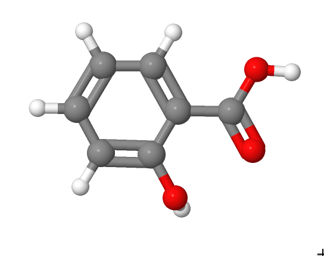
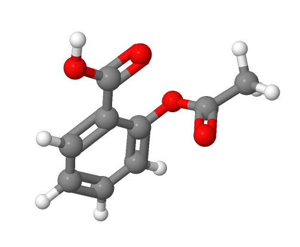
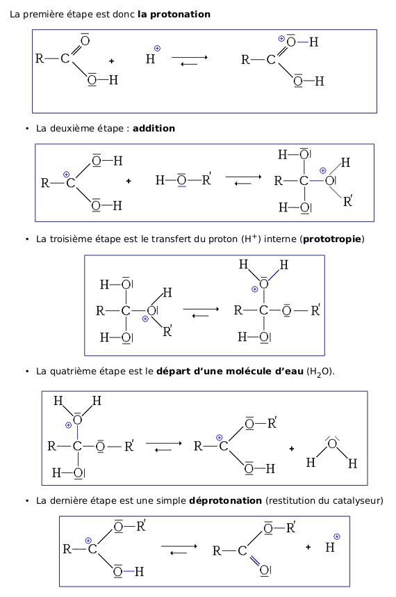

<!--
**Transformation en chimie organique**
Transformation en chimie organique
Aspect macroscopique :
- Modification de chaîne, modification de groupe
caractéristique.
- Grandes catégories de réactions en chimie organique :
substitution, addition, élimination.
Aspect microscopique :
- Liaison polarisée, site donneur et site accepteur de
doublet d’électrons.
- Interaction entre des sites donneurs et accepteurs de
doublet d'électrons ; représentation du mouvement d’un
doublet d’électrons à l’aide d’une flèche courbe lors d’une
étape d’un mécanisme réactionnel.

Reconnaître les groupes caractéristiques dans les alcool,
aldéhyde, cétone, acide carboxylique, ester, amine,
amide.
Utiliser le nom systématique d’une espèce chimique
organique pour en déterminer les groupes caractéristiques
et la chaîne carbonée.
Distinguer une modification de chaîne d’une modification
de groupe caractéristique.
Déterminer la catégorie d’une réaction (substitution,
addition, élimination) à partir de l’examen de la nature
des réactifs et des produits.
Déterminer la polarisation des liaisons en lien avec
l’électronégativité (table fournie).
Identifier un site donneur, un site accepteur de doublet
d'électrons.
Pour une ou plusieurs étapes d’un mécanisme
réactionnel donné, relier par une flèche courbe les sites
donneur et accepteur en vue d’expliquer la formation ou
la rupture de liaisons.
-->

## Modification d'une molécule

### Modification de la chaîne carbonée

La **distillation du pétrole** conduit à des mélanges d'hydrocarbures.

Certains sont directement utilisés, mais la plupart doivent être
modifiés pour répondre aux besoins du marché.

- Raccourcissement de la chaîne carbonée

[[examples]]
|- (craquage) hexane → propane + alcène
|- (vapocraquage) butane → éthène + produit inorganique

- Modification de la structure de la chaîne carbonée

[[examples]]
|- (isomérisation) octane → 2,2,4-triméthylpentane
|- (cyclisation) hexane → méthylcyclopentane + produit inorganique
|- (deshydrocyclisation) hexane → benzène + 4H~2~

- Allongement de la chaîne carbonée

[[examples]]
|- (alkylation) méthylpropane + méthylpropène → 2,2,4-triméthylpentane
|- (polyaddition) n éthène → polyéthylène

### Modification de groupe caractéristique

La création de nouvelles espèces chimiques résulte souvent d'un **changement de groupe
caractéristique**.

Synthèse de l'aspirine(acide acétylsalicylique) à partir d'acide salicylique.

**acide salycilique**

**aspirine**

## Quelles sont les grandes catégories de réaction en chimie organique ?

Elles sont au nombre de trois :

- **les réactions de substitution** : un atome ou un groupe d'atome est
  **remplacé** par un autre atome ou groupe d'atome.
- **les réactions d'addition** : des atomes ou groupes d'atomes sont
  **ajoutés** aux atomes d'une *liaison multiple (ou d'un cycle)*.
- **les réactions d'élimination** : des atomes ou de groupes
  d'atomes, portés par des atomes adjacents sont **éliminés** pour former
  une *liaison multiple(ou un cycle).*

## Mécanismes réactionnels

Un mécanisme réactionnel est la *modélisation microscopique* des
**mouvements de doublets d'électrons**:

- de **sites donneurs** : doublet liant ou non-liants
- vers des **sites accepteurs** : atome portant une charge positive
  partielle ou entière.

[[example]]
|Mécanisme d'estérification:
|
|
|*[Article Wikipedia sur l'estérification](https://fr.wikipedia.org/wiki/Est%C3%A9rification#Alcools_primaires_et_secondaires)*{.cite-source}
