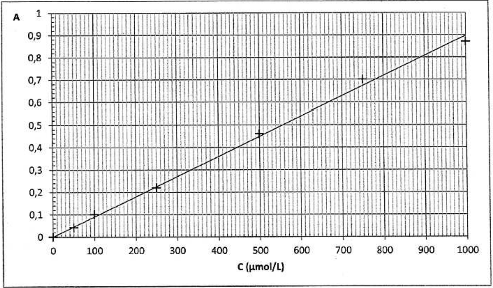
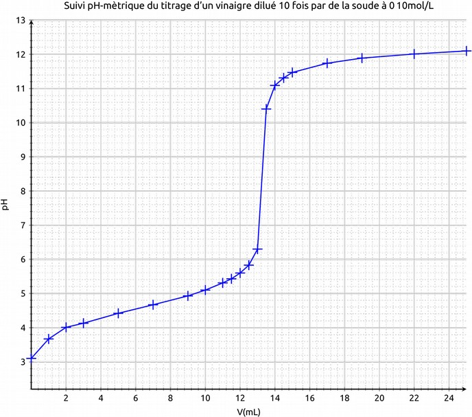
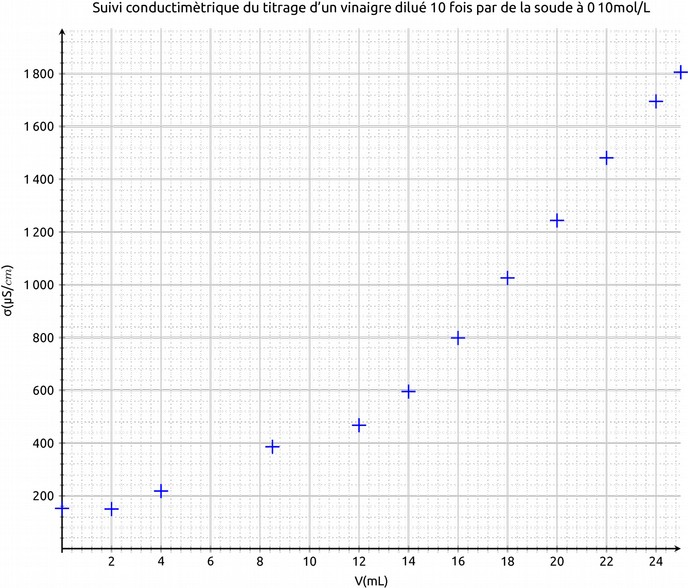

---
tags:
  [
    'dosage',
    'contrôle de qualité',
    'titrage',
    'équivalence',
    'réaction',
    'concentration',
  ]
---

<!--
**BO 2012 **:

+-----------------------------------+-----------------------------------+
| **Contrôle de la qualité par | \*Pratiquer une démarche |
| dosage** | expérimentale pour déterminer la |
| | concentration d'une espèce à |
| Dosages par étalonnage : | l'aide de courbes d'étalonnage en |
| | utilisant la spectrophotométrie |
| --- spectrophotométrie ; loi de | et la conductimétrie, dans le |
| Beer-Lambert ; | domaine de la santé, de |
| | l'environnement ou du contrôle de |
| --- conductimétrie ; explication | la qualité.* |
| qualitative de la loi de | |
| | Établir l'équation de la réaction |
| Kohlrausch, par analogie avec la | support de titrage à partir d'un |
| loi de Beer-Lambert. | protocole expérimental. |
| | |
| Dosages par titrage direct. | *Pratiquer une démarche |
| | expérimentale pour déterminer la |
| Réaction support de titrage ; | concentration d'une espèce |
| caractère quantitatif. | chimique par titrage par le suivi |
| Équivalence dans un titrage ; | d'une grandeur physique et par la |
| repérage de l'équivalence pour un | visualisation d'un changement de |
| titrage pH-métrique, | couleur, dans le domaine de la |
| conductimétrique et par | santé, de l'environnement ou du |
| utilisation d'un indicateur de | contrôle de la qualité.\* |
| fin de réaction. | |
| | Interpréter qualitativement un |
| | changement de pente dans un |
| | titrage conductimétrique. |
+-----------------------------------+-----------------------------------+ -->

**Réaliser un dosage** c'est déterminer, avec la plus grande précision possible, la concentration
d'une espèce chimique dissoute en solution.

## Dosage par étalonnage

Un **dosage par étalonnage** consiste à déterminer la concentration d'une espèce en solution en
comparant une grandeur caractéristique de la solution : _absorbance, conductivité électrique_, à la
même grandeur mesurée pour des **solutions étalons.**

[[appli| Dosage spectrophotométrique du diiode]]
|_[Exercice 2](http://labolycee.org/2012/2012-Pondichery-Exo2-Sujet-Spectrophotometrie-5-5pts.pdf) Bac S Pondichéry 2012._{.cite-source}
|
|
|Absorbance de la solution S : A = 0,78.
|
|Déterminer graphiquement la concentration molaire $C_{S.exp}$ en diiode de la solution S.

## Dosage par titrage

Un dosage par titrage est une technique de dosage mettant en jeu une
**réaction chimique**. La réaction de titrage doit être **totale,
rapide** et unique.

 By Mehinger - Syrabas-titrering.svg, <a href="https://creativecommons.org/licenses/by-sa/4.0" title="Creative Commons Attribution-Share Alike 4.0">CC BY-SA 4.0</a>, <a href="https://commons.wikimedia.org/w/index.php?curid=78256575">Link</a>

### Équivalence d'un titrage

[[def|Equivalence d'un titrage]]
|L'équivalence d'un titrage se produit quand la solution titrante et la solution titrée ont réagi
|dans les proportions stœchiométriques.

C'est à l'équivalence qu'on détermine la concentration du réactif titré.

### Relation à l'équivalence

Soit la réaction de titrage d'équation:

$$
\sf a\ R\acute{e}actif_{titr\acute{e}} + b\ R\acute{e}actif_{titrant} \longrightarrow Produit(s)
$$

On peut montrer qu'à l'équivalence:

$$
\frac{n(R\acute{e}actif_{titr\acute{e}})}{a} = \frac{n(R\acute{e}actif_{titrant})}{b}
$$

Dans le cas particulier où la stœchiométrie est a=1, b=1, la quantité de réactif titrant versé à
l'équivalence est égale à la quantité initiale de réactif titré:
$n(R\acute{e}actif_{titr\acute{e}\ initial}) = n(R\acute{e}actif_{titrant\ vers\acute{e}\ \grave{a}\ l'\acute{e}quivalence})$

[[example]]
|Titrage d'un acide*(titré)* par une base*(titrant)* avec une stoechiométrie 1-1:
|
|$$
|n(A)_{initial} = n(B)_{eq}
|$$
|
|Ou en termes de concentrations:
|
|$$
|c_A V(A)_{initial} = c_B V(B)_{eq}
|$$
|
|On peut en déduire La concentration de l'acide:
|
|$$
|c_A =  \frac{c_B V(B)_{eq}}{V(A)_{initial}}
|$$

[[appli|Titrage iodométrique]]
|Lors du titrage d'un volume V~1~ = 10,0 mL une solution de thiosulfate de sodium $\sf (2Na^{+} + S_2O_3^{2-})$
|par une solution de diiode $\sf I_2$
|concentration c~2~ = 1,0×10^-3^ mol.L^-1^ on observe l'équivalence pour
|un volume V~2E~ = 9,5 mL.
|
|Exprimer puis calculer la concentration c~1~ en diiode de la solution
|titrée sachant que la réaction support du titrage a pour
|équation :
|$$
|\sf I_2 ( aq )  +  2 S_2O_3^{2-}( aq )   \longrightarrow   2I^{-} ( aq )+ S_4 O_6 ^{2-} ( aq ) 
|$$
|

## Comment repérer l'équivalence d'un titrage ?

**Le passage de l'équivalence** correspond à un changement de réactif limitant:

- **avant l'équivalence** : c'est le
  réactif\_\_\_\_\_\_\_\_\_\_\_\_\_\_\_\_\_qui est en excès.
- **après l'équivalence** : c'est le
  réactif\_\_\_\_\_\_\_\_\_\_\_\_\_\_\_\_\_qui est en excès.

### Suivi d'une grandeur

Suivant le type de réaction, le suivi d'une grandeur(pH/conductivité σ) permet d'observer le
**changement de réactif limitant** :

[[example]]
|Titrage du vinaigre dilué par la soude
|
|#### Suivi pH-mètrique
|
|
|Le repérage de l'équivalence peut-être obtenu par la méthode des tangentes
|<http://labolycee.org/anims/methode-tangente.swf>
|Ou par le calcul de la dérivée du pH en fonction du volume.
|
|#### Suivi conductimètrique
|
|
|Le passage de l'équivalence entraîne une rupture de pente, avant l'équivalence le réactif titré
|est consommée lors de chaque ajout de réactif titrant, alors qu'après il reste en solution.
|
|On donne les conductivités molaires ioniques des ions mis en jeu:
|λ (Na^+^)= 5,00 mS.m^2^.mol^-1^ ;λ (CH3COO^-^)= 4,09 mS.m^2^.mol^-1^ λ (HO-)= 19,8 mS.m^2^.mol^-1^

### Utilisation d'un indicateur coloré de pH

Un indicateur coloré permet de repérer précisément le volume équivalent si le **pH à l'équivalence
appartient à la [zone de virage](https://fr.wikipedia.org/wiki/Titrage_par_indicateurs_color%C3%A9s#Choix_de_l'indicateur_color%C3%A9) de l'indicateur**.

 <a href="//commons.wikimedia.org/wiki/File:Indicateur_de_ph.jpg" title="Copyrighted free use">Copyrighted free use</a>, <a href="https://commons.wikimedia.org/w/index.php?curid=531096">Link</a>

