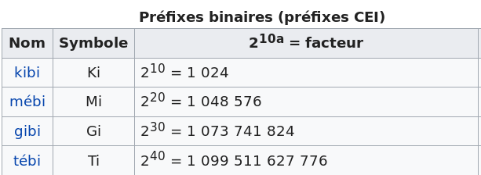
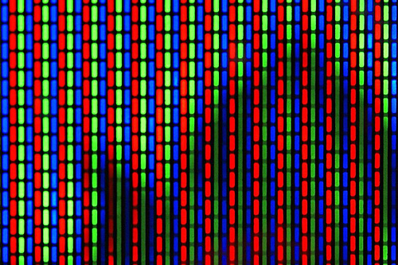
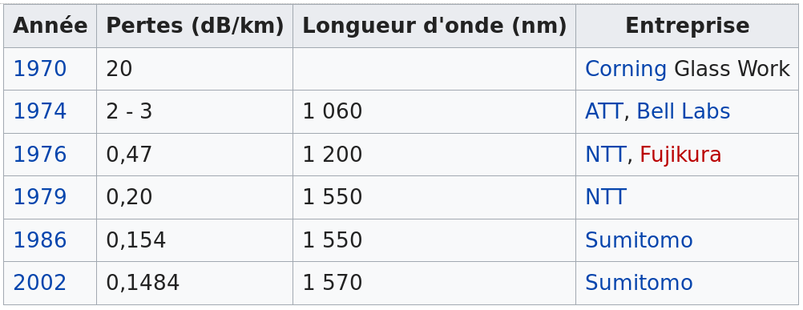
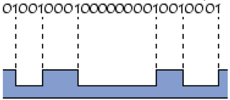
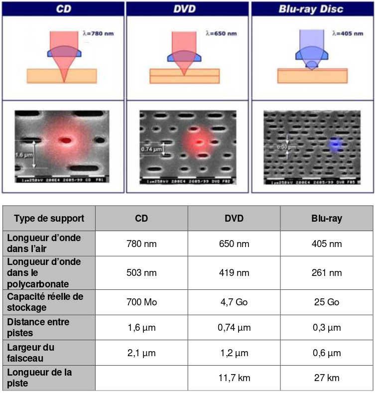

---
tags:
  [
    'conversion',
    'analogique',
    'numérique',
    "codage de l'information"
  ]
---

<!--
**BO 2012 **:

**Transmettre et stocker de l'information**

+-----------------------------------+-----------------------------------+
| **Notions et contenus** | **Compétences exigibles** |
+-----------------------------------+-----------------------------------+
| **Chaîne de transmission | Identifier les éléments d'une |
| d'informations** | chaîne de transmission |
| | d'informations. |
| | |
| | Recueillir et exploiter des |
| | informations concernant des |
| | éléments de chaînes de |
| | transmission d'informations et |
| | leur évolution récente. |
+-----------------------------------+-----------------------------------+
| **Images numériques** | Associer un tableau de nombres à |
| | une image numérique. _Mettre en |
| Caractéristiques d'une image | œuvre un protocole expérimental |
| numérique : pixellisation, codage | utilisant un capteur (caméra ou |
| RVB et niveaux de gris. | appareil photo numériques par |
| | exemple) pour étudier un |
| | phénomène optique._ |
+-----------------------------------+-----------------------------------+
| **Signal analogique et signal | Reconnaître des signaux de nature |
| numérique** | analogique et des signaux de |
| | nature numérique. |
| Conversion d'un signal analogique | |
| en signal numérique. | _Mettre en œuvre un protocole |
| Échantillonnage ; quantification | expérimental utilisant un |
| ; numérisation. | échantillonneur-bloqueur et/ou un |
| | convertisseur analogique |
| | numérique (CAN) pour étudier |
| | l'influence des différents |
| | paramètres sur la numérisation |
| | d'un signal (d'origine sonore par |
| | exemple)._ |
+-----------------------------------+-----------------------------------+

+-----------------------------------+-----------------------------------+
| **Procédés physiques de | Exploiter des informations pour |
| transmission** | comparer les différents types de |
| | transmission. |
| Propagation libre et propagation | |
| guidée. Transmission : | Caractériser une transmission |
| | numérique par son débit binaire. |
| \- par câble ; | |
| | Évaluer l'affaiblissement d'un |
| \- par fibre optique : notion de | signal à l'aide du coefficient |
| mode ; | d'atténuation. |
| | |
| \- transmission hertzienne. Débit | _Mettre en œuvre un dispositif de |
| binaire. Atténuations. | transmission de données (câble, |
| | fibre optique)._ |
+-----------------------------------+-----------------------------------+
| **Stockage optique** | Expliquer le principe de la |
| | lecture par une approche |
| Écriture et lecture des données | interférentielle. |
| sur un disque optique. Capacités | |
| de stockage. | Relier la capacité de stockage et |
| | son évolution au phénomène de |
| | diffraction. |
+-----------------------------------+-----------------------------------+
 -->

## Signal analogique et signal numérique

Un **signal analogique** varie généralement de façon **continue** alors qu'un **signal numérique**
ne prend que des **valeurs discrètes**.

### Codage binaire

La plupart du temps, les informations sont numérisées sous forme binaire (0 ou 1).

[[def|bit]]
|1 bit représente une unité d'information: 0 ou 1.

On utilise souvent des multiples du bit: l'**octet**(*byte* en anglais):

$$
1\ octet = 8\ bit
$$

**Remarque** : dans le domaine du binaire(base 2), on utilise des
préfixes différents de ceux du système international(base 10).

*[article Wikipedia sur les préfixes binaires](https://fr.wikipedia.org/wiki/Pr%C3%A9fixe_binaire#Tableaux_des_pr%C3%A9fixes_binaires_et_d%C3%A9cimaux)*{.cite-source}

### Conversion analogique numérique

La qualité de la conversion analogique numérique dépend de deux paramètres :

- **la résolution** : ou pas du convertisseur (résolution en tension)
- **la fréquence d'échantillonnage** (résolution temporelle)

[[appli|Stockage sur CD]]
|Quelle durée de son stéréo peut-être enregistrée sur un CD de 700 Mo:
|
|1. Numérisé en qualité CD: 16 bits / 44,1kHz par voie. 
|2. Numérisé en `mp3` à 320 kbps(kilo bits per second) pour les deux voies.

## Codage d'une image numérique

Une image numérique est composée d'une succession de pixels. Pour chaque pixel, on code la couleur
par synthèse additive RVB.

*[graphicdesign.stackexchange.com Licence CC-BY-SA](https://graphicdesign.stackexchange.com/a/20572)*{.cite-source}

Sur un pixel, l'intensité lumineuse de chaque composante(RVB) est codée par un octet, soit 8 bits = 2^8^ =
256 niveaux par composante.

Ce qui donne un ensemble de \_\_\_\_\_\_\_\_\_\_\_\_\_\_nuances de couleurs.

## Transmission d'informations

Dans le domaine numérique, toute information, image, son, texte est
numérisée sous forme binaire ;

La qualité d'une transmission d'information dépend essentiellement de
deux paramètres :

- le **débit binaire** en bit.s^-1^.

[[examples]]
|- *USB 3.0:* 5 Gbit/s;
|- *Bluetooth v5:* 3 Mbit/s
|- *Accés fibre FTTH:* 1GBit/s en téléchargement.
|
|*[Article Wikipedia sur le débit binaire](https://fr.wikipedia.org/wiki/D%C3%A9bit_binaire#Exemples)*{.cite-source}

- Le **coefficient d'atténuation** de la ligne en dB.m^-1^ qui mesure
  l'affaiblissement de la puissance du signal avec le distance parcourue.

[[examples]]
|Atténuation des fibres optiques au cours du temps.
|
|
|*[Article Wikipedia sur les fibres optiques](https://fr.wikipedia.org/wiki/Fibre_optique#Att%C3%A9nuation)*{.cite-source}

## Stockage optique

Les CD et DVD permettent le stockage d'informations binaires par gravure de creux dans un disque en polycarbonate.

<a href="http://creativecommons.org/licenses/by-sa/3.0/" title="Creative Commons Attribution-Share Alike 3.0">CC BY-SA 3.0</a>, <a href="https://commons.wikimedia.org/w/index.php?curid=1353973">Lien</a>

`youtube: BxQWm3i-AvY`

*[Médiathèque du CEA](http://www.cea.fr/multimedia/Pages/animations/technologies/lecteur-CD.aspx)*{.cite-source}

L'épaisseur des alvéoles est calculée afin que le passage sur une alvéole corresponde à des
**interférences** destructives. On peut ainsi repérer les alvéoles en mesurant l'intensité
lumineuse réfléchie par le disque.

[[plus|Codage Miller]]
|Contrairement à ce que l'on peut lire parfois, les creux et les bosses ne représentent pas les 
|« 0 » et les « 1 » des informations binaires. C’est le passage d’un creux à une bosse ou d’une 
|bosse à un creux qui indique un « 1 ». S’il n’y a pas de passage bosse-creux, alors il s’agit 
|d’un « 0 ». On appelle cela un « front ».*[Article Wikipedia sur le CD](https://fr.wikipedia.org/wiki/Disque_compact#D%C3%A9tails_physiques)*{.cite-source}
|*BAC Antilles 2014*{.cite-source}

La **capacité de stockage est limitée par la diffraction** qui « empêche » le faisceau d'être
infiniment fin. En utilisant des plus courtes longueurs d'ondes, on diminue la largeur du faisceau
de diffraction, et on augmente ainsi la capacité de stockage à surface équivalente.

*BAC Antilles 2014*{.cite-source}
