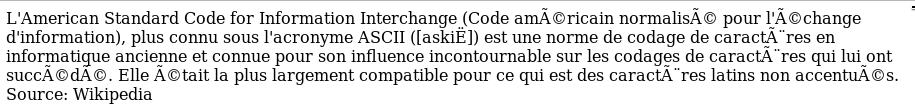
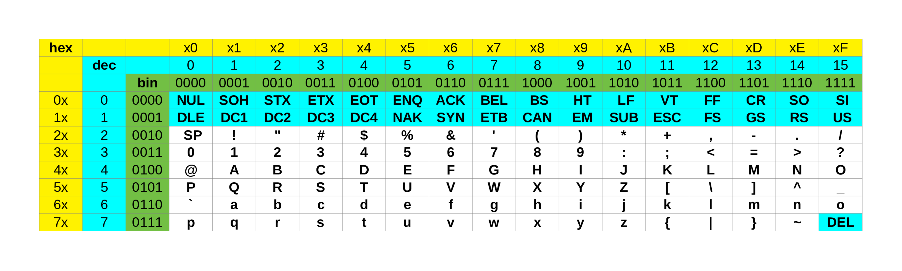
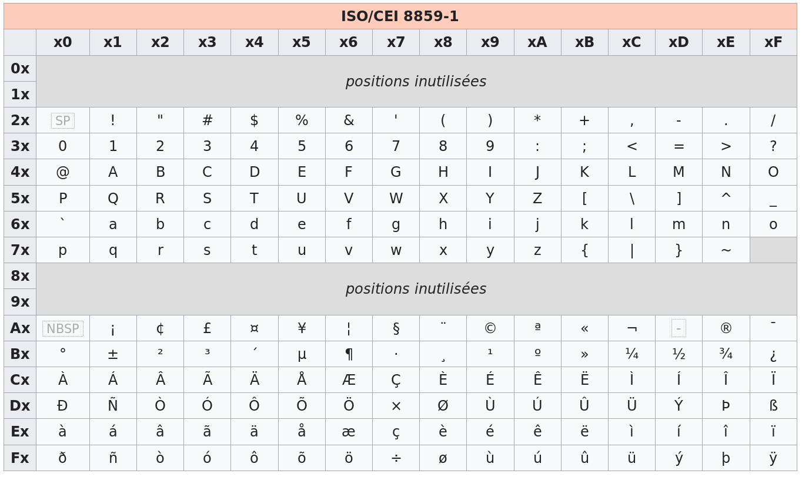

::: programme
+--------------------------------+-------------------------------------+---------------------------------------+
|            Contenus            |         Capacités attendues         |             Commentaires              |
+================================+=====================================+=======================================+
| Représentation d’un            | Identifier l'intérêt des différents | Aucune connaissance précise des       |
| texte en machine.              | systèmes d'encodage.                | normes d'encodage n'est exigible      |
|                                |                                     |                                       |
| Exemples des                   | Convertir un fichier texte dans     |                                       |
| encodages `ASCII`,             | différents formats d'encodage.      |                                       |
| `ISO-8859-1`, `Unicode`        |                                     |                                       |
+--------------------------------+-------------------------------------+---------------------------------------+
:::

Pour représenter un texte, il est nécessaire d'afficher les caractères qui le composent. Le choix
du codage des caractères dépend fortement des langues, ainsi la langue française comporte de
nombreuses lettres accentuées non utilisées en anglais par exemple:

<kbd>é</kbd>, <kbd>è</kbd>, <kbd>ê</kbd>, <kbd>ç</kbd>, <kbd>à</kbd>...

Le premier codage à avoir été utilisé est le codage ascii(American Standard Code for Information
Interchange), qui ne prévoit pas l'utilisation de lettres accentuées et qui peut vous amener
parfois à lire des textes à la limite du compréhensible sur vos écrans.

En voici un exemple



## Le codage ascii

> Le codage ASCII est une norme de codage de caractères en informatique ancienne et connue pour son
> influence incontournable sur les codages de caractères qui lui ont succédé. Elle était la plus
> largement compatible pour ce qui est des caractères latins non accentués. **ASCII contient les
> caractères nécessaires pour écrire en anglais.**

> L'ASCII définit seulement **128 caractères** numérotés de 0 à 127 et codés en binaire de 0000000
> à 1111111. Sept bits suffisent donc pour représenter un caractère codé en ASCII. Toutefois, les
> ordinateurs travaillant presque tous sur un multiple de huit bits (multiple d'un octet) depuis
> les années 1970, chaque caractère d'un texte en ASCII est souvent stocké dans un octet dont le 8e
> bit est 0. &nbsp; *[Article ASCII sur Wikipedia](https://fr.wikipedia.org/wiki/American_Standard_Code_for_Information_Interchange)*{.cite-source}

Voici la table ascii:



Certains des caractères présents ne peuvent pas être affichés(repérés par un fond bleu), ce sont
des caractères de contrôle. Vous pouvez trouver leur signification sur cette
[page](http://isn.fil.univ-lille1.fr/activite3/doc/ascii.txt).

Pour lire le tableau, on associe au caractère le code binaire suivant: `n°deligne_n°decolonne`. Par
exemple, le caractère <kbd>a</kbd>  est situé dans la case correspondant à la 7ème ligne, 2ème
colonne. Sa représentation binaire est:`110_0001` soit sous la forme d'un octet: `01100001`. Ce qui
correspond au caractère 97 en décimal.

Pour faciliter la lecture des codes ascii par un humain, il est plus commode de coder les numéros
de ligne et de colonne en hexadécimal, et la lettre 'a' aura alors pour code `61` en hexadécimal.

## L'encodage ascii étendu

> La nécessité de représenter des textes comportant des caractères non présents dans la table ASCII
> tels ceux de l'alphabet latin utilisés en français comme le 'à', le 'é' ou le 'ç' impose
> l'utilisation d'un autre codage que l'ASCII.

Plusieurs propositions de codage coexistent.

Afin de faciliter les choses, ces propositions sont des extensions du codage ASCII:

- le codage des caractères présents dans la table ASCII est conservé ;
- le principe du codage de chacun des caractères sur un octet est conservé.

Mais les 8 bits de l'octet vont être utilisés. Cela permet de coder $2^8$ = 256 caractères, soit
**128 caractères supplémentaires**.

> L'ISO, organisation internationale de normalisation, propose de son côté plusieurs variantes de
> codages adaptées aux différentes langues. La plus utilisée concerne les langues européennes
> occidentales. Il s'agit de l'ISO-8859-1, aussi nommé ISO-Latin1.
> *[Université de Lille](http://isn.fil.univ-lille1.fr/activite3/codcar.html)*{.cite-source}



On peut constater que cette table ne prend pas en charge le caractère <kbd>€</kbd>, ainsi une
nouvelle norme mieux adaptée au français a été introduite l'`ISO 8859-15`.

Certains caractères ont été ajoutés dont <kbd>€</kbd>, <kbd>œ</kbd>, <kbd>Œ</kbd>...

Mais il existe d'autres variantes adaptées à d'autres langues:

- `ISO-8859-2` pour les pays d'Europe de l'est,
- `ISO-8859-3` pour les pays du sud est de l'Europe...

Du fait de l'internationalisation des pratiques en informatique, on a mis au point un standard
international permettant d'encoder les caractères de toutes les langues: le standard **`Unicode`**.

## L'encodage unicode utf-8

L'encodage utf-8 est un encodage en élaboration qui permet d'encoder tous les caractères de toutes
les langues, il est actuellement en train de s'imposer face aux antres encodages en raison de son
universalité.

<p><a href="https://commons.wikimedia.org/wiki/File:UnicodeGrow2b.png#mediaviewer/File:UnicodeGrow2b.png"></a><br>"<a href="https://commons.wikimedia.org/wiki/File:UnicodeGrow2b.png#mediaviewer/File:UnicodeGrow2b.png">UnicodeGrow2b</a>" by <a href="//commons.wikimedia.org/wiki/User:Krauss" title="User:Krauss">Krauss</a> - <span class="int-own-work">Own work</span>. Licensed under <a title="Creative Commons Attribution-Share Alike 4.0" href="http://creativecommons.org/licenses/by-sa/4.0">CC BY-SA 4.0</a> via <a href="//commons.wikimedia.org/wiki/">Wikimedia Commons</a>.</p>

::: {.plus titre="Statistiques actualisées"}
Au 21 septembre 2019, l'UTF-8 est utilisé par 94% des sites. [Source](https://w3techs.com/technologies/overview/character_encoding/all)
:::

> À l'évidence, 256 caractères ne suffisant pas pour représenter les lettres de tous les alphabets
> utilisés (pensons au russe, à l'hébreu, etc.), un nouveau standard a été introduit : Unicode. La
> table Unicode comporte la définition de près de cent cinquante mille caractères.
> &nbsp;
> Le codage de cette table est multiple. Le codage le plus couramment utilisé se nomme UTF-8. Son
> principe est le suivant : une première série de caractères sont codés sur un octet. D'autres
> caractères sont codés sur deux octets, le premier octet débute par '110' pour l'indiquer, l'octet
> suivant débute par '10'. De même des codages sur 3 ou 4 octets sont utilisés pour d'autres
> caractères. (Cette rapide introduction à UTF-8 est volontairement simplifiée.)
> &nbsp;
> Les 128 premiers caractères de la table UTF-8 sont compatibles avec le codage ASCII. Ainsi le
> codage UTF-8 d'un texte ne comportant que des caractères présents dans la table ASCII sera le
> même que le codage ASCII de ce texte.
> &nbsp;
> Ce ne sera pas vrai pour un texte ISO-Latin-1. Il importe donc, quand on veut décoder un texte,
> de savoir quel est le codage utilisé sous peine de décoder improprement les caractères.
> *[Université de Lille](http://isn.fil.univ-lille1.fr/activite3/codcar.html)*{.cite-source}

La table complète des caractères unicode peut être consultée sur le site
[unicode-table.com](http://unicode-table.com/fr/)

Par exemple si on cherche dans cette table la lettre <kbd>é</kbd>, on trouve le code:**`U+00E9`**
appelé point code, en binaire cela correspond au nombre décimal 233, et au nombre binaire
`1110 1001`. Ce nombre binaire sera représenté en utf-8 sur deux octets sous la forme:
`110x_xxxx 10xx_xxxx`.  Les chiffres binaires du point de code sont rangés de droite à gauche aux
positions 'x' de ce schéma.

On obtient donc `1100_0011 1010_1001` pour le caractère <kbd>é</kbd>.

Ce qui représente en hexadécimal:`C3A9`

## L'encodage des caractères en python

En **`python 3`**, tous les fichiers doivent être codés en utf-8, et les chaînes de caractères
string sont encodées en utf-8, contrairement aux bytes qui ne doivent contenir que des caractères
ascii.

## L'encodage des caractères en html

Pour obtenir un affichage correct des caractères spéciaux en html, il faut déclarer l'encodage
utf-8 dans le fichier d'en-tête(`<head>`) de la page html en utilisant la balise `<meta>`.

Voici la structure type d'un fichier `html5`.

```html
<!doctype html>
<html>

    <head>
        <meta charset="utf-8">
        <title>Titre du document</title>
    </head>

    <body>
        Contenu du document, avec d'éventuels accents!!!
        et caractères étranges , de toutes les langues...
        ...ظɶ
        ...ऴ,ඛ
        ...ტ,ላ,Ꮹ,ᜨ...
    </body>
</html>
```

Il est également possible d'afficher des caractères par leur code html, ces codes sont également
présents sur la page [unicode-table.com](http://unicode-table.com/fr/).

Par exemple le caractère <kbd>À</kbd> `U+00C0` peut être codé en html par `&#192;`, ou encore en
notation hexadécimale: `&#xc0;`
