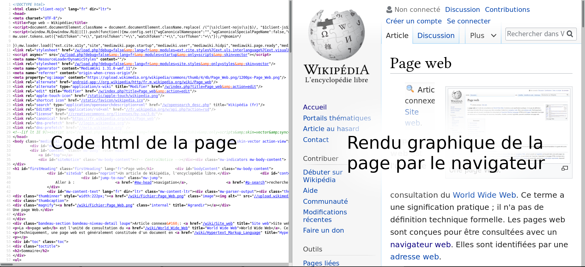

::: programme
Lors de la navigation sur le Web, les internautes interagissent avec leur machine par le biais des
pages Web.

La compréhension du dialogue client-serveur déjà abordé en classe de seconde est consolidée, sur des
exemples simples, en identifiant les requêtes du client, les calculs puis les réponses du serveur
traitées par le client.
:::

> On confond souvent Internet et le Web (ou « toile » en français). On trouve des choses sur
> Internet, on surfe sur le Web. Mais où est la différence ? *[Article de Laurent Viennot sur le
> site interstices.fr]([Laurent
> Viennot](https://interstices.info/idee-recue-web-et-internet-cest-la-meme-chose/))*{.cite-source}

- L'**internet** est le réseau physique des ordinateurs reliés entre eux.
- Le **Web** est l'ensemble des protocoles et langages qui permettent à ces ordinateurs de
  communiquer entre eux.
 
## La naissance du Web

Le web fut inventé en 1989 par Tim Berners-Lee et une équipe de recherches au CERN (Centre européen
pour la Recherche Nucléaire).

C'est un système hypertexte qui permet qui permet de lier des documents par des hyperliens.

<iframe src="https://player.vimeo.com/video/207612470" title="L’histoire de Tim Berners-Lee ou presque… Par isabelle Christment 6’24" webkitallowfullscreen="" mozallowfullscreen="" allowfullscreen="" width="550" height="309" frameborder="0"></iframe>

Lien vers la page de [Class Code](https://pixees.fr/assistez-a-la-naissance-du-web-2/).

*Note: les vidéos des cours d’OpenClassrooms comme toutes les ressources de Class´Code sont
librement accessibles, sous licence Creative-Commons.*

## L'architecture du web

Le web est possible grâce au **réseau internet** qui relie entre eux les ordinateurs.

Certains ordinateurs hébergent des pages web: **les serveurs**, chaque page web a une adresse
URL(Uniform resource Locator).

Chez vous, votre ordinateur: **le client** peut demander qu'on lui transmette des pages web à
partir de leur URL grâce au protocole HTTP(hypertext transfer protocol).

## Les langages du web
### Côté client
Tous les navigateurs(*clients*) utilisent trois langages:

- `html`: HyperText Markup Language: Il contient le texte de la page et décrit ce texte afin qu'il
  puisse être compris par des programmes informatiques(navigateur web ou robots des moteurs de
  recherche).
- `css`: Cascading StyleSheet: permet de mettre en forme la page web en modifiant les couleurs,
  polices...
- `js`: javaScript:permet de rendre les pages web interactives, pour par exemple récupérer les
  données d'un utilisateur entrées dans un formulaire,

Leurs syntaxes et leur possibilités ne cessent d'augmenter au fur et à mesure que nos usages
d'internet évoluent.

La fondation [W3C](https://www.w3.org/) a pour rôle de définir toutes les règles de ces langages(et
d'autres) afin de maintenir le web accessible à tous et ouvert.

### Côté serveur

Le navigateur du client peut envoyer des informations particulières au serveur par le biais du
protocole `HTTP`.

Le serveur peut adapter la page envoyée à ses paramètres grâce à un langage de programmation côté serveur. Principalement `PHP`(hypertext processor) aujourd'hui, mais tout langage peut-être utilise(Python, Ruby, NodeJS...)

## Rôle du navigateur

Le navigateur permet de traduire toutes les informations contenues dans les fichiers `html`, `css` et `js`, en un rendu qui s'affiche à l'écran avec lequel l'utilisateur peut interagir. Pour afficher le code source d'une page, il suffit d'utiliser la combinaison <kbd>CTRL</kbd>+<kbd>U</kbd>.

## Le développement d'une page Web

Avant de publier le site sur internet, on commence par le développer localement sur son ordinateur
avec **deux logiciels**:

### Un éditeur de code

Un simple éditeur de texte qui permet d'écrire le code `html`, `css` et `js`.

Bien qu'un simple éditeur de texte suffise, on utilise plutôt des éditeurs de code qui sont dédiés
à cet usage et qui permettent de colorer le code, l'indenter, le vérifier, l'auto compléter...

::: examples
- [Notepad ++](https://notepad|-plus|-plus.org/fr/)
- [Atom](https://atom.io/)
- [Visual Studio Code](https://code.visualstudio.com/)
- [Brackets](http://brackets.io/)
:::

### Un navigateur web

Un navigateur qui permet de visualiser le rendu du code, ce navigateur doit être récent pour pouvoir
développer ce site en utilisant les dernières mises à jour des langages.

::: examples
- [Mozilla Firefox](https://www.mozilla.org/fr/firefox/new/)
- [Google Chrome](https://www.google.fr/chrome/browser/desktop/index.html)
- [Microsoft Edge](https://www.microsoft.com/fr-fr/windows/microsoft-edge)
:::

::: {.plus titre="Comment appliquer des changements rapidement?"}

Quand vous avez modifié le code source dans l'éditeur, et que vous voulez vérifier le nouveau rendu
par le navigateur :

1. Enregistrez le fichier dans l'éditeur: <kbd>CTRL</kbd>+<kbd>S</kbd>.
2. Rafraîchissez l'affichage du navigateur. <kbd>CTRL</kbd>+<kbd>R</kbd>.

Vous pouvez placer les deux écrans côte à côte si vous avez un écran large, ou passer d'une fenêtre
à une autre avec le raccourci: <kbd>ALT</kbd>+<kbd>TAB</kbd>.
:::

::: {.plus titre="Comment déboguer votre page web ?"}

Tous les navigateurs disposent d'outils puissants de débogage, à commencer par le simple afficheur
de code source(<kbd>ALT</kbd>+<kbd>TAB</kbd>), ou pour des outils plus puissants vous pouvez ouvrir
les `Outils de développement`: <kbd>CTRL</kbd>+<kbd>MAJ</kbd>+<kbd>I</kbd>
:::
