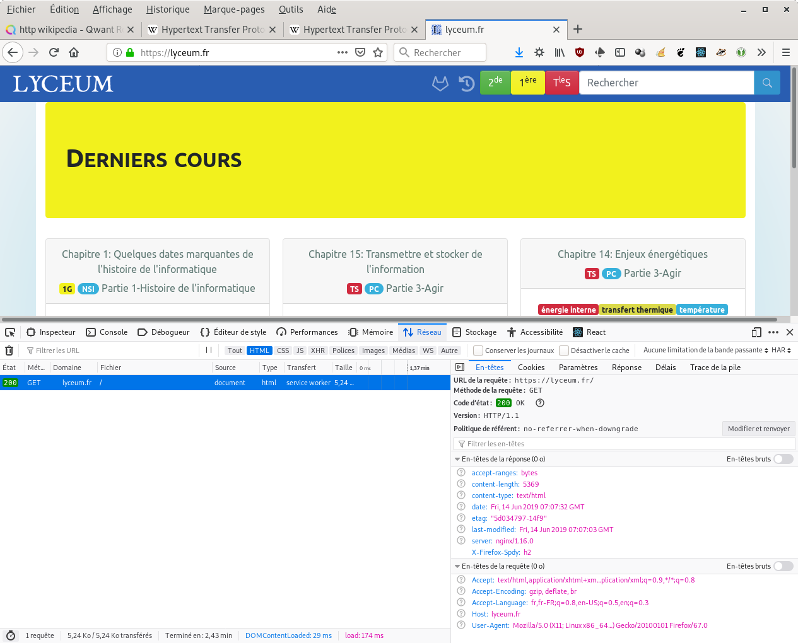
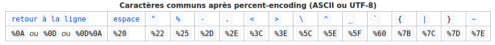

---
tags:
  ["communication client-serveur", "protocole http", "paramètres d'une requête"]
---

::: programme
+----------------------------+------------------------------------------+-------------------------------------------+
| Contenus | Capacités attendues | Commentaires |
+============================+==========================================+===========================================+
| Interaction client- | Distinguer ce qui est exécuté | Il s’agit de faire le lien avec ce qui |
| serveur. | sur le client ou sur le serveur et | a été vu en classe de seconde et |
| | dans quel ordre. | d’expliquer comment on peut |
| Requêtes HTTP, | | passer des paramètres à un site |
| réponses du serveur | Distinguer ce qui est mémorisé | grâce au protocole HTTP. |
| | dans le client et retransmis au | |
| | serveur. | |
| | | |
| | Reconnaître quand et pourquoi | |
| | la transmission est chiffrée. | |
+----------------------------+------------------------------------------+-------------------------------------------+
:::

Dès la création du `html` par Tim Berners Lee, celui-ci a également créé le protocole
http(_hypertext transfer protocol_) pour normaliser l'échange des données entre le client(le
navigateur) et le serveur qui fournit les pages web.

## HTTP

Les protocoles HTTP, ou HTTPS pour sa version sécurisée afin de crypter les informations échangées,
définissent des en-têtes lors des requêtes du client et des réponses du serveur.

Tous les navigateurs permettent de les afficher en utilisant le _moniteur réseau_ des **outils de
développement** du navigateur(_Touche F12_).

Voici une requête et une réponse de la page d'accueil du site situé à l'adresse:
<https://lyceum.fr>



### Requête du client

Analysons la requête:

- Méthode: `GET`

Ici on veut obtenir la page web, il existe aussi d'autres méthodes `POST`, `PUT`, `DELETE`...

- URL: <https://www.lyceum.fr/>

L'adresse URL de la page ici c'est la page d'accueil.

- En-têtes:

Des informations sur le client.

```
Host: lyceum.fr
User-Agent: Mozilla/5.0 (X11; Linux x86_64; rv:67.0) Gecko/20100101 Firefox/67.0
Accept: text/html,application/xhtml+xml,application/xml;q=0.9,*/*;q=0.8
Accept-Language: fr,fr-FR;q=0.8,en-US;q=0.5,en;q=0.3
Accept-Encoding: gzip, deflate, br
```

### Réponse du serveur

- En-têtes:

Des informations sur la réponse envoyée par le serveur, ici le code `200` signifie que la requête a
pu être correctement traitée, sinon des codes normalisés existent `404`: page non trouvée, `403`
accès non autorisé...

L'ensemble des codes et leur signification est disponible sur
[MDN](https://developer.mozilla.org/fr/docs/Web/HTTP/Status).

```
HTTP/1.1 200 OK
server: nginx/1.16.0
date: Fri, 14 Jun 2019 07:07:32 GMT
content-type: text/html
content-length: 5369
last-modified: Fri, 14 Jun 2019 07:07:03 GMT
etag: "5d034797-14f9"
accept-ranges: bytes
X-Firefox-Spdy: h2
```

- Réponse:

Il s'agit tout simplement de la page `html` renvoyée que je résume ici, c'est en fait la page
`html` complète.

```html
<!DOCTYPE html>
<html>
  <head>
    <meta charset="utf-8" />
    ...
    <body>
      ...
    </body>
  </head>
</html>
```

## L'application côté serveur

Le serveur peut fournir ce que l'on appelle un site dynamique, c'est-à-dire qu'il adapte la page
renvoyée aux utilisateurs et aux paramètres de la requête.

Pour cela il faut que le serveur soit muni d'un langage de programmation comme `php`, `python`, ou autre pour
générer la page grâce à un programme.

## Ajout de paramètres à une requête http

Prenons l'exemple du site Wikipedia qui fonctionne sous `php`.

Lorsque vous faites une recherche à partir de n'importe quelle page de l'encyclopédie; tapez par exemple:
_Tim Berners-Lee_, en haut à droite de Wikipedia.

Ouvrez votre moniteur réseau, avant de valider la recherche avec entrée ou un click sur les
propositions d'articles, vous allez voir les requêtes suivantes qui vont s'effectuer.


Vous voyez que pour effectuer cette recherche, votre navigateur va renvoyer une requête mais pas vers une simple page `html` mais vers un script `php` de Wikipedia en lui ajoutant des paramètres comme s'il s'agissait d'une fonction.

<https://fr.wikipedia.org/w/index.php?cirrusUserTesting=control&search=Tim+Berners-Lee&title=Sp%C3%A9cial%3ARecherche&go=Continuer&wprov=acrw1_1>

Le script `php` situé sur le serveur `fr.wikipedia.org` au chemin `/w/index.php` est exécuté avec
les paramètres fournis après le signe `?` et séparés par des `&`, ici:

```
cirrusUserTesting=control
search=Tim+Berners-Lee
title=Spécial:Recherche
go=Continuer
wprov=acrw1_1
```

Après l'exécution du script `php`, le serveur renvoie une code de redirection `302` qui va ensuite
nous rediriger vers la page recherchée: <https://fr.wikipedia.org/wiki/Tim_Berners-Lee>.

::: {.plus titre="Percent-encoding"}

Dans les URL, les caractères spéciaux tels `@` sont échappés
avec un code par exemple: `%40` pour `@`, `%20` pour l'espace.



Voir l'article [Wikipedia](https://fr.wikipedia.org/wiki/Percent-encoding) pour plus de détails.
:::
