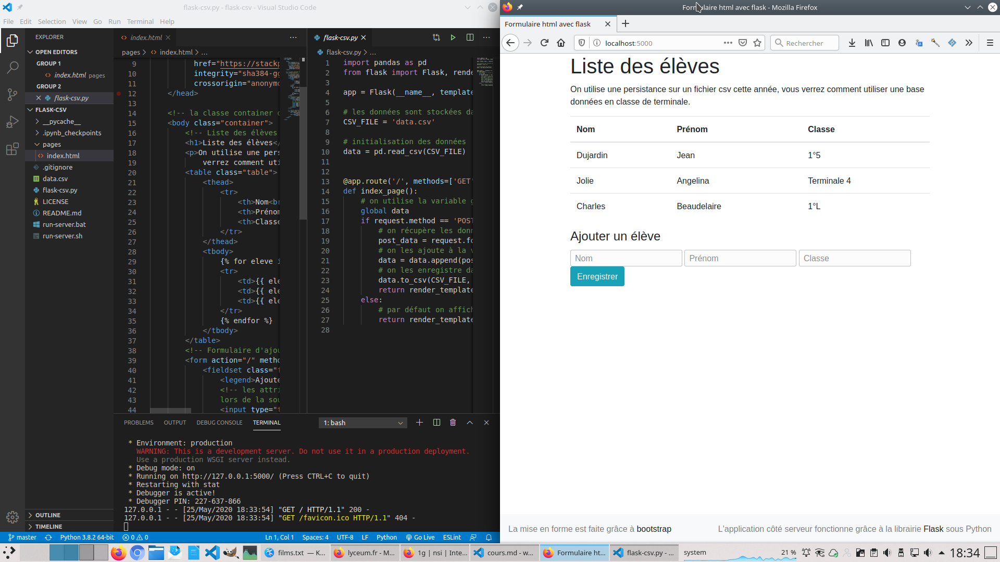

## TP sur l'application web client serveur

Vous allez créer une application web, avec un serveur écrit en python, telle que décrite dans le
cours.

Le code est disponible dans ce dépôt [git](https://github.com/heoinfo/flask-csv) au format
[zip](https://github.com/heoinfo/flask-csv/archive/master.zip). Téléchargez-le, puis dézippez-le.

Pour modifier le code :

- ouvrir le dossier précédemment dézippé avec visual studio code(Raccourci CTRL+MAJ+O),
- ouvrir un terminal dans visual studio code(Rechercher terminal dans la palette de commandes pour
  l’ouvrir, le raccourci dépend des distributions),
- Dans la console exécuter le script pour lancer le serveur avec la commande :
    - *Windows* : `run_server.bat`
    - *Linux/MacOS* : `bash run_server.sh`

Vous pourrez alors ouvrir votre navigateur pour observer son fonctionnement à l’adresse locale :
http://localhost:5000

Vous pourrez parcourir le code, et le modifier :
- côté **client** : fichier `pages/index.html` (langage client `html`)
- côté **serveur** : fichier `flask-csv.py` (langage serveur : `python`)

#### Travail proposé

1. Ajoutez **coté client** des entrées au formulaire pour stocker d’autres informations, par
   exemple l’âge.
2. Ajouter une validation du champ âge **côté serveur** pour vérifier que l’age est bien de type
   entier.
3. Travailler **à la fois du côté du client et du serveur** pour proposer à l’utilisateur de
   supprimer une entrée.

