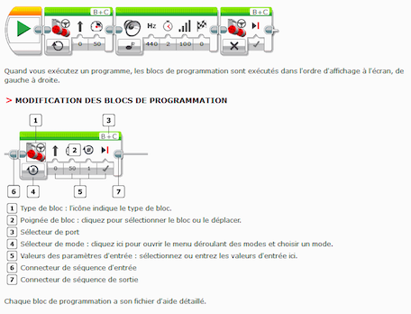
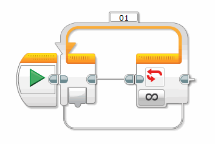
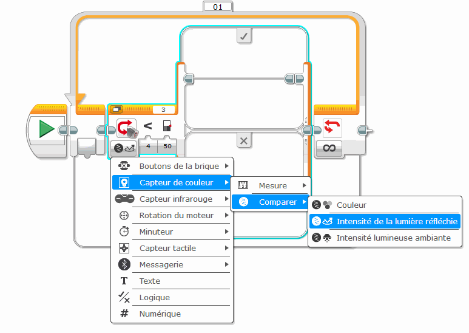
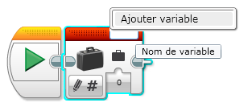
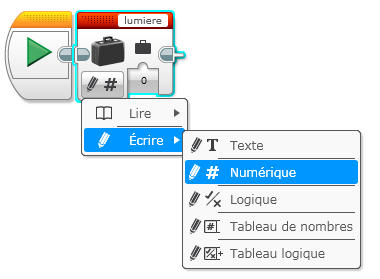
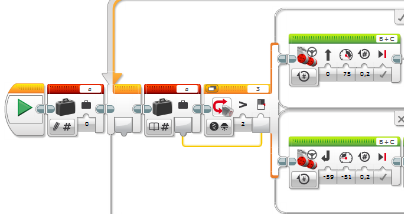

::: programme
+---------------------------+------------------------------------+----------------------------+
|         Contenus          |        Capacités attendues         |        Commentaires        |
+===========================+====================================+============================+
| Périphériques d’entrée et | Identifier le rôle des capteurs et | Les activités peuvent être |
| de sortie                 | actionneurs.                       | développées sur des objets |
|                           |                                    | connectés, des systèmes    |
|                           |                                    | embarqués ou robots.       |
|                           |                                    |                            |
| Interface Homme-          | Réaliser par programmation         |                            |
| Machine (IHM)             | une IHM répondant à un cahier      |                            |
|                           | des charges donné.                 |                            |
+---------------------------+------------------------------------+----------------------------+
:::

Dans ce chapitre, nous allons aborder l'utilisation de périphériques d'entrée et de sortie dans le
cadre de la robotique en utilisant des robots éducatifs Lego NXT.

A la différence d'un simple ordinateur, les robots sont capables d'interagir avec le monde
extérieur en utilisant:

- des **capteurs**, il s'agit de *périphériques d'entrée* permettant de mesurer divers paramètres
  extérieurs( lumière, distance, température...)
- des **actionneurs**, il s'agit de *périphériques de sortie*(moteurs, vérins, bras motorisés)
  permettant d'agir sur le monde extérieur en réponse au programme implémenté dans le robot.

Pour vous aider tout au long de cette partie, vous disposez de la [notice](./images/noticeang-nxt.pdf) du robot en anglais auquel le texte du TP se réfère.

Cependant, si vous n'êtes pas à l'aise avec l'anglais, l'association robotique de Sophia-Antipolis [pobot.org](https://pobot.org) propose également un excellent [tutoriel](https://www.pobot.org/IMG/pdf/hasparren-tutorial_nxtg-v2.pdf) pour utiliser le robot nxt.

## Réaliser le montage du robot

Le robot est peut-être en partie monté, utiliser l'image suivante pour le vérifier. Si besoin vous
référer à la notice officielle.

Mettre en place les capteurs

-  de contact (vers l'avant du robot)
-  de couleur (vers le sol, à 0,5 cm du sol environ)

[[plus|S'il vous reste du temps]]
|
|- Réaliser les tests de fonctionnement de ces capteurs proposés dans la notice (aux pages 26 et 27)
|- Pour faire de la place en mémoire, effacer les programmes ajoutés par les élèves avant vous: menu NXT Files (my files)

## Utilisation du logciel EV3 

Vous allez apprendre à configurer un projet dans le logiciel EV3, puis réaliserez quelques tests
sur vos capteurs avant de créer votre premier programme, le très classique
suiveur de lignes.

N'oubliez pas de prendre des notes au fur et à mesure de vos avancées.

### Configuration du projet

- Lancer le logiciel EV3. Cliquer sur l'onglet + en haut à gauche pour démarrer un nouveau projet.

  

- Connecter le robot sur un port USB à l'aide d'un câble approprié. Démarrer le robot pour qu'il
  soit détecté par le logiciel

- Ouvrir l'aide EV3 et suivre le tutoriel sur les généralités.

  

- Sur la "Page du Matériel" : lire attentivement les explications pour renseigner les ports sur
  lesquels vous avez branchés les 2 moteurs (B et C), le gros moteur central (A), le capteur de
  contact (port 1 ou 2) et le capteur de couleur (port3)

  

  Configurez le projet dans la fenêtre matériel avec ces renseignements

### Réalisation des tests

- Réalisez alors des tests sur votre robot et lire les valeurs affichées pour le capteur de
  contact, lorsqu'il est :

-   enfoncé
-   relâché

- Réalisez les tests sur votre robot et lire les valeurs affichées pour le capteur de couleur
  lorsque l'on dispose sous le capteur un objet de couleur

-   bleu

-   vert

-   rouge

-   jaune

- Réalisez les tests sur ce même capteur de couleur, mais en mode "mesure d'intensité ambiante".
  Noter la valeur lorsque l'on dispose devant le capteur un objet :

-   Blanc

-   Noir

- Refaire le même test, mais cette fois ci en mode "mesure d'intensité réfléchie" (le capteur
  émettant de la lumière rouge)

- Consignez tous vos résultats par écrit dans votre cahier : capteurs, ports, conditions d'essais,
  résultats

- Sur la page de l'aide : Programmes : Familiarisez vous avec la programmation par "briques"

## Le suiveur de ligne

Le texte original du TP est à l'adresse suivante :

<http://www.sitedunxt.fr/articles/articles-4-9-3+faire-du-suivi-de-ligne.php>

Le TP proposé ici a été adapté pour le logiciel EV3, plus récent.

Le principe de notre programme sera le suivant. Initialement, le robot sera placé de telle sorte
qu'il soit centré sur la ligne noire. Le capteur de lumière se trouvant juste au dessus de
celle-ci.

Nous allons faire avancer notre robot tout en le faisant tourner d'un côté ou d'un autre.

Lorsqu'il détectera une couleur noire, il avancera en tournant vers la droite. De ce fait, ce léger
virage déplacera le capteur de lumière vers un côté de la ligne et il se retrouvera à un moment au
dessus de la couleur blanche.

Le robot aura tout simplement sorti de l'axe de la ligne.

Lorsqu'il détectera une autre couleur que le noir, comme par exemple la couleur blanche de la
planche de test, il avancera en tournant cette fois ci vers la gauche.

Ainsi, le robot reviendra vers l'axe de la ligne noire et il aura avancé car les deux roues auront
tournées dans le même sens sur une courte distance.

Le capteur repassant au dessus de la ligne noire, il aura donc fait un cycle complet, à savoir,
être sur la ligne puis s'en éloigner et enfin revenir vers cette même ligne.

Le cœur du programme est là. Il ne suffira plus qu'à faire effectuer ce cycle au robot de manière
permanente.

### Réalisation du programme

Commençons par placer une boucle infinie au début de notre programme. En effet, le suivi de ligne
va se faire en permanence :

Puis, placez à l'intérieur de cette boucle un bloc "Commutation" paramétré sur le capteur de
couleur et réglé sur la couleur noire :

Vous devez ici choisir l'option Capteur photosensible du paramètre Action et sélectionner le signe
\< (plus petit que) dans le paramètre Comparer, en sélectionnant le bouton de gauche représenté par
une lumière sombre, de manière à indiquer au bloc "Commutation" d'exécuter le rayon de séquence
supérieur (b) condition vrai[/b]) lorsque le capteur de lumière renverra une valeur de luminosité
inférieur à la valeur de déclenchement indiqué dans le champ de saisie situé à droite. Cette valeur
de déclenchement a une valeur de 50 par défaut. Vous pouvez changer ce réglage.

Si le capteur identifie devant lui une couleur noire, celle de la ligne, la condition est vrai et
le bloc "Commutation" exécutera le bloc placé sur le rayon de séquence supérieur.

Nous allons utiliser un bloc "Déplacement et direction" pour contrôler les deux moteurs de
propulsion et le configurer de tel manière que le robot tourne vers la droite : Dans la partie
supérieure du bloc de commutation, ajouter le bloc et paramétrer la direction (ici, j'ai choisi 30°
de sorte que le robot continue à avancer et ne fasse pas que virer)

Puis le déplacement vers la gauche : partie inférieure du bloc.

Comme il est là, le programme pourrait fonctionner correctement.

Si le capteur mesure une valeur inférieure à 50, c'est à dire qu'une couleur sombre comme la
couleur noire de la ligne se trouve en face de lui, le rayon de séquence supérieur est exécuté es
le robot avance en tournant vers la droite.

Si le capteur mesure une valeur supérieure à 50, c'est à dire qu'une couleur claire comme la
couleur blanche de la planche de test se trouve en face de lui, le rayon de séquence inférieur est
exécuté et le robot avance en tournant vers la gauche.

Toutes les valeurs renvoyées par le capteur de lumière se trouvant supérieure à ce seuil, c'est à
dire dans la plage de valeur allant de 50 à 100, sont considérées comme faisant parties de la
catégorie des couleurs claires. De même, toutes les valeurs inférieures à ce seuil allant de 0 à 49
sont considérées comme des couleurs sombres.

## Comment utiliser des variables dans le logiciel EV3?

Texte adapté du site du NXT :

<http://www.sitedunxt.fr/articles/articles-4-25-2+les-variables-et-les-constantes.php>

Dans cette partie du tutoriel consacrée au NXT-G, nous allons aborder le sujet très important que
sont les variables et les constantes.

C'est grâce à ces variables notamment que vos programmes pourront être encore plus complexes et
intelligents.

Contrairement au langage Python, dans EV3, la déclaration de variable est **obligatoire** et doit
être faite avant toutes utilisations des variables.

Si vous ne faites pas de déclaration de variable, vous ne pourrez tous simplement pas utiliser
cette variable dans votre programme.

> Pour déclarer une variable, il faut utiliser le bloc « Variable » (rouge), et cliquer dans le
> coin supérieur droit : Un menu affiche alors « Ajouter variable »

Renseigner alors le nom de la variable, par exemple « lumiere » pour notre exemple.

Le bouton en bas à gauche du bloc de configuration vous permet de préciser l'action :

-   "Lire" la valeur contenue dans celle-ci ou pour "Ecrire" une valeur dans cette même variable.
-   "Ecrire", le bloc "Variable" mémorise la valeur que vous entrez dans le champ nommé "Valeur"
    juste en dessous.

Ici, vous sélectionnerez « écrire » et choisirez le type : « Numérique »

> Ajouter un bloc « boucle » avec répétition infinie.
>
>Ajouter un bloc de mesure de couleur (capteur de couleur)
>
>Ajouter à nouveau le bloc variable « lumiere ». Si un fil de données est connecté au bloc
>"Variable", la valeur transporté par ce fil de données est mémorisé dans la variable : connectez
>alors les 2 derniers blocs comme sur le schéma suivant :

Lorsque vous choisissez l'option "Lire", le bloc "Variable" vous restitue la valeur de cette
variable par l'intermédiaire d'un fil de données que vous pouvez utiliser dans votre programme.

Ici, la valeur mesurée par le capteur est mise dans la variable `lumiere`

> Modifier ensuite le bloc capteur de couleur pour réaliser une mesure de l'intensité ambiante. Il
> faudra refaire le fil de données qui se sera effacé.

Compléter alors le programme avec les blocs :

> « attendre ». Paramétrer sur 5s.
>
>« Variable » : Paramétrer pour lire la valeur « numérique » de la variable « lumiere »
>
>« Texte » : prolonger le fil de données depuis le bloc variable précédent et le relier à A.
>
>« Afficher » : Le texte à afficher est dans le coin supérieur droit. Choisissez "Relié" comme
>valeur d'entrée Texte dans le coin supérieur droit du bloc pour afficher une valeur d'entrée Texte
>acceptant un fil de données. Relier ce fil de données dans la partie inférieure du bloc comme sur
>le schéma suivant.
>
>« Attendre » : paramétrer sur 10s

### Pour aller plus loin

Utiliser le fil de variable avec un sélecteur :

rappel : pour utiliser une variable : il faut d'abord la déclarer (bloc de variable : écrire)

Puis lire son contenu

Et enfin, créer un fil de variable depuis le bloc lecture vers le bloc sélecteur, comme sur le
schéma ci dessous :

On peut utiliser ce morceau de programme pour un projet : détection et recherche de la lumière par
exemple : le robot devra retrouver la source de lumière à l'aide de conditions tests que vous
devrez établir.
