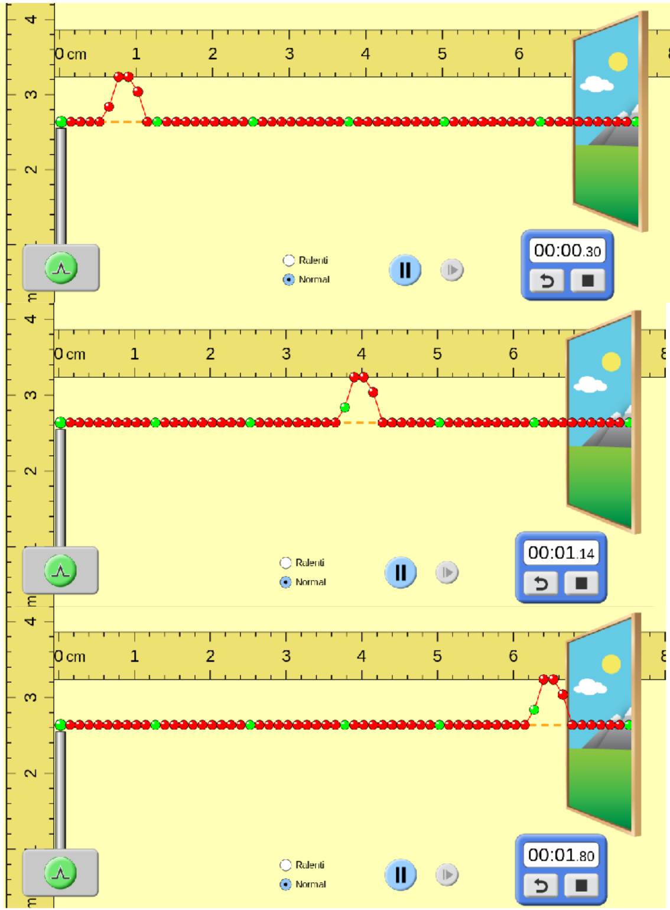

<!--
[notions]
Rayonnements dans l’Univers
Absorption de rayonnements par l’atmosphère terrestre.
Les ondes dans la matière
Houle, ondes sismiques, ondes sonores.
Magnitude d’un séisme sur l’échelle de Richter.
Niveau d’intensité sonore.
Détecteurs d’ondes (mécaniques et
électromagnétiques) et de particules (photons,
particules élémentaires ou non).

[competences]
Extraire et exploiter des informations sur l’absorption de
rayonnements par l’atmosphère terrestre et ses
conséquences sur l’observation des sources de
rayonnements dans l’Univers.
Connaître des sources de rayonnement radio, infrarouge
et ultraviolet.
Extraire et exploiter des informations sur les
manifestations des ondes mécaniques dans la matière.
Connaître et exploiter la relation liant le niveau d’intensité
sonore à l’intensité sonore.
Extraire et exploiter des informations sur :
- des sources d’ondes et de particules et leurs utilisations ;
- un dispositif de détection.
*Pratiquer une démarche expérimentale mettant en œuvre
un capteur ou un dispositif de détection.*
-->

## Les deux types d'ondes

Il existe deux types principaux d'ondes :

- **les ondes mécaniques** sont des perturbations qui se propagent dans un milieu matériel élastique.

::: examples
- son,
- onde sismique,
- vague...
:::

[[prop|&nbsp;]]
|La propagation d'une onde ne transporte pas de matière, mais uniquement de l'énergie.

- **les ondes électromagnétiques** peuvent se propager sans support matériel.

::: examples
- onde lumineuse
- onde radio,
- UV,
- IR...
:::

## Les ondes électromagnétiques

`youtube: w7y-1eY0mcE`

::: prop
Les ondes électromagnétiques se propagent  avec une vitesse avoisinant celle de la lumière, soit près de 300 000 kilomètres par seconde.

$$c=3,00 \times 10^{8}\ m\cdot s^{-1}$$
:::

::: {.plus titre=" Célérité de la lumière"}
En réalité, on ne devrait pas parler de vitesse, mais de *célérité* de la lumière, car il s'agit d'une onde.
Il s'agit d'une constante physique universelle dont la valeur exacte est [299 792 458 m/s](https://fr.wikipedia.org/wiki/Vitesse_de_la_lumi%C3%A8re).
:::

- Spectre des ondes électromagnétiques

Les ondes électromagnétiques différent par leur fréquence(ou longueur d'onde)

 By <a href="//commons.wikimedia.org/wiki/User:Inductiveload" title="User:Inductiveload">Inductiveload</a>, <a rel="nofollow" class="external text" href="http://mynasadata.larc.nasa.gov/images/EM_Spectrum3-new.jpg">NASA</a>. Translation by <a href="//commons.wikimedia.org/wiki/User:Berrucomons" title="User:Berrucomons">Berru</a> (<a href="//commons.wikimedia.org/wiki/User_talk:Berrucomons" title="User talk:Berrucomons">talk</a>) - self-made, information by NASA Based off of <a href="//commons.wikimedia.org/wiki/File:EM_Spectrum3-new.jpg" title="File:EM Spectrum3-new.jpg">File:EM_Spectrum3-new.jpg</a> by NASA The butterfly icon is from the P icon set, <a ref="//commons.wikimedia.org/wiki/File:P_biology.svg" title="File:P biology.svg">P biology.svg</a>The humans are from the Pioneer plaque, <a href="//commons.wikimedia.org/wiki/File:Human.svg" title="File:Human.svg">Human.svg</a>The buildings are the Petronas towers and the Empire State Buildings, both from <a href="//commons.wikimedia.org/wiki/File:Skyscrapercompare.svg" title="File:Skyscrapercompare.svg">Skyscrapercompare.svg</a>, <a href="http://creativecommons.org/licenses/by-sa/3.0/" title="Creative Commons Attribution-Share Alike 3.0">CC BY-SA 3.0</a>, <a href="https://commons.wikimedia.org/w/index.php?curid=8756209">Link</a>

**À connaître** : sources d'ondes électromagnétiques.

- Source UV : étoile chaude
- Source IR : étoile froide
- Source radio : galaxie, fond diffus de l'univers

## Célérité et retard

La vitesse de propagation d'une onde est appelée **célérité**.

**Le retard $τ_{AB}$ est la durée** nécessaire pour qu'une perturbation se propage d'un point A à un point B.

D'après la formule de la vitesse:

$$
\tau_{AB}=\frac{AB}{v}
$$

**Notations**

- $\tau_{AB}$: retard de l'onde entre les points A et B en $s$.
- $AB$: distance entre les points A et B en $m$.
- $v$: célérité de l'onde en $m\cdot s^{-1}$

::: {.appli titre=" Calculer une célérité en utilisant le retard"}
Calculer la célérité de l'onde dans la succession d'images ci-dessus.
:::