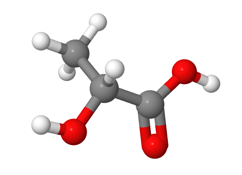
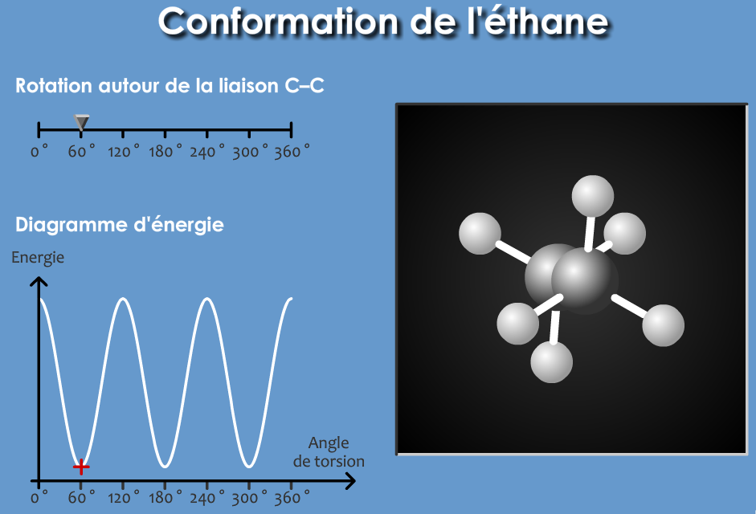

<!--
**BO 2012 **:

+-----------------------------------+-----------------------------------+
| **Notions et contenus** | **Compétences exigibles** |
+-----------------------------------+-----------------------------------+
| **Représentation spatiale des | Reconnaître des espèces chirales |
| molécules** | à partir de leur représentation. |
| | |
| Chiralité : définition, approche | Utiliser la représentation de |
| historique. | Cram. |
| | |
| Représentation de Cram. Carbone | Identifier les atomes de carbone |
| asymétrique. | asymétrique d'une |
| | |
| Chiralité des acides α-aminés. | molécule donnée. |
| | |
| Énantiomérie, mélange racémique, | À partir d'un modèle moléculaire |
| diastéréoisomérie | ou d'une représentation, |
| | reconnaître si des molécules sont |
| (_Z/E_, deux atomes de carbone | identiques, énantiomères ou |
| asymétriques). | diastéréoisomères. |
| | |
| Conformation : rotation autour | _Pratiquer une démarche |
| d'une liaison simple ; | expérimentale pour mettre en |
| | évidence des propriétés |
| conformation la plus stable. | différentes de |
| | diastéréoisomères._ |
| Formule topologique des molécules | |
| organiques. Propriétés | _Visualiser, à partir d'un modèle |
| biologiques et stéréoisomérie. | moléculaire ou d'un logiciel de |
| | simulation, les différentes |
| | conformations d'une molécule._ |
| | |
| | Utiliser la représentation |
| | topologique des molécules |
| | organiques. |
| | |
| | Extraire et exploiter des |
| | informations sur : |
| | |
| | --- les propriétés biologiques de |
| | stéréoisomères, |
| | |
| | --- les conformations de |
| | molécules biologiques, |
| | |
| | pour mettre en évidence |
| | l'importance de la stéréoisomérie |
| | |
| | dans la nature. |
+-----------------------------------+-----------------------------------+ -->

## Comment reconnaître une molécule chirale ?

::: {.def terme="molécule chirale"}
Une molécule est **chirale** si elle **n'est pas superposable à son
image dans un miroir**.
:::

::: example
la molécule CHIBrCl

 Par Calvero. — Selfmade with ChemDraw., Domaine public, <a href="https://commons.wikimedia.org/w/index.php?curid=1299969">Lien</a>

:::

### Chiralité et symétrie

::: prop
Une molécule chirale ne présente pas de plan ou de centre de symétrie.
:::

### Molécules avec un atome de carbone asymétrique

::: {.def terme="carbone asymétrique"}
Un atome de **carbone asymétrique** est un atome de carbone tétraédrique lié à quatre atomes ou
groupes d'atomes tous différents. On le note habituellement $C^{*}$.
:::

::: prop
Une molécule possédant un atome de carbone asymétrique est toujours chirale.
:::

::: examples
- l'acide lactique
C(%3DO)O)
- le butan-2-ol
CC)
:::

::: {.appli titre="Représentation topologique"}
Donner la représentation topologique de ces molécules en indiquant par une étoile le carbone
asymétrique.
:::

## Stéréoisomères de conformations

En raison de la libre rotation autour des liaisons simples, il existe une infinité de formes pour
une même molécule, appelées **conformations**.

On passe d'un stéréoisomère de conformation à un autre par **rotation autour d'une liaison
simple**(sans rupture de liaison).

::: example
Les conformères de l'éthane:

:::

## Stéréoisomères de configurations

**Rappel**: deux molécules sont **isomères** si elles ont la **même formule brute**, mais une
formule développée différente.

::: {.def terme="stéréoisomères"}
Deux molécules sont **stéréoisomères** si elles ont la même **formule plane**, mais une
**organisation spatiale** des atomes différente.
:::

Deux stéréoisomères de configuration sont des molécules différentes, pour passer de l'un à l'autre,
il est nécessaire de **rompre des liaisons chimiques**.

::: examples
- stéréoisomères Z/E du but-2-ène,

&nbsp;

&nbsp;

- stéréoisomères de l'acide lactique et du butan-2-ol.

&nbsp;

&nbsp;
:::

## Molécules énantiomères et diastéréoisomères

On distingue deux types de **stéréoisomères de configuration** :

- les **énantiomères** qui sont l'image l'un de l'autre dans un miroir,
- et les **diastéréoisomères** qui ne le sont pas.

::: {.appli titre="molécule à deux atomes de carbone asymétrique $\sf CHBrCl-CHClF$"}
{.right}

1. Représenter les 4 stéréoisomères de configuration de cette molécule.
2. Représenter par des flèches les relations de stéréosomérie qui les lient(énatiomérie ou diastéréoisomérie)
&nbsp;
&nbsp;
:::

## Propriétés des stéréoisomères

::: prop
Les **diastéréoisomères** possèdent des **propriétés physiques et
chimiques différentes**, et peuvent donc être aisément séparés.

Par contre, **deux énantiomères ont les mêmes propriétés physiques et
chimiques** mais n'ont pas en général les mêmes propriétés biochimiques.
:::

En raison de leur ressemblance, deux énantiomères sont difficiles à séparer ou même à obtenir
séparément lors d'une synthèse.

::: {.def terme=" Mélange racémique"}
Un mélange contenant deux énantiomères en proportion égale est appelé **mélange racémique.**
:::