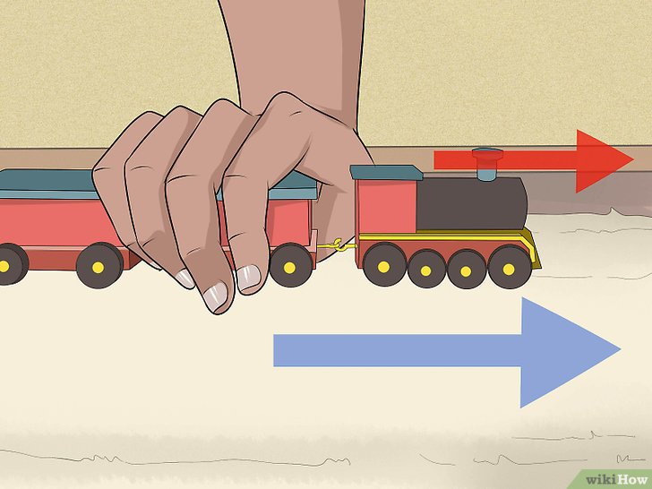
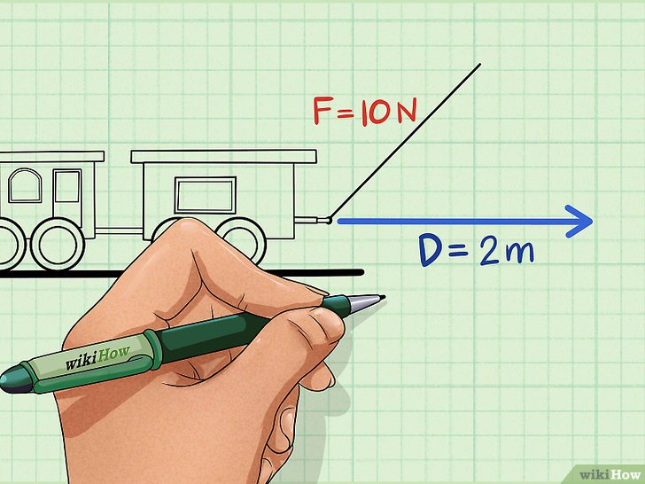
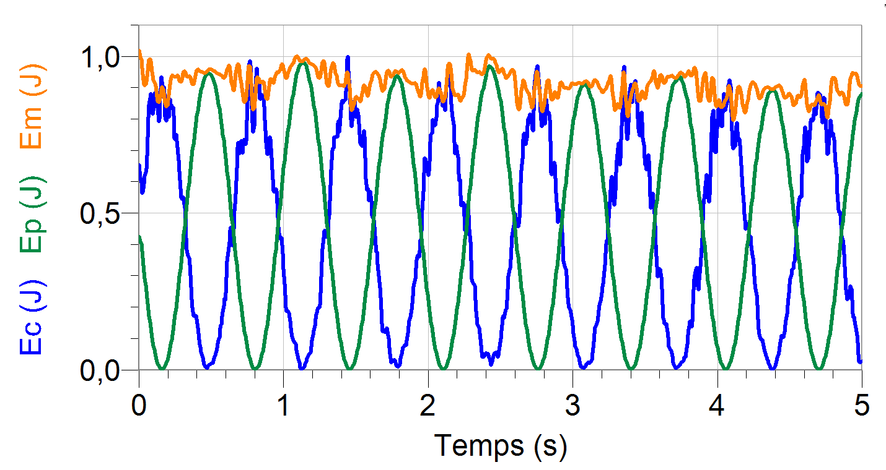
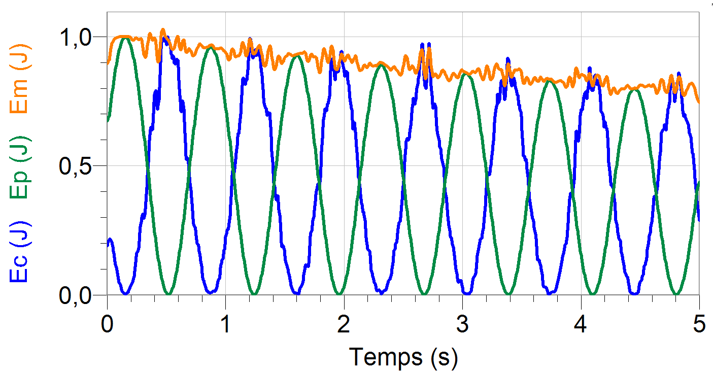

<!--
Mesure du temps et oscillateur, amortissement
Travail d’une force.
Force conservative ; énergie potentielle.
Forces non conservatives : exemple des frottements.
Énergie mécanique.
Étude énergétique des oscillations libres d’un système
mécanique.
Dissipation d’énergie.
Définition du temps atomique.

Pratiquer une démarche expérimentale pour mettre en
évidence :
- les différents paramètres influençant la période d’un
oscillateur mécanique ;
- son amortissement.
Établir et exploiter les expressions du travail d’une force
constante (force de pesanteur, force électrique dans le
cas d’un champ uniforme).
Établir l’expression du travail d’une force de frottement
d’intensité constante dans le cas d’une trajectoire
rectiligne.

Analyser les transferts énergétiques au cours d’un
mouvement d’un point matériel.
Pratiquer une démarche expérimentale pour étudier
l’évolution des énergies cinétique, potentielle et
mécanique d’un oscillateur.
Extraire et exploiter des informations sur l’influence des
phénomènes dissipatifs sur la problématique de la
mesure du temps et la définition de la seconde.

Extraire et exploiter des informations pour justifier
l’utilisation des horloges atomiques dans la mesure du
temps. -->

## Énergie cinétique

Il s'agit de l'**énergie liée à la vitesse du système**.

$$
Ec = \frac{1}{2}mv^{2}
$$

*Remarque: L'énergie cinétique est supérieure ou égale à zéro.*

Conversions de vitesses :

- 1 m/s = 3,6 km/h

::: {.appli titre=" un véhicule de 1,5 t roule à 50 km/h."}
Calculer son énergie cinétique.
:::

## Travail d'une force

En physique, le **travail** noté **W** est une **grandeur algébrique** qui permet de mesurer
l'*énergie transférée par un force* à un système.

Si au cours du mouvement, la force a pour effet :

- d'**augmenter l'énergie** du système : **W \> 0**, le travail est
  **moteur.**
- De **diminuer l'énergie** du système : **W \< 0**, le travail est
  **résistant.**

### Expression du travail d'une force constante

Le **travail d'une force constante** lors d'un déplacement d'un point A vers un point B est
indépendant du chemin suivi, il a pour expression:

$$
W_{AB}(\vec{F}) = \vec{F} \cdot \vec{AB}
$$

### Propriété

::: prop
Le travail d'une force constante ne dépend pas du chemin suivi lors du déplacement.
:::

### Cas particuliers

#### Si la force est colinéaire au déplacement

$$
W_{AB}(\vec{F}) = \pm F\ AB
$$

::: {.appli titre="Lien vers le tutoriel de WikiHow"}

:::

#### Si la force n'est pas colinéaire au déplacement

$$
W_{AB}(\vec{F}) = F\ AB\ \cos(\widehat{\vec{F},\vec{AB}})
$$

::: {.appli titre="Lien vers le tutoriel de WikiHow"}

:::

## Travail de forces usuelles
### Travail du poids

Le poids est une force constante verticale vers le bas de valeur $P=m\ g$.

Son travail ne dépend que de la **différence de hauteur** entre les points de départ et d'arrivée.

 By <a href="//commons.wikimedia.org/wiki/User:Ilevanat" title="User:Ilevanat">Ilevanat</a> - Own work, <a href="https://creativecommons.org/licenses/by-sa/3.0" title="Creative Commons Attribution-Share Alike 3.0">CC BY-SA 3.0</a>, <a href="https://commons.wikimedia.org/w/index.php?curid=14735358">Link</a>

::: {.appli titre="Vitesse lors d'une chute"}
En l'absence de frottements, de quelle hauteur doit tomber un objet pour atteindre une vitesse de 50 km/h ?
:::

### Travail d'une force électrostatique

#### Rappels sur le condensateur

Un condensateur plan est formé de deux plaques métalliques planes séparées par un matériau
isolant(le diélectrique).

Lorsque l'on applique une tension $U$ aux bornes du condensateur, un champ électrostatique $\vec{E}$
est créé entre les plaques.

Le champ électrostatique est:

- perpendiculaire aux plaques,
- dirigé de la borne + vers la borne -,
- de valeur $E=\frac{U}{d}$

 By <a href="//commons.wikimedia.org/wiki/User:Papa_November" title="User:Papa November">Papa November</a> - self-made SVG version of <a href="//commons.wikimedia.org/wiki/File:Dielectric.png" title="File:Dielectric.png">Image:Dielectric.png</a>, incorporating <a href="//commons.wikimedia.org/wiki/File:Capacitor_schematic.svg" title="File:Capacitor schematic.svg">Image:Capacitor schematic.svg</a> as its base., <a href="https://creativecommons.org/licenses/by-sa/3.0" title="Creative Commons Attribution-Share Alike 3.0">CC BY-SA 3.0</a>, <a href="https://commons.wikimedia.org/w/index.php?curid=4030086">Link</a>

#### Expression du travail de la force électrostatique

La force électrostatique a pour expression:

$$
\vec{F_e} = q \vec{E}
$$

<https://phet.colorado.edu/sims/html/charges-and-fields/latest/charges-and-fields_fr.html>

En calculant le travail de la force électrique lors du déplacement d'une charge q d'un point $P$ la
borne positive vers un point $N$ de la borne négative, on obtient:

$$
W_{NP}(\vec{F_e}) = q\ U
$$

::: {.appli titre="Expérience de Thomson"}
Thomson accélérait les électrons avec des condensateurs soumis à une tension de
1 kV. Quelle vitesse avaient les électrons à la sortie du condensateur ?
:::

### Travail des forces de frottements

Les forces de frottement dépendent du chemin suivi, on les appelle des **forces non
conservatives**.

Une force de frottement $\vec{f}$ est généralement de sens opposé au déplacement, son travail est
alors résistant.

$$
W(\vec{f})<0
$$

[{.center}](https://phet.colorado.edu/sims/html/forces-and-motion-basics/latest/forces-and-motion-basics_fr.html)

::: {.appli titre=" Force de freinage"}
Calculer la valeur de la force de freinage d'un véhicule de 1,5 t sachant que la distance de
freinage à 50 km/h est de 9 m sur sol sec.

*[Article Wikipedia sur la distance d'arrêt](https://fr.wikipedia.org/wiki/Distance_d%27arrêt#Valeur_selon_la_vitesse)*{.cite-source}
:::

## Forces conservatives et énergies potentielles

::: {.def terme="Force conservative"}
Une force est dite **conservative**, si son travail ne dépend pas du
chemin suivi.
:::

On peut dans le cas des forces conservatives, associer à une force une **énergie potentielle Ep**,
ou énergie de position.

Par définition, la *variation d'énergie potentielle* est égale à l'**opposé**
du travail de la force conservative lors du mouvement.

$$
\Delta Ep_{AB}(\vec{F}) = -W_{AB}(\vec{F})
$$

::: prop
Comme l'énergie potentielle est définie par une variation, l'énergie potentielle d'une force est 
définie à une constante près.
:::

::: {.plus titre="Conservation de l'énergie mécanique"}
L'intéret de cette définition est d'assurer la conservation de l'énergie mécanique $Em = Ec+Ep$.
Le travail des forces fait augmenter ou diminuer l'énergie cinétique suivant s'il est moteur ou 
résistant(Il s'agit du *théorème de l'énergie cinétique*).
$$
\Delta Ec_{AB} = W_{AB}(\vec{F})
$$

D'après la définition de l'énergie potentielle:
$$
\Delta Ep_{AB}(\vec{F}) = -W_{AB}(\vec{F})
$$
On obtient:
$$
\Delta Em_{AB} = \Delta Ec_{AB} + \Delta Ep_{AB}(\vec{F}) = W_{AB}(\vec{F}) - W_{AB}(\vec{F}) = 0
$$
La variation d'énergie mécanique du système soumis à une force conservative est nulle, ce qui 
revient à dire que l'énergie mécanqiue est constante.
:::

### Énergie potentielle de pesanteur

C'est l'énergie potentielle associée au travail au poids:

$$
Epp(z) = m\ g\ z\ +\ cte
$$

**Notations**
- $Epp$: énergie potentielle de pesanteur du système en joule($J$)
- $m$: masse du système étudié en kilogramme($kg$)
- $g$: intensité de la pesanteur en mètre par seconde au carré($m\cdot s^{-2})$
- $z$: altitude du système par rapport à l'altitude de référence en mètre($m$)

::: {.appli titre="Animation *skatepark de l'énergie* sur phet.colorado.edu"}
[{.center}](https://phet.colorado.edu/sims/html/energy-skate-park-basics/latest/energy-skate-park-basics_fr.html)
:::

### Énergie potentielle électrique

C'est l'énergie potentielle associée au travail de la force électrique:

$$
Epe(V) = q\ V\ +\ cte
$$

**Notations**
- $Epe$: énergie potentielle électrique du système en joule($J$)
- $q$: charge électrique du système étudié en Coulomb($C$)
- $V$: potentiel électrique auquel est soumis le système en volt($V$)

## Energie mécanique $Em$

L'énergie mécanique $Em$ est la somme de l'énergie cinétique et des énergies potentielles des forces
conservatives qui agissent sur le système.

$$
Em=Ec + \sum Epp
$$

### Conservation de l'énergie mécanique

::: prop
L'énergie mécanique d'un système **se conserve** si:
- le système n'est soumis qu'à des **forces conservatives**
- et/ou à des forces **non conservatives dont le travail est nul**.
$$
\Delta Em = 0 \Leftrightarrow  Em = constante
$$
:::

::: example
Pendule non amorti

:::

### Non conservation de l'énergie mécanique

::: prop
Dans le cas ou les forces **non conservatives** travaillent, la variation d'énergie mécanique est
égale au travail des forces non conservatives $W_{nc}$
$$
\Delta Em = W_{nc}
$$

- Si les forces non conservatives ont un **travail résistant**: $W_{nc} < 0 \Leftrightarrow \Delta Em < 0 \Leftrightarrow Em\ diminue$
- Si les forces non conservatives ont un **travail moteur**: $W_{nc} > 0 \Leftrightarrow \Delta Em > 0 \Leftrightarrow Em\ augmente$
:::

::: example
Pendule amorti: *ici les forces de frottement ont un travail résistant*.

:::