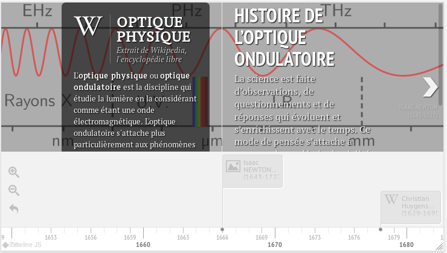

`h5p: 1060965078`

## Le parcours scientifique d'Alan Turing

En utilisant comme *source* l'article «[Alan Turing itinéraire d’un
précurseur](https://interstices.info/alan-turing-itineraire-dun-precurseur/)», écrire un résumé de
10-20 lignes expliquant les divers sujets qu'a étudiés Alan Turing au cours de sa vie.

## Créez votre propre frise

Créez _votre histoire de l'informatique_ en utilisant les [sources](./#sources) données dans le
cours, et en réalisant une frise chronologique grâce à la librairie `javascript`
[TimelineJS](https://timeline.knightlab.com/)

### Recherche documentaire

Pour cela vous allez devoir dans un premier temps concevoir sur le papier votre
frise en sélectionnant les éléments les plus signifiants, en les ordonnant.
N'oubliez pas de noter également vos sources de texte et d'images(libres de
droit dans le cas d'une publication sur la toile).

### Création de la frise interactive

Vous intégrerez ensuite vos éléments au sein d'un fichier de données `csv`(comma
separated values, soit valeurs séparées par des virgules) que vous éditerez avec
un tableur([LibreOffice](https://fr.libreoffice.org/) de préférence).

Voici un exemple de rendu d'une frise avec `timeline.js`.

.

Vous pouvez visualiser le fichier `csv` de données qui a permis de créer cette
frise à cette adresse:
<https://framagit.org/eduinfo/timelinejs-local/-/blob/master/src/timeline-data.csv>.

La particularité de la librairie [TimelineJS](https://timeline.knightlab.com/),
est qu'elle permet d'ajouter eu plus du simple texte, des médias issus de
diverses sources: Wikipedia, Youtube, SoundCloud, Instangram, Tweeter... [(lien
vers la liste complète sur
knightlab.com)](https://timeline.knightlab.com/docs/media-types.html)

Voici la signification des entrées de ce tableau de données:

+-------------------+-----------------------------------------------------------------------------------------------------------------------------------+
|       Clef        |                                                               Rôle                                                                |
+===================+===================================================================================================================================+
| `date`            | année de la découverte ou de l'invention(**obligatoire** sauf pour la vignette de titre)                                          |
+-------------------+-----------------------------------------------------------------------------------------------------------------------------------+
| `type`            | laisser vide pour un événement normal et indiquer `titre` pour la                                                                 |
|                   | vignette de titre de la frise.                                                                                                    |
+-------------------+-----------------------------------------------------------------------------------------------------------------------------------+
| `titre`           | titre de la vignette.                                                                                                             |
+-------------------+-----------------------------------------------------------------------------------------------------------------------------------+
| `texte`           | texte à inclure dans la vignette.                                                                                                 |
+-------------------+-----------------------------------------------------------------------------------------------------------------------------------+
| `mediaUrl`        | adresse de l'élément media(exemple:  <https://fr.wikipedia.org/wiki/Pascaline>, ou localement: `mon-image.jpg`)                   |
+-------------------+-----------------------------------------------------------------------------------------------------------------------------------+
| `mediaCredit`     | auteur et licence du média intégré                                                                                                |
+-------------------+-----------------------------------------------------------------------------------------------------------------------------------+
| `mediaLegend`     | légende à ajouter au media                                                                                                        |
+-------------------+-----------------------------------------------------------------------------------------------------------------------------------+
| `mediaThumbnail`  | vignette à utiliser pour afficher la vignette sur la frise,  si vide, une                                                         |
|                   | vignette par défaut est ajouté en fonction du média(exemple: logo  Youtube pour les média youtube)                                |
+-------------------+-----------------------------------------------------------------------------------------------------------------------------------+
| `backgroundUrl`   | adresse url d'une image à utiliser pour le fond de la  vignette.                                                                  |
+-------------------+-----------------------------------------------------------------------------------------------------------------------------------+
| `backgroundColor` | couleur du fond de la vignette, vous pouvez utiliser une couleur héxadécimale                                                     |
|                   | `#RRGGBB` ou avec transparence `#RRGGBBaa`, ou simplement un nom de couleur                                                       |
|                   | `css` comme `white`, `lime`...                                                                                                    |
|                   | [lien vers la liste complète  des couleurs sur  MDN](https://developer.mozilla.org/fr/docs/Web/CSS/Type_color#Les_mots-cl%C3%A9s) |
+-------------------+-----------------------------------------------------------------------------------------------------------------------------------+

Pour créer votre frise, téléchargez le dossier compressé du code de la frise
d'exemple à l'adresse suivante:
<https://framagit.org/eduinfo/timelinejs-local/-/archive/master/timelinejs-local-master.zip>, puis éditez
le fichier `timeline-data.csv` avec le tableur.

Observez le rendu dans le navigateur en ouvrant le fichier `index.html` et en
rafraîchissant la page à chaque changement(`CTRL+R`).

_A vos claviers!_
