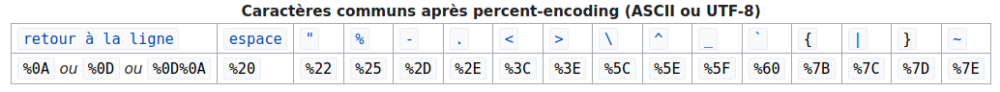
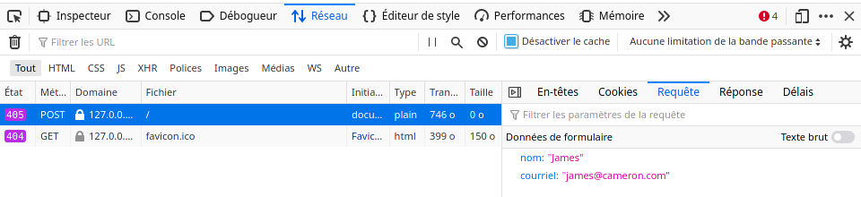

::: programme
+----------------------------+------------------------------------------+-------------------------------------------+
|          Contenus          |           Capacités attendues            |               Commentaires                |
+============================+==========================================+===========================================+
| Formulaire d’une page Web  | Analyser le fonctionnement d’un          | Discuter les deux types de requêtes selon |
|                            | formulaire simple.                       | le type des valeurs à transmettre et/ou   |
|                            |                                          | leur confidentialité.                     |
|                            | Distinguer les transmissions de          |                                           |
|                            | paramètres par les requêtes POST ou GET. |                                           |
+----------------------------+------------------------------------------+-------------------------------------------+
:::


::: intro clearfix

<a title="File Upload Bot at the English-language Wikipedia, CC BY-SA 3.0 <http://creativecommons.org/licenses/by-sa/3.0/>, via Wikimedia Commons" href="https://commons.wikimedia.org/wiki/File:Sample_web_form.png"></a>

Dans ce chapitre, nous allons voir comment permettre à l'utilisateur d'entrer des données sur une
page web grâce à la balise html `<form>`. Ces données seront ensuite transmises au serveur pour
alimenter des bases de données comme nous le verront au chapitre suivant.

:::

## Création du formulaire avec la balise `<form>`

Les formulaires sont un moyen de récupérer des données à partir du client pour les passer à
l'application serveur.

Dans le fichier `html`, on utilise la balise `<form>` en y ajoutant l'attribut `method` qui permet
d'indiquer quel est le type de requête HTTP.

```html
<form method="get">

    <label for="nom">Entrez votre nom: </label>
    <input type="text" name="nom" required>
  
    <label for="email">Entrez votre email: </label>
    <input type="email" name="email" required>
  
    <input type="submit" value="Enregistrer">
  
</form>
```

### Méthode `HTTP GET`

Avec cette méthode, les paramètres du formulaire sont placés dans l'_url_ lors de la soumission.

:::example

Soumission des données par la méthode GET:

<http://chemin/fichier.html?nom=James&email=james%40cameron.com>

- nom: James
- email: james@cameron.com

:::

::: {.plus titre="Percent-encoding"}

Dans les URL, les caractères spéciaux tels `@` sont échappés
avec un code par exemple: `%40` pour `@`, `%20` pour l'espace.



Voir l'article [Wikipedia](https://fr.wikipedia.org/wiki/Percent-encoding) pour plus de détails.
:::


::: {.appli titre="Création d'un formulaire avec la méthode GET"}

Créer une page `index.html` dans laquelle vous placerez un formulaire, avec la méthode `GET`.

```html
<!doctype html>
<html lang="fr">
  <head>
    <meta charset="utf-8" />
    <title>Un document minuscule</title>
  </head>
  <body>
    <h1>Les formulaires en html</h1>
    <!-- Le formulaire ci-dessous -->
    <form method="GET">
    <input type="text" name="nom" placeholder="Entrer votre nom">
    <button type="submit">Envoyer les données</button>
  </body>
</html>
```

Enregistrer ce fichier puis l'ouvrir dans le navigateur.

1. Entrer une valeur dans le formulaire et appuyer sur le bouton pour le soumettre et observer la
   barre d'adresse du navigateur.

2. Ajouter d'autres types d'entrées avec la balise `<input>`.

   - `<input type="text" ...`: Par défaut: entrée de texte.
   - `<input type="button" ...`: Un bouton(on préfèrera cependant la balise
     [`<button>`](https://developer.mozilla.org/en-US/docs/Web/HTML/Element/button) cependant).
   - `<input type="checkbox" ...`: Case à cocher.
   - `<input type="radio" ...`: un bouton radio qui permet de sélectionner une seule valeur parmi un
     groupe de différentes valeurs.

   Assurez-vous que toutes les balises `input` ont bien un attribut `name` pour pouvoir être
   traités.

   Observer dans la barre d'adresse comment sont placés les paramètres lors de la soumission du 
   formulaire avec le bouton `submit`.

:::

### Méthode `HTTP POST`

Avec cette méthode les données sont transmises dans le corps de la requête http, sans les encoder dans l'url cette fois-ci. 

Le serveur doit accepter les requêtes POST.

Pour observer les paramètres d'une requête `POST`, il faut ouvrir la console de développement du navigateur, dans l'onglet réseaux.



Les paramètres étant «cachés» dans la requête HTML, on les utilisera notamment pour la soumission de formulaires avec des données confidentielles:

- mot de passe
- email
- [données personnelles](/2gt/snt/4-les-donnees-structurees-et-leur-traitement/1-donnees) en général


::: {.appli titre="Création d'un formulaire avec la méthode POST"}

Sur la page web précédente, ajouter un autre formulaire, qui utilisera cette fois-ci la méthode `POST`.

Pour que le formulaire fonctionne il faut lancer un serveur local, si vous êtes sur Visual Studio Code, je vous conseille d'installer l'extension [Live Server](https://marketplace.visualstudio.com/items?itemName=ritwickdey.LiveServer)

Vérifier les différences de fonctionnement entre ces deux formulaires en utilisant la console
réseau du navigateur.

:::

## Validation des données du formulaire

A priori, les données sont destinées traitées au niveau du serveur comme nous le verrons dans le
prochain chapitre.

Il n'est cependant pas rare de valider les données côté client en `javascript` avant envoi des
données pour ne pas surcharger le serveur.

::: example

Vérification que le nom n'est pas vide.

```html
<!doctype html>
<html lang="fr">
  <head>
    <meta charset="utf-8" />
    <title>Un document minuscule</title>
  </head>
  <body>
    <h1>Les formulaires en html</h1>
    <!-- Le formulaire ci-dessous -->
    <form method="GET" >
      <input type="text" name="nom" placeholder="Entrer votre nom">
      <input type="tel" name="telephone" placeholder="0123456789">
      <button type="submit" onclick="validateForm()">Envoyer les données</button>
    </form>
    <script>
      function validateForm() {
        const nom = document.querySelector("input[name='nom']").value
        if (nom === ''){
          alert("Nom ne doit pas être vide")
        } else {"Envoi des données"}
      }
    </script>
  </body>
</html>
```
:::

::: appli

Vérifier en `javascript` qu'on a un numéro de téléphone qui commence par 0 et comporte 10 chiffres.

:::


