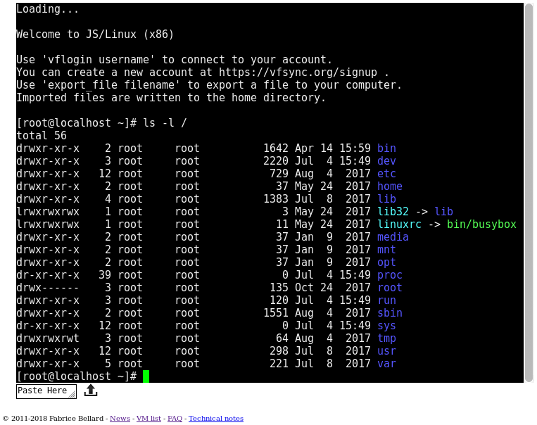
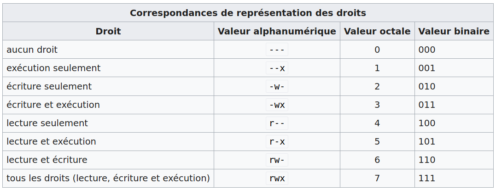

::: programme
+-------------------------+---------------------------------+---------------------------------+
|        Contenus         |       Capacités attendues       |          Commentaires           |
+=========================+=================================+=================================+
| Systèmes d'exploitation | Identifier les fonctions d'un   | Les différences entre systèmes  |
|                         | système d'exploitation.         | d'exploitation libres et        |
|                         |                                 | propriétaires sont évoquées.    |
|                         |                                 |                                 |
|                         | Utiliser les commandes de base  | Les élèves utilisent un système |
|                         | en ligne de commande.           | d'exploitation libre.           |
|                         |                                 |                                 |
|                         | Gérer les droits et permissions | Il ne s'agit pas d'une étude    |
|                         | d'accès aux fichiers.           | théorique des systèmes          |
|                         |                                 | d'exploitation.                 |
+-------------------------+---------------------------------+---------------------------------+
:::

::: intro clearfix

<a href="https://commons.wikimedia.org/wiki/File:Operating_system_placement-fr.svg#/media/Fichier:Operating_system_placement-fr.svg"></a>


Nous avons vu qu'un ordinateur a été conçu pour pouvoir lui faire exécuter des algorithmes sous
forme de programmes. 

Le **système d'exploitation est un programme tout à fait singulier**, il est chargé en mémoire vive
dès le démarrage de l'ordinateur et y reste jusqu'à son extinction. Il a la charge de coordonner
l'ensemble des tâches qui sont exécutées par l'ordinateur. Il est situé entre le matériel et les
applications.

Les deux familles de systèmes d'exploitation les plus populaires sont Unix (dont macOS, GNU/Linux,
iOS et Android) et Windows.

- Windows est principalement utilisé sur les PC de bureau, c'est un système d'exploitation
  _propriétaire_ tout comme MacOS.
- Linux au contraire est un _système d'exploitation libre_, il est principalement utilisé dans les
  serveurs, téléphones portables via Android et les supercalculateurs. Son code source est
  accessible en [ligne](https://github.com/torvalds/linux).

:::

Voici une courte vidéo de l'institut Mines-Telecom présentant l'histoire des systèmes
d'exploitation.

`youtube: 4OhUDAtmAUo`

## Responsabilités du système d'exploitation

Le système d'exploitation a les responsabilités suivantes:

- Gérer le lancement des diverses applications et donner l'illusion que l'ordinateur est *multitâche*;
- identifier les utilisateurs;
- gérer l'organisation du disque dur et de ses fichiers;
- contrôler l'accès aux données du disque dur et ressources de l'ordinateur.

## Émulation d'un système linux grâce à JSlinux

Comme nous avons au lycée un système d'exploitation Windows et que le programme officiel demande de
travailler sous Linux, nous allons faire le TP de ce chapitre directement dans le navigateur grâce
à l'émulateur de système mis au point par Fabrice Bellard accessible à l'adresse :

https://bellard.org/jslinux/vm.html?url=alpine-x86.cfg&mem=192

[](https://bellard.org/jslinux/vm.html?url=alpine-x86.cfg&mem=192){.center}

::: appli

Une fois le terminal lancé:

- Ajouter un nouvel utilisateur: `adduser ben`, et lui donner un mdp.
- Ajouter un mot de passe à l'utilisateur `root`(administrateur du système): `passwd root`.
- Changer d'utilisateur: `su ben`.
- Se déplacer dans son dossier utilisateur: `cd /home/ben`
- Importer des fichiers grâce à l'icone Upload Files, par exemple ce fichier zip: `wget https://framagit.org/eduinfo/flask-csv/-/archive/master/flask-csv-master.zip`
- Le dézipper: `unzip flask-csv-master.zip`


:::

## Quelques commandes de base

### Où suis-je? `pwd`

`pwd` renvoie le dossier courant.

Par défaut quand on ouvre un terminal on se trouve dans son dossier $HOME:

- `/home/username` pour l'utilisateur username
- `/root/` si vous êtes root, l'utilisateur administrateur du système.

### Naviguer dans le système de fichiers `ls` et `cd`

- `ls` liste les fichier et répertoires du dossier courant.
- `ls /chemin/vers/dossier`: liste les fichiers et répertoires du dossier donné en argument/

On peut également se déplacer dans le système de fichiers avec `cd` pour change directory.

- `cd /root`

::: {.plus titre=" chemins absolus et relatifs"}
Les chemins d'accés peuvent être specifiées de deux façons:

- chemin *absolu*: commence par un `/` et précise le chemin complet à partir de la racine du système de fichier. P.ex: cd /usr/share/applications
- chemin *relatif*: pas de slash au début(ou un point: `./`) on part du répertoire courant:
    - cd Music ou cd ./Music
    - cd .. pour remonter d'un dossier
    - cd ../Documents pour remonter d'un dossier et aller dans le dossier Documents
:::

### Connaître les droits sur les fichiers `ls -l`

L'option `-l` pour long précise dans sa sortie:

`permission    type    utilisateur propriétaire    groupe propriétaire    taille    date   nom`

```bash
localhost:~$ ls -l /home/ben/flask-csv-master
total 28
-rw-r--r--    1 ben      ben           1064 Mar 29 11:10 LICENSE
-rw-r--r--    1 ben      ben           1199 Mar 29 11:10 README.md
-rw-r--r--    1 ben      ben             89 Mar 29 11:10 data.csv
-rw-r--r--    1 ben      ben            888 Mar 29 11:10 flask-csv.py
drwxrwxrwx    2 ben      ben             64 Mar 29 11:10 pages
-rwxr-xr-x    1 ben      ben            108 Mar 29 11:10 run-server.bat
-rwxr-xr-x    1 ben      ben            132 Mar 29 11:10 run-server.sh
```

Les droits sont sous la forme drwxrwxrwx.

- `d` indique qu'il s'agit d'un dossier
- `r`: droit de lecture
- `w`: droit d'écriture
- `x`: droit d'exécution

Il y a trois types de droits dans l'ordre:

1. utilisateur
2. groupe
3. autres

::: example

- `-rw-r--r--`: fichier avec droit de lecture et d'écriture pour l'utilisateur propriétaire, mais
  uniquement des droits de lecture pour les membres du groupe propriétaire et les autres
  utilisateurs.
- `drwxr-xr-x`: dossier avec droit de lecture, écriture et exécution pour l'utilisateur propriétaire,
  mais uniquement des droits de lecture et d'exécution pour les membres du groupe propriétaire et
  les autres utilisateurs.
:::

### Gérer les droits avec `chmod`

Un utilisateur a le droit de faire un `chmod` sur un fichier :

- s'il est `root` ;
- ou s'il est le propriétaire du fichier en question.

*[Article Wikipedia sur `chmod`](https://fr.wikipedia.org/wiki/Chmod)*{.cite-source}

Les options passées à la commande chmod sont indiquées comme ceci :

    chmod options modes fichiers

Pour un fichier : `chmod [u g o a] [+ - =] [r w x] nom_du_fichier`

Pour le contenu d'un répertoire (de façon récursive) : `chmod -R [u g o a] [+ - =] [r w x] nom_du_répertoire `

Les lettres `u g o a` designe les types de propriétaires concernés:

- u propriétaire (user)
- g groupe (group)
- o les autres (others)
- a tous (all)

Les lettres `+ - =` désignent les changements d'état: + et - pour ajouter ou retirer un type de droit aux droits courants, et l'opérateur = pour les écraser.

Les lettres `r w x` désignent les permissions: *read, write, execute*.

::: example
Dans le cas précédent si l'on souhaite que tous les utilisateurs du groupe `docker` puissent lire 
et écrire dans le fichier `brouillon.ipynb`, on lance la commande `chmod g+w` sur le fichier:
:::

```bash
chmod g+w Documents/git/2heoinfo/flask-csv/brouillon.ipynb
```
On peut alors vérifier le changement de droits avec `ls -l`

```bash
ben@coolerarch:~$ ls -l Documents/git/2heoinfo/flask-csv/
total 28
-rw-rw-r-- 1 ben docker 2690  4 juil. 10:39 brouillon.ipynb
...
```

::: {.plus titre=" Ecriture octale"}
Pour modifier toutes les permission d'une seule commande, on utilise la notation octale.
{.center}
Les commandes sont alors condensées pour préciser tous les droits:
- `chmod 755 mon_dossier` donne au propriétaire tous les droits, aux membres du groupe et aux autres les droits de lecture et d'accès. C'est un droit utilisé traditionnellement sur les répertoires.
- `chmod 644 mon_fichier` donne au propriétaire les droits de modification et lecture, aux membres du groupe et aux autres uniquement les droits de lecture. C'est un droit utilisé traditionnellement sur les fichiers.
:::

### Gérer les propriétaires avec `chown`

L'utilisateur racine(`root`) peut changer le propriétaire d'un fichier ou d'un dossier(de l'anglais
*change the owner*)

*[Article Wikipedia sur `chmod`](https://fr.wikipedia.org/wiki/Chown)*{.cite-source}

La syntaxe générale de la commande est:

    chown [-hHLPR] [utilisateur][:groupe] cible1 [cible2 ..]

::: examples
- Rendre l'utilisateur `john` propriétaire du fichier `toto.txt`: `chown john /home/jane/toto.txt`
- Pour modifier le propriétaire de tout le contenu d'un dossier :  `chown -Rf utilisateur1 /home/dossier1`
- Pour modifier l'utilisateur et le groupe: `chown ben:prof /home/jane/toto.txt`
:::

::: ref

- [Informatique pour tous en classes préparatoires aux grandes écoles de Benjamin Wack](http://www.editions-eyrolles.com/Livre/9782212137002/informatique-pour-tous-en-classes-preparatoires-aux-grandes-ecoles)
- Articles Wikipedia sur les OS et les commandes UNIX chmod, chown.
- [Cours sur pixees.fr](https://pixees.fr/informatiquelycee/n_site/nsi_prem_cmd_base_linux.html)

Crédit image <a href="//commons.wikimedia.org/w/index.php?title=User:Golftheman&amp;action=edit&amp;redlink=1" class="new" title="User:Golftheman (page does not exist)">Golftheman</a>, <a href="https://creativecommons.org/licenses/by-sa/3.0" title="Creative Commons Attribution-Share Alike 3.0">CC BY-SA 3.0</a>, <a href="https://commons.wikimedia.org/w/index.php?curid=5602846">Lien</a>

:::