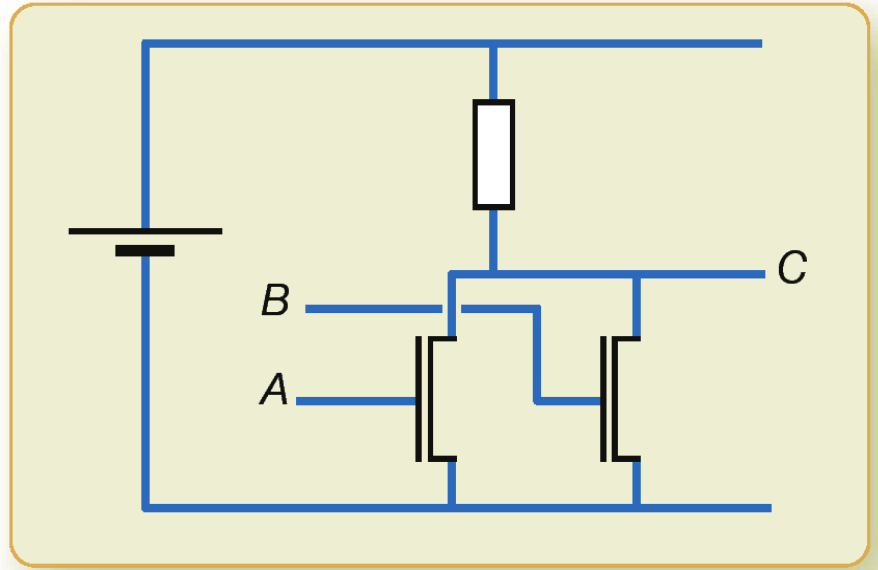
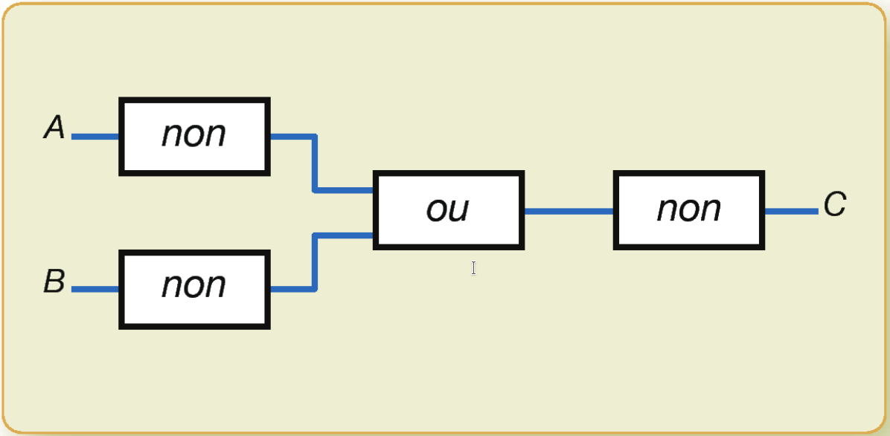

## Circuit avec transistors

Quelle est la table du circuit suivant?

*[Exercice 13.1 du livre ISN aux éditions Eyrolles ](http://www.editions-eyrolles.com/Livre/9782212135435/)*{.cite-source}

## Association de portes logiques

Quelle est la table du circuit suivant? Est-ce la table d'une fonction booléenne connue?

