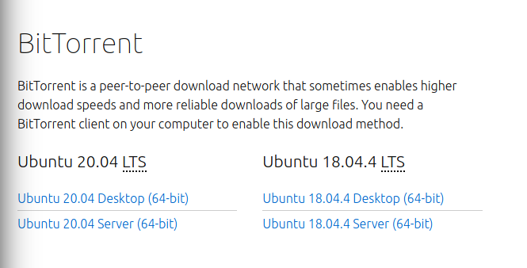

::: programme

+-----------------------------+------------------------------------------------------------------+
|        **Contenus**         |                     **Capacités attendues**                      |
+=============================+==================================================================+
| Protocole TCP/IP : paquets, | Distinguer le rôle des protocoles IP et TCP.                     |
| routage des paquets         |                                                                  |
|                             |                                                                  |
|                             | Distinguer la fiabilité de transmission et l’absence de garantie |
|                             | temporelle.                                                      |
+-----------------------------+------------------------------------------------------------------+
| Réseaux pair-à-pair         | Décrire l’intérêt des réseaux pair-à-pair ainsi que les usages   |
|                             | illicites qu’on peut en faire.                                   |
+-----------------------------+------------------------------------------------------------------+

+-------------------------------------------------------------------------------------------------+
|                                    **Exemples d’activités**                                     |
+=================================================================================================+
| - Illustrer le fonctionnement du routage et de TCP par des activités débranchées ou à l’aide de |
| logiciels dédiés, en tenant compte de la destruction de paquets.                                |
| - Déterminer l’adresse IP d’un équipement et l’adresse du DNS sur un réseau.                    |
+-------------------------------------------------------------------------------------------------+

:::

> Dans ce chapitre, nous voyons comment _assurer le transport des informations entre machines_.

## Le routage

Le réseau internet étant décentralisé, pour communiquer entre elles les machines doivent passer par
l'intermédiaire d'autres machines: les **routeurs**.

 Image par <a href="https://meta.wikimedia.org/wiki/User:Tomybrz" class="extiw" title="m:User:Tomybrz">Tomybrz</a> — Travail personnel, <a href="https://creativecommons.org/licenses/by-sa/4.0" title="Creative Commons Attribution-Share Alike 4.0">CC BY-SA 4.0</a>, <a href="https://commons.wikimedia.org/w/index.php?curid=73745782">Lien</a>

Le routage est le mécanisme par lequel des chemins sont sélectionnés dans un réseau pour acheminer
les données d'un expéditeur jusqu'à un ou plusieurs destinataires.

::: .plus

L'efficacité du routage passe par des algorithmes qui utilisent des tables de routage indiquant
quelle route prendre pour acheminer un paquet vers une adresse donnée.

:::

## Comment deux machines peuvent-elles communiquer?

Les applications d'internet peuvent utiliser deux principaux modes de communication:

- la communication client-serveur,
- la communication pair à pair(_peer to peer_ en anglais.)

### La communication client-serveur

Cele-ci est décrite dans le chapitre [Le fonctionnement du Web](/2gt/snt/2-le-web/2-le-fonctionnement-du-web)

 By <a href="//commons.wikimedia.org/wiki/User:Mauro_Bieg" title="User:Mauro Bieg">User:Mauro Bieg</a> - derived from the <a href="//commons.wikimedia.org/wiki/File:Computer_n_screen.svg" title="File:Computer n screen.svg">Image:Computer n screen.svg</a> which is under the GNU LGPL, <a href="http://www.gnu.org/licenses/lgpl.html" title="GNU Lesser General Public License">LGPL</a>, <a href="https://commons.wikimedia.org/w/index.php?curid=2551745">Link</a>

### Les réseaux pair à pair

 By <a href="//commons.wikimedia.org/wiki/User:Mauro_Bieg" title="User:Mauro Bieg">User:Mauro Bieg</a> - Own work, Public Domain, <a href="https://commons.wikimedia.org/w/index.php?curid=2551723">Link</a>

Dans un réseau pair à pair au contraire, chaque machine est à la fois client et serveur.

On parle d'architecture **décentralisée.**

Un exemple courant est le partage de fichier par torrent:

Vous téléchargez un fichier en utilisant les ordinateurs connectés voisins et en même temps vous
envoyez des paquets du fichier à d'autres utilisateurs voisins.

::: examples

- [peertube](https://joinpeertube.org/) au lieu de youtube.
- [mastodon](https://joinmastodon.org/) au lieu de twitter.

:::

::: appli

Citer au moins un avantage et un avantage et un inconvénient au réseau pair à pair par rapport à
l'architecture classique client-serveur.

:::

<!-- 
Avantages:

Inconvénient:

- lorsque vous visitez la plateforme vous utilisez des ressources pour envoyer des données à
  d'autres utilisateurs. -->
