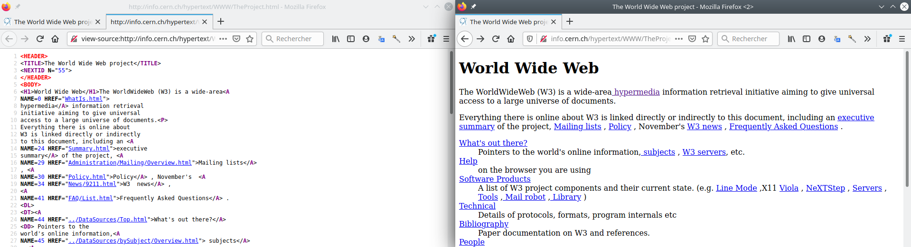

::: programme

+-----------------------------+-------------------------------------------------------------------------------+
|        **Contenus**         |                            **Capacités attendues**                            |
+=============================+===============================================================================+
| Requête HTTP                | Décomposer le contenu d’une requête HTTP et identifier les paramètres passés. |
+-----------------------------+-------------------------------------------------------------------------------+
| URL                         | Décomposer l’URL d’une page.                                                  |
|                             | Reconnaître les pages sécurisées.                                             |
+-----------------------------+-------------------------------------------------------------------------------+
| Modèle client/serveur       | Inspecter le code d’une page hébergée par un serveur et distinguer ce qui est |
|                             | exécuté par le client et par le serveur.                                      |
+-----------------------------+-------------------------------------------------------------------------------+
| Langages HTML et CSS        | Distinguer ce qui relève du contenu d’une page et de son style                |
|                             | de présentation.                                                              |
|                             | Étudier et modifier une page HTML simple.                                     |
+-----------------------------+-------------------------------------------------------------------------------+

:::

> L'ensemble des documents électroniques du web doivent pouvoir être consulté à partir de machines
> variées, ordinateurs, tablettes, objets connectés. C'est pour cela que des _protocoles
> standardisés_ ont été mis au point pour garantir un accès universel à tous.

On commence par une vidéo de l'INRIA: Le web, "site internet" ou "site web" ?

`youtube: GqD6AiaRo3U`

## Le modèle client-serveur

Pour commencer, une vidéo de l'université de Lille.

<!--  -->

[](https://vimeo.com/138623558)

*[Culture Sciences CC-BY-SA-NC](https://culturenumerique.univ-lille.fr/module2.html#subsec_2_1)*{.cite-source}

Le web est constitué de:

- **serveurs** qui hébergent les pages web,
- **clients** comme les navigateurs web qui demandent les pages web.

<p><a href="https://commons.wikimedia.org/wiki/File:Server-based-network.svg#/media/File:Server-based-network.svg"></a><br>By <a href="//commons.wikimedia.org/wiki/User:Mauro_Bieg" title="User:Mauro Bieg">User:Mauro Bieg</a> - derived from the <a href="//commons.wikimedia.org/wiki/File:Computer_n_screen.svg" title="File:Computer n screen.svg">Image:Computer n screen.svg</a> which is under the GNU LGPL, <a href="http://www.gnu.org/licenses/lgpl.html" title="GNU Lesser General Public License">LGPL</a>, <a href="https://commons.wikimedia.org/w/index.php?curid=2551745">Link</a></p>


## L'URL_(Uniforme Resource Locator)_

Chaque page web possède une adresse unique qui permet de l'identifier.

Une URL se décompose en trois grandes parties :

- Le protocole,
- le domaine précédé éventuellement du sous-domaine,
- le chemin vers la ressource.

Prenons l'exemple suivant :
[https://fr.wikipedia.org/wiki/Grace_Hopper](https://fr.wikipedia.org/wiki/Grace_Hopper)

::: prop

HTTPS est la version sécurisée du protocole HTTP dans laquelle els données échangées entre le client et le serveur sont chiffrées.

:::

::: {.plus titre="Paramètres d'URL"}

Dans le cas de pages dynamiques, il est possible d'ajouter des paramètres aux URL en les plaçant
après le chemin de la ressource.

Par exemple, pour utiliser le moteur de recherche de Wikipédia :

[https://fr.wikipedia.org/w/index.php?search=Johnny&title=Spécial Recherche&fulltext=1](https://fr.wikipedia.org/w/index.php?search=Johnny&title=Sp%C3%A9cial%20Recherche&fulltext=1&ns0=1)

_**Attention** aux caractères spéciaux, vous rencontrerez parfois le `%20`, c'est tout simplement
un espace qui n'est pas admis dans les URL._

:::

## Le protocole `HTTP`

Dans le web, le client échange de nombreuses informations avec le serveur, les pages web bien sûr,
mais également:

- des informations sur le navigateur,
- des données d'identification(cookie p.ex),
- la langue du contenu...

Ces données sont codifiées par le protocole `HTTP` ou `HTTPS` dans le cas d'échanges sécurisés(mots
de passe, paiements...)

- Le **client** effectue des demandes au serveur comme:
       - `GET`: demande d'une page
       - `POST`: transmission de données d'un formulaire p.ex
       - `DELETE`: suppression d'une ressource du serveur
       - ...

Les informations nécessaires à la requête sont placées dans des en-têtes un peu comme si les
messages étaient placés dans une enveloppe.

::: example

Voici la requête `HTTP`_(un extrait)_ envoyée pour demander la page la page
https://fr.wikipedia.org/wiki/Hypertext_Transfer_Protocol en cliquant sur le lien du moteur de
recherche www.qwant.com.

La première ligne indique le type de requête(GET, POST...), l'adresse de la ressource, et la
version du protocole.

```
GET /wiki/Hypertext_Transfer_Protocol HTTP/2
Host: fr.wikipedia.org
User-Agent: Mozilla/5.0 (X11; Linux x86_64; rv:80.0) Gecko/20100101 Firefox/80.0
Accept: text/html,application/xhtml+xml,application/xml;q=0.9,image/webp,*/*;q=0.8
Accept-Language: fr,fr-FR;q=0.8,en-US;q=0.5,en;q=0.3
...
Referer: https://www.qwant.com/
...
Cookie: WMF-Last-Access=14-Sep-2020; WMF-Last-Access-Global=14-Sep-2020; GeoIP=FR:PAC:Nice:43.71:7.26:v4;
...
```

:::

- Le **serveur** répond au client en commençant par lui envoyer un [code d'état](https://fr.wikipedia.org/wiki/Liste_des_codes_HTTP):
       - `200`: succès de la requête
       - ...
       - `301` ou `302`: redirection vers une autre page;
       - `404`: page non trouvée
       - ...
       - `500`: erreur du serveur
       - ...

::: example

Et voici l'en-tête_(un extrait)_ de la réponse du serveur:

```
HTTP/2 200 OK
date: Sun, 13 Sep 2020 09:14:27 GMT
...
content-language: fr
...
last-modified: Sun, 06 Sep 2020 18:23:06 GMT
content-type: text/html; charset=UTF-8
...
content-length: 33988
...
```

La réponse renvoyée (après l'en-tête) étant la page `html` demandée dont nous parlerons juste
après :

```html
<!DOCTYPE html>
<html class="client-nojs" lang="fr" dir="ltr">
<head>
<meta charset="UTF-8"/>
<title>Hypertext Transfer Protocol — Wikipédia</title>
...
</html>
```

:::

::: appli

En analysant les en-têtes de la requête et de la réponse, expliquez quelles sont les informations
envoyées par le client et le serveur ; c'est-à-dire, expliquez la signification des informations
`Host`, `User-Agent`...

:::


## Le langage `html` et le navigateur web

Lorsque le navigateur web (le client) envoie une requête `HTTP` vers un serveur web, celui-ci lui
renvoie du code `html` qui est rendu à l'écran grâce au navigateur.

Le langage `html` est un langage qui utilise des balises ouvrantes `<balise>` et fermantes
`</balise>`.

Voici par exemple le code-source à gauche et le rendu de la [première page
web](http://info.cern.ch/hypertext/WWW/TheProject.html) du cern rendue dans un navigateur moderne.




::: appli

Faire l'[exercice 1](./exo). 

:::

::: examples

- Un titre de niveau 1: `<h1>Mon titre</h1>`html
- un lien hypertexte: ` 
:::

::: {.plus titre="Les normes du html"}

Bien entendu, les premiers navigateurs n'étaient pas aussi évolués qu'aujourd'hui, vous pouvez
d'ailleurs avoir une idée du rendu de cette page à l'époque de sa création à cette adresse:
http://line-mode.cern.ch/www/hypertext/WWW/TheProject.html

Le langage `html` ne cesse d'évoluer pour répondre à tous les nouveaux usages d'internet,
utilisation d'écrans tactiles, lectures de vidéos, paiements...

On peut trouver sa spécification [ici](https://html.spec.whatwg.org/)

:::
