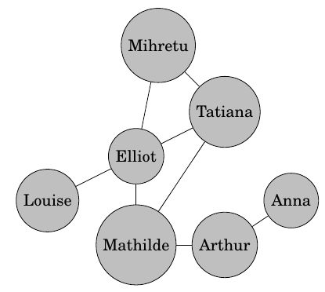

::: programme

+---------------------------------------+--------------------------------------------------------------+
|             **Contenus**              |                   **Capacités attendues**                    |
+=======================================+==============================================================+
| Rayon, diamètre et centre             | Déterminer ces caractéristiques sur des graphes simples.     |
| d’un graphe                           |                                                              |
|                                       |                                                              |
| Notion de « petit monde »             | Décrire comment l’information présentée par les réseaux      |
|                                       | sociaux est conditionnée par le choix préalable de ses amis. |
| Expérience de Milgram                 |                                                              |
+---------------------------------------+--------------------------------------------------------------+

:::

> Pour représenter les liens entre les personnes présentes sur un réseau social, on utilise un type particulier de représentation graphique: **les graphes**.

 By <a href="https://ru.wikipedia.org/wiki/%D0%A3%D1%87%D0%B0%D1%81%D1%82%D0%BD%D0%B8%D0%BA:Festys" class="extiw" title="ru:Участник:Festys">Festys</a> - Own work, <a href="https://creativecommons.org/licenses/by-sa/3.0" title="Creative Commons Attribution-Share Alike 3.0">CC BY-SA 3.0</a>, <a href="https://commons.wikimedia.org/w/index.php?curid=22915309">Link</a>

## Vocabulaire

Dans un graphe social, on représente:

- les personnes par des ronds: les _nœuds_, 
- leurs relations par des traits: les _arêtes_.

*[Eduscol](https://cache.media.eduscol.education.fr/file/SNT/10/5/RA19_Lycee_G_SNT_2nd_Milgram_graphe_1161105.pdf)*{.cite-source}

## Représentations des liens entre personnes

Un graphe peut-être décrit par un tableau dans lequel on va porter les relations d'amitié entre les
personnes.

+----------+---------+---------+--------+--------+----------+--------+------+
|          | Mihretu | Tatiana | Elliot | Louise | Mathilde | Arthur | Anna |
+----------+---------+---------+--------+--------+----------+--------+------+
| Mihretu  |         |         |        |        |          |        |      |
+----------+---------+---------+--------+--------+----------+--------+------+
| Tatiana  |         |         |        |        |          |        |      |
+----------+---------+---------+--------+--------+----------+--------+------+
| Elliot   |         |         |        |        |          |        |      |
+----------+---------+---------+--------+--------+----------+--------+------+
| Louise   |         |         |        |        |          |        |      |
+----------+---------+---------+--------+--------+----------+--------+------+
| Mathilde |         |         |        |        |          |        |      |
+----------+---------+---------+--------+--------+----------+--------+------+
| Arthur   |         |         |        |        |          |        |      |
+----------+---------+---------+--------+--------+----------+--------+------+
| Anna     |         |         |        |        |          |        |      |
+----------+---------+---------+--------+--------+----------+--------+------+

## Rayon, diamètre et centre d'un graphe

Pour mesurer les caractéristiques d'un graphe, on mesure les distances entre les nœuds.

La **distance** entre deux sommets dans un graphe est définie par la longueur d'un plus court chemin
entre ces deux sommets.

Il peut être commode de remplir un tableau de distances pour caractériser le graphe.

+----------+---------+---------+--------+--------+----------+--------+------+
| distance | Mihretu | Tatiana | Elliot | Louise | Mathilde | Arthur | Anna |
+----------+---------+---------+--------+--------+----------+--------+------+
| Mihretu  | 0       |         |        |        |          |        |      |
+----------+---------+---------+--------+--------+----------+--------+------+
| Tatiana  |         | 0       |        |        |          |        |      |
+----------+---------+---------+--------+--------+----------+--------+------+
| Elliot   |         |         | 0      |        |          |        |      |
+----------+---------+---------+--------+--------+----------+--------+------+
| Louise   |         |         |        | 0      |          |        |      |
+----------+---------+---------+--------+--------+----------+--------+------+
| Mathilde |         |         |        |        | 0        |        |      |
+----------+---------+---------+--------+--------+----------+--------+------+
| Arthur   |         |         |        |        |          | 0      |      |
+----------+---------+---------+--------+--------+----------+--------+------+
| Anna     |         |         |        |        |          |        | 0    |
+----------+---------+---------+--------+--------+----------+--------+------+

::: {.def terme="rayon"}

La **plus petite distance** à laquelle puisse se trouver un sommet de _tous les autres_.

:::

::: {.def terme="diamètre"}

La **plus grande distance** possible qui puisse exister _entre deux de ses sommets_.

:::

::: {.def terme="centre"}

Le ou les **nœuds** distant d'au maximum un **rayon** des autres.

:::

Pour déterminer ces caractéristiques on mesure la distance maximale de chaque nœud aux autres (on
parle d'excentricité).

+----------------+---------+---------+--------+--------+----------+--------+------+
| distance       | Mihretu | Tatiana | Elliot | Louise | Mathilde | Arthur | Anna |
+----------------+---------+---------+--------+--------+----------+--------+------+
| distance       |         |         |        |        |          |        |      |
| maximale       |         |         |        |        |          |        |      |
| (excentricité) |         |         |        |        |          |        |      |
+----------------+---------+---------+--------+--------+----------+--------+------+

::: appli

Déterminer le rayon, le diamètre et le centre du graphe précédent.

:::

## Les petits mondes

Sur les réseaux sociaux actuels, _3,5 personnes en moyenne_ séparent deux personnes choisies au
hasard. On est donc effectivement _connecté au monde entier_.

 By Screenshot taken by <a href="//commons.wikimedia.org/w/index.php?title=User:DarwinPeacock&amp;amp;action=edit&amp;amp;redlink=1" class="new" title="User:DarwinPeacock (page does not exist)">User:DarwinPeacock</a> - Screenshot of free software <a rel="nofollow" class="external text" href="http://graphexploration.cond.org/">GUESS</a>, <a href="https://creativecommons.org/licenses/by/3.0" title="Creative Commons Attribution 3.0">CC BY 3.0</a>, <a href="https://commons.wikimedia.org/w/index.php?curid=6057981">Link</a>

Cependant, de part la conception des _algorithmes de recommandations_, ces réseaux nous présentent
souvent des contenus de personnes qui nous ressemblent et qui pensent comme nous ce qui «
étonnamment » nous empêche d'être au contact des autres et de leurs différences. **On reste dans
notre petit monde**.