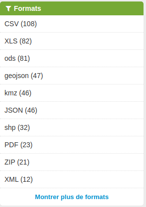

::: programme

+--------------+---------------------------------------------------------+
| **Contenus** |                 **Capacités attendues**                 |
+==============+=========================================================+
| Données      | Définir une donnée personnelle.                         |
|              | Identifier les principaux formats et représentations de |
|              | données.                                                |
+--------------+---------------------------------------------------------+
| Métadonnées  | Retrouver les métadonnées d’un fichier personnel.       |
+--------------+---------------------------------------------------------+

:::

> Les données personnelles sont un grand enjeu actuel du web, c'est pour cela que l'Europe et la
Californie se sont dotées de lois pour faire respecter des règles sur la collecte et le traitement
des données personnelles par les entreprises du web.


::: {.plus titre="Formulaire html"}

Dans une page web, les formulaires sont représentés à l'aide de balises `<form>` et `<input>`.

```html
<form name="formA" action="/cgi-bin/test" method="post">
 <p>Appuyez sur "Info" pour les détails du formulaire, ou "Définir" pour modifier ces détails.</p>
 <p>
  <button type="button" onclick="getFormInfo();">Info</button>
  <button type="button" onclick="setFormInfo(this.form);">Set</button>
  <button type="reset">Reset</button>
 </p>

 <textarea id="form-info" rows="15" cols="20"></textarea>
</form>
```

Voir cette page sur [MDN](https://developer.mozilla.org/fr/docs/Web/API/HTMLFormElement) pour plus
d'informations.

:::

## Qu'est-ce qu'une donnée personnelle ?

> Une donnée personnelle correspond à toute information qui permet d'identifier directement ou
> indirectement une personne physique.

*[CNIL](https://www.cnil.fr/fr/definition/donnee-personnelle)*{.cite-source}

::: examples

- Nom,
- Prénom
- photographie du visage
- date et lieu de naissance
- adresse, adresse électronique, adresse IP
- numéro de téléphone
- numéro de sécurité sociale
- numéro de carte bancaire

:::

::: plus

En droit français, les personnes morales sont les personnes agissant au sein d'une entreprise ou
d'une association par exemple.

:::

<!-- TODO ajouter les métadonnées 

Excellente vidéo:
https://www.lemonde.fr/pixels/video/2015/06/15/comment-les-metadonnees-permettent-de-vous-surveiller-explique-en-patates_4654461_4408996.html

-->

## Les données ouvertes

À l'inverse des données collectées par certaines entreprises privées pour mieux connaitre leurs
utilisateurs ou éventuellement faire un commerce de ces données, les données ouvertes sont
librement accessibles grâce à une licence ouverte garantissant leur libre accès et leur
réutilisation par tous, sans restriction technique, juridique ou financière.

::: def

Les **données ouvertes** ou _open data_ sont des données numériques dont l'accès et l'usage sont
laissés libres aux usagers.

:::

::: examples

- Plateforme ouverte des données publiques françaises: https://www.data.gouv.fr/fr/
- Données de la ville de Nice Côte d'azur: http://opendata.nicecotedazur.org/data/dataset
- Données d'électricité en France: https://data.enedis.fr/
- ...

:::

## Les divers formats de données

Les données peuvent être stockées sous divers _formats_ adaptés à leurs usages.



- Les formats de tableur adaptés aux humains, par exemple: 

  - `XLS`: tableur Microsoft Excel.
  - `ODS`: tableur LibreOffice sous licence libre.

- Les formats textuels adaptés aux machines, mais compréhensibles malgré tout.

  - `XML`: format de données avec balises _eXtensible Markup Langage_

  Par exemple, voici le début de la [liste des restaurants de Nice au format `xml`](http://opendata.nicecotedazur.org/data/dataset/liste-des-restaurants-de-nice-geolocalises/resource/d2acb1ee-9b27-4d54-a281-c0bab4653f62).

  ```xml
  <entry>
    <ID>519</ID>
    <name_fr>AUBERGE DE L'AIRE SAINT-MICHEL</name_fr>
    <address>
      <address_line>Chemin de Châteaurenard</address_line>
      <zip>06100</zip>
      <city>NICE</city>
    </address>
    <phone>+33(0)4 93 84 42 07</phone>
  </entry>
  <entry>
    <ID>520</ID>
       ...
  ```

  - `CSV`: données séparées par des virgules _Coma Separated Values_
  
    Par exemple, voici un extrait de la [liste des musées de Nice au format `csv`](http://opendata.nicecotedazur.org/data/dataset/musees-et-galeries-de-la-ville-de-nice/resource/6275d491-cbda-44a9-bfed-34d02deeb944).
  
    ```
"Type d'établissement","Identité","Adresse Postale"
"MUSEE","MUSÉE MATISSE","06364 Nice CEDEX 04"
"GALERIE ","GALERIE DES PONCHETTES","06364 Nice CEDEX 04"
... 
    ```
  - `JSON`: notation objet issue de javascript.

    Par exemple, voici le début des données de [cartographie des vélos bleus en `json`](http://opendata.nicecotedazur.org/data/dataset/cartographie-des-stations-velobleu/resource/ffa94ca0-b27a-424a-bb97-76ee0c833878?inner_span=True).
  
    ```json
    {
    "docs": [
      {
        "NBR_PT_ACC": 15,
        "IDENT": "131",
        "NBR_VELO": 0,
        "COMPL_LOC": "Le long du parking-relais Pont Michel, à proximité de la station de tramway",
        "NOM_VOIE": "ROUTE DE TURIN",
        "EMPLACEMEN": "Trottoir"
      },
      {
        "NBR_PT_ACC": 15,
        "IDENT": "132",
        "NBR_VELO": 0,
        "COMPL_LOC": "n43",
        "NOM_VOIE": "AVENUE DENIS SEMERIA",
        "EMPLACEMEN": "Chaussée"
      },
    ```
