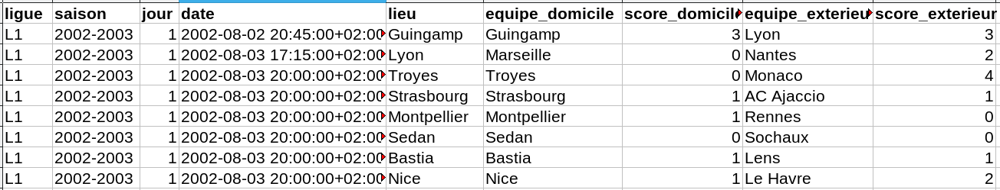

::: programme

+-----------------------------------+-----------------------------------------------------------------+
|           **Contenus**            |                     **Capacités attendues**                     |
+===================================+=================================================================+
| Données structurées               | Identifier les différents descripteurs d’un objet.              |
|                                   | Distinguer la valeur d’une donnée de son descripteur.           |
|                                   | Utiliser un site de données ouvertes, pour sélectionner et      |
|                                   | récupérer des données.                                          |
+-----------------------------------+-----------------------------------------------------------------+
| Traitement de données structurées | Réaliser des opérations de recherche, filtre, tri ou calcul sur |
|                                   | une ou plusieurs tables.                                        |
+-----------------------------------+-----------------------------------------------------------------+

:::

## Descripteurs et valeurs

Dans un jeu de données, on distingue:

- le **descripteur** par exemple `lieu` qui est un champ commun à tout le jeu de données.
- de sa **valeur** `Nice`, `Marseille`... qui est propre à chaque ligne des données.



## Les dictionnaires en Python

En python, une entrée peut-être représentée par un dictionnaire ou les couples `"descripteur":
valeur` sont séparés par des virgules et entourées d'accolades.

```python
match = {'ligue': 'L1',
         'saison': '2002-2003',
         'jour': '1',
         'date': '2002-08-03 20:00:00+02:00',
         'lieu': 'Nice',
         'equipe_domicile': 'Nice',
         'score_domicile': '1',
         'equipe_exterieur': 'Le Havre',
         'score_exterieur': '2'}
```

Chaque valeur peut-être accédée grâce à son descripteur (ou clé):

```python
print(match["lieu"]) # affiche "Nice"
```

::: appli

Expliquer simplement quelle donnée représente le dictionnaire match?

:::

## Exploitation d'un fichier `csv` en Python

Lorsqu'on lit un fichier `csv` en Python, chaque ligne du fichier est automatiquement converti en
`dict`ionnaire.

Voici par exemple comment afficher toutes les lignes d'un fichier appelé `data.csv`.

```python
# import du module csv de Python
import csv

# Lecture de chaque ligne sous forme de dictionnaire
with open('data.csv') as csv_file:
    reader = csv.DictReader(csv_file)
    for ligne in reader:
        # affiche le dictionnaire complet
        print(ligne)
        # ou on affiche qu'une valeur par ligne
        # print(ligne["descripteur"])
```

Voici par exemple la sortie obtenue avec le fichier des musées de Nice:

```
{"Type d'établissement": 'MUSEE', 'Identité': "MUSÉE D'ART MODERNE ET D'ART CONTEMPORAIN MAMAC", 'Adresse': 'Place Yves Klein 06300 Nice'}
{"Type d'établissement": 'MUSEE', 'Identité': 'MUSÉE MATISSE', 'Adresse': '164 Avenue des Arènes de Cimiez, 06000 Nice'}
{"Type d'établissement": 'MUSEE', 'Identité': 'PALAIS LASCARIS', 'Adresse': '15 rue Droite            06300 Nice'}
{"Type d'établissement": 'MUSEE', 'Identité': "MUSEUM D'HISTOIRE NATURELLE", 'Adresse': '60 bd Risso           06300 Nice'}
{"Type d'établissement": 'MUSEE', 'Identité': "MUSEE D'ARCHEOLOGIE DE NICE CIMIEZ", 'Adresse': '160, avenue des Arènes de Cimiez 06000 Nice'}
{"Type d'établissement": 'MUSEE', 'Identité': "MUSEE D'ARCHEOLOGIE DE NICE TERRA AMATA", 'Adresse': '25 bd Carnot\n06300 Nice'}
{"Type d'établissement": 'MUSEE', 'Identité': 'MUSÉE DES BEAUX-ARTS JULES CHERET', 'Adresse': '33 av des Baumettes    06000 Nice'}
{"Type d'établissement": 'MUSEE', 'Identité': "MUSÉE INTERNATIONAL D'ART NAÏF ANATOLE JAKOVSKY", 'Adresse': 'Château Sainte-Hélène 23, avenue de Fabron 06200 NICE'}
{"Type d'établissement": 'MUSEE', 'Identité': 'MUSÉE DE LA PHOTOGRAPHIE CHARLES NEGRE', 'Adresse': '1 Place Pierre Gautier 06300 Nice'}
{"Type d'établissement": 'MUSEE', 'Identité': 'VILLA MASSÉNA', 'Adresse': '65 rue de France   06000 Nice'}
{"Type d'établissement": 'MUSEE', 'Identité': 'PRIEURE DU VIEUX LOGIS', 'Adresse': '59 Avenue de Saint-Barthélémy, 06100 Nice'}
{"Type d'établissement": 'GALERIE ', 'Identité': 'GALERIE DE LA MARINE', 'Adresse': '59 quai des Etats-Unis  06300 Nice'}
{"Type d'établissement": 'GALERIE ', 'Identité': 'GALERIE DES PONCHETTES', 'Adresse': '77 Quai des États-Unis, 06300 Nice'}
{"Type d'établissement": '', 'Identité': 'MONASTERE DES FRANCISCAINS', 'Adresse': 'Place du Monastère - 06000 Nice'}
```