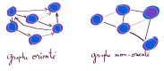
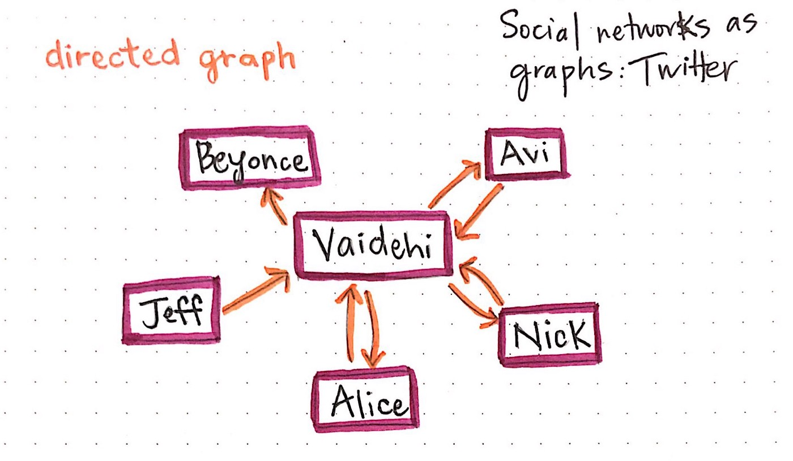

::: programme

+-------------------------+------------------------------------+------------------------------------------+
|        Contenus         |        Capacités attendues         |               Commentaires               |
+=========================+====================================+==========================================+
| Graphes : structures    | Modéliser des situations sous      | On s’appuie sur des exemples             |
| relationnelles.         | forme de graphes.                  | comme le réseau routier, le              |
|                         |                                    | réseau électrique, Internet, les         |
| Sommets, arcs, arêtes,  | Écrire les implémentations         | réseaux sociaux.                         |
| graphes orientés ou     | correspondantes d’un graphe :      |                                          |
| non orientés.           | matrice d’adjacence, liste de      | Le choix de la représentation            |
|                         | successeurs/de prédécesseurs.      | dépend du traitement qu’on veut          |
|                         |                                    | mettre en place : on fait le lien        |
|                         | Passer d’une représentation à      | avec la rubrique « algorithmique ».      |
|                         | une autre.                         |                                          |
|                         |                                    |                                          |
|                         |                                    |                                          |
+-------------------------+------------------------------------+------------------------------------------+

:::

::: intro clearfix

<p><a href="https://commons.wikimedia.org/wiki/File:Random-graph-Erdos_generated_network.svg#/media/File:Random-graph-Erdos_generated_network.svg"></a><br>By <a href="//commons.wikimedia.org/wiki/User:Renepick" title="User:Renepick">Renepick</a> - <span class="int-own-work" lang="en">Own work</span>, <a href="https://creativecommons.org/licenses/by-sa/3.0" title="Creative Commons Attribution-Share Alike 3.0">CC BY-SA 3.0</a>, <a href="https://commons.wikimedia.org/w/index.php?curid=29999054">Link</a></p>

> Dans ce chapitre, nous étudions les _graphes_, une structure de données très utilisée pour
> représenter les liens et les interactions entre des objets, les personnes, les villes, les
> ordinateurs... En effet, nous verrons qu'il existe de nombreuses variétés de _graphes_ permettant
> ainsi de décrire des situations diverses, tout en conservant, une même représentation et donc des
> mêmes méthodes pour les manipuler par informatique.

:::

## Les graphes : une structure de données non linéaire

Vous êtes déjà habitués à manipuler des listes, n-uplets ou encore les piles et les files, qui sont
des exemples de _structures de données linéaires_, c'est-à-dire à une dimension, on peut les
parcourir du début à la fin en suivant _un seul chemin_.


Dans le chapitre précédent nous avons vu les [arbre](../../1-structures-de-donnees/4-arbres)s, un
exemple structure de données non linéaire très utilisé pour représenter une hiérarchie entre des
données comme des liens de descendance dans un arbre généalogique.

En fait, les arbres sont des graphes avec bien particuliers tels que tous les nœud sauf la racine
ont un unique parent(on parle de _graphe acyclique orienté_).

Maintenant que nous parlons de graphe, il n 'existe plus aucune restriction, il n'y a plus de
racine, plus de restriction sur les parents, les enfants, ou quoi que ce soit.


::: {.def terme="graphe"}

Un graphe est une structure composée d'_objets_ dans laquelle certaines paires d'objets sont en
relation.

:::

> Les objets correspondent à des abstractions mathématiques et sont appelés _sommets_ (ou nœuds ou
points), et les relations entre sommets sont des _arêtes_ (ou liens ou lignes).


::: {.def terme="Graphe orienté"}

On distingue les graphes _non orientés_, où les arêtes relient deux sommets de _manière
symétrique_, et les graphes _orientés_, où les arêtes, alors appelées _flèches_, relient deux sommets
de manière asymétrique.

*[Article wikipedia sur les graphes][wkp]*{.cite-source}



:::

::: {.def terme="Graphe pondéré"}

Un graphe pondéré ou un réseau est un graphe où chaque arête porte un nombre (son poids).

<p><a href="https://commons.wikimedia.org/wiki/File:Weighted_network.png#/media/Fichier:Weighted_network.png"></a><br>Image par <a href="//commons.wikimedia.org/w/index.php?title=User:Tore.opsahl&action=edit&redlink=1" class="new" title="User:Tore.opsahl (page does not exist)">Tore.opsahl</a> — Based on File:Social-network.svg, Domaine public, <a href="https://commons.wikimedia.org/w/index.php?curid=7833144">Lien</a></p>

Ces poids peuvent représenter par exemple des coûts, des longueurs ou des capacités, en fonction du
problème traité. Ces graphes sont fréquents dans divers contextes, comme le problème de plus court
chemin ou le problème du voyageur de commerce.

:::

## Quelques exemples de graphes

En fait les graphes sont omniprésents, car il est rare que l'information puissent être réduite à
une structure linéaire comme les listes ou encore à un arbre dans lequel la descendance est
parfaitement établie.

### Internet 

Prenons l'exemple d'internet, le réseau internet est un ensemble de machines sont identifiées par
leur adresse IP. Elles sont reliées entre elles _sans une machine mère_ qui centralise les échanges
et dans lequel le chemin des paquets n'est pas unique entre deux machines grâce aux protocoles de
routage.

<p><a href="https://commons.wikimedia.org/wiki/File:Internet_map_1024.jpg#/media/File:Internet_map_1024.jpg"></a><br>By <a href="//commons.wikimedia.org/w/index.php?title=Barrett_Lyon&action=edit&redlink=1" class="new" title="Barrett Lyon (page does not exist)"> The Opte Project</a> - Originally from the <a href="https://en.wikipedia.org/wiki/Main_Page" class="extiw" title="en:Main Page">English Wikipedia</a>; description page is/was <a href="https://en.wikipedia.org/wiki/en:Image:Internet_map_1024.jpg" class="extiw" title="w:en:Image:Internet map 1024.jpg">here</a>., <a href="https://creativecommons.org/licenses/by/2.5" title="Creative Commons Attribution 2.5">CC BY 2.5</a>, <a href="https://commons.wikimedia.org/w/index.php?curid=1538544">Link</a></p>

Lorsque nous cliquons entre des sites Web et que nous naviguons entre les URL, nous naviguons
vraiment à travers un graphique. Parfois, ces graphiques ont des sommets avec des bords non
orientés - je peux aller et venir d'une page Web à une autre - et d'autres qui sont dirigés - je ne peux que
passer de la page Web A à la page Web B, et jamais l'inverse.

Mais il y a un meilleur exemple qui illustre magnifiquement nos interactions quotidiennes avec les
graphes: les _réseaux sociaux_.

### Réseaux sociaux

Prenons l'exemple des réseaux sociaux tels sur Facebook ou son alternative libre
[Diaspora](https://diasporafoundation.org/).

Dans ce type de réseau social:

- les sommets sont les utilisateurs
- les arêtes sont les liens d'amitié entre ces utilisateurs.


*[A gentle introduction to graph theory][medium]*{.cite-source}

L'amitié se veut être un lien bidirectionnel, on ne peut être ami de quelqu'un qui n'est pas votre
ami: **C'est un graphe non-orienté**.

Au contraire dans les réseaux de microblogging comme Twiter ou son alternative libre
[Mastodon](https://mastodon.social/about), les liens ne sont pas de la même nature.

On peut suivre une personne, mais il n'est pas obligatoire que cette personne vous suivre en retour.


*[A gentle introduction to graph theory][medium]*{.cite-source}

Le suivi est un lien directionnel : **C'est un graphe non-orienté**.

### Graphes routiers

::: clearfix 

<p><a href="https://commons.wikimedia.org/wiki/File:Carte_TGV.svg#/media/File:Carte_TGV.svg"></a>Auteur de la carte&nbsp;: <a href="//commons.wikimedia.org/w/index.php?title=User:Madcap&action=edit&redlink=1" class="new" title="User:Madcap (page does not exist)">madcap</a>.Travail basé sur la carte du réseau publiée par la SNCF sur son site internet.<a href="http://creativecommons.org/licenses/by-sa/3.0/" title="Creative Commons Attribution-Share Alike 3.0">CC BY-SA 3.0</a>, <a href="https://commons.wikimedia.org/w/index.php?curid=655061">Link</a></p>

Les graphes routiers sont un bel exemple de graphes **pondérés non-orientés**. On peut utiliser le
temps ou la distance pour la pondération.

On place souvent les nœuds à leur position réelle sur une carte sur ce type de graphes.

:::

## Comment implémenter un graphe?

Il existe deux façons d'implémenter un graphe:

- La matrice d'adjacence,
- la liste de successeurs/prédécesseurs.

Nous allons voir comment réaliser ces deux implémentations, et comment passer de l'une à l'autre.

### La matrice d'adjacence

::: def

On représente les liens entre les $n$ sommets du graphe par une matrice de dimension $n$ dont
l'élément non diagonal $a_{ij}$ est le nombre d'arêtes (ou son poids pour un graphe pondéré) liant
le sommet $i$ au sommet $j$.

:::

L'élément diagonal $a_{ii}$ est le nombre de boucles au sommet i.

Dans le cas d'un graphe non orienté, la matrice d'adjacence est _symétrique_.


Pour un graphe orienté, elle est quelconque.


*[Article Wikipédia sur les matrices d'adjacence](https://fr.wikipedia.org/wiki/Matrice_d%27adjacence)*{.cite-source}

### La liste de successeurs/prédécesseurs

::: def

La liste d'adjacence d'un graphe non orienté, est la liste des voisins de chaque sommet.

:::

*[Article Wikipédia sur la liste d'adjacence](https://fr.wikipedia.org/wiki/Liste_d%27adjacence)*{.cite-source}


::: {.plus titre="Quelle implémentation choisir?"}

Cette représentation est particulièrement adaptée aux graphes creux (c'est-à-dire peu denses),
contrairement à la matrice d'adjacence adaptée aux graphes denses.

+----------------------+-------------------+-------------------+----------------------+
|    Implémentation    | Accés à une arête | Accés à un voisin | Utilisation préférée |
+======================+===================+===================+======================+
| matrice d’adjacence  | O(1)              | O(n)              | Graphe dense         |
+----------------------+-------------------+-------------------+----------------------+
| liste de successeurs | O(n)              | O(1)              | Graphe creux         |
+----------------------+-------------------+-------------------+----------------------+

:::

### Implémentations en Python

Le créateur de Python Guido Von Rossum, proposa une implémentation de graphe en Python utilisant la
**liste d'adjacence**(https://www.python.org/doc/essays/graphs/):

> Few programming languages provide direct support for graphs as a data type, and Python is no
> exception. However, graphs are easily built out of lists and dictionaries. For instance, here's a
> simple graph (I can't use drawings in these columns, so I write down the graph's arcs): 

```
A -> B
A -> C
B -> C
B -> D
C -> D
D -> C
E -> F
F -> C
```

```python
graph = {'A': ['B', 'C'],
         'B': ['C', 'D'],
         'C': ['D'],
         'D': ['C'],
         'E': ['F'],
         'F': ['C']}
```

En ce qui concerne les **matrices**, on les représente généralement sous forme de tableaux de
tableaux, comme vu en
[première](/1g/nsi/3-representation-des-donnees-types-construits/2-tableaux#tableaux-à-deux-dimensions-les-matrices).

$$
\begin{pmatrix}
   1 & 2 & 3\\
   4 & 5 & 6\\
   7 & 8 & 9 
\end{pmatrix}
$$

```python
M = [[1, 2, 3],
     [4, 5, 6],
     [7, 8, 9]]
```


::: appli

1. Dessiner une représentation conventionnelle du graphe proposé par Guido Von Rossum.
2. Écrire la matrice d'adjacence correspondante.
3. Proposer une implémentation de la matrice d'adjacence de ce graphe en Python en utilisant une
   liste de liste.

:::


::: ref

- [A gentle introduction to graph theory][medium]
- [Article wikipedia sur les graphes][wkp]

[medium]: https://medium.com/basecs/a-gentle-introduction-to-graph-theory-77969829ead8
[wkp]: https://fr.wikipedia.org/wiki/Graphe_(math%C3%A9matiques_discr%C3%A8tes)

:::