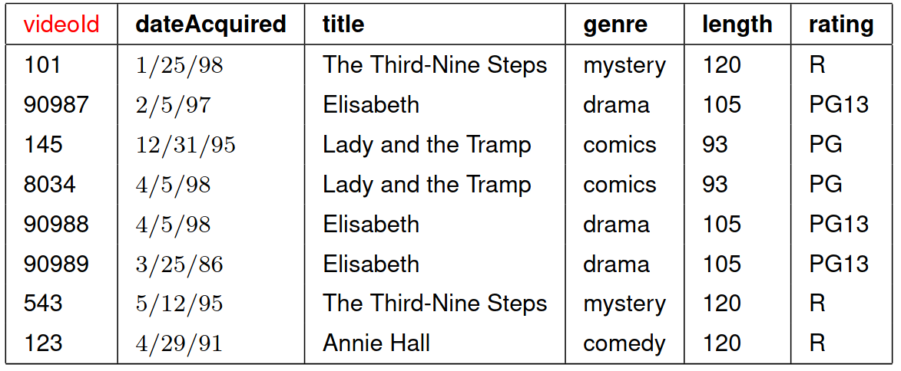

## Création de relations avec sqlite browser

1. Reprendre l'exemple du cours et créer une base de données mieux conçue en créant deux relations:

   - `dvd` pour les données concernant les disques.
   - `film` pour les données concernant les films.
   
   

2. Après avoir créé entrées de DVD et de films, vérifier que sqlite respecte bien les trois
   contraintes d'intégrité.

## Création d'un schéma relationnel

Proposer sur le papier un schéma relationnel pour les données sur les oscars du [chapitre 1](/tg/nsi/2-bases-de-donnees/1-les-bases-de-donnees-relationnelles/#motivations).

## Vers le SQL

SQLite Browser possède un onglet pour exécuter des requêtes SQL (au programme du prochain
chapitre!), vous pouvez vous familiariser avec sa syntaxe en faisant le TP proposé par [Stéphan Van
Zuijlen](https://isn-icn-ljm.pagesperso-orange.fr/NSI-TLE/res/media_TD2.eWeb/co/module_cours_exos_creation_base.html).

