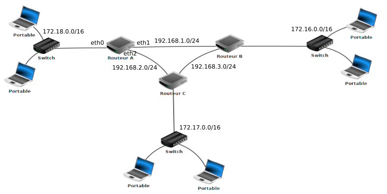

::: programme

+------------------------+-------------------------------------+----------------------------------------+
|        Contenus        |         Capacités attendues         |              Commentaires              |
+========================+=====================================+========================================+
| Protocoles de routage. | Identifier, suivant le protocole de | En mode débranché, les tables de       |
|                        | routage utilisé, la route           | routage étant données, on se           |
|                        | empruntée par un paquet.            | réfère au nombre de sauts              |
|                        |                                     | (protocole RIP) ou au coût des         |
|                        |                                     | routes (protocole OSPF).               |
|                        |                                     |                                        |
|                        |                                     | Le lien avec les algorithmes de        |
|                        |                                     | recherche de chemin sur un             |
|                        |                                     | graphe est mis en évidence.            |
+------------------------+-------------------------------------+----------------------------------------+

:::

> Dans ce chapitre nous poursuivons l'étude des réseaux entamée en seconde et en première par
> l'étude des **protocoles de routage**. Nous allons voir comment l'information trouve un chemin à
> l'intérieur d'internet.

On commence par une vidéo qui rappelle le vocabulaire essentiel des réseaux:

- commutateur ou _switch_ en anglais.
- réseau local (_LAN _)
- routeur
- internet (_WAN_)

`youtube: JqweQE6TDTc`

*Mr.Techno via youtube sous licence CC-BY*{.cite-source}

:::appli

Définir les termes cités ci-dessus.

:::

## Comment se «frayer» un chemin à travers le réseau ?

Avant d'aborder dans le détail les techniques et algorithmes utilisés, nous allons commencer par
étudier un exemple pour comprendre ce qui se passe.

*David Roche via pixees.fr CC-BY-SA*{.cite-source}

::: appli

1. Combien y a-t-il de réseaux locaux?
2. Quel chemin sur le réseau doit parcourir l'information pour relier deux machines d'un même
   réseau local comme M13 -> M15?
3. Montrer qu'il existe plusieurs chemins possibles pour communiquer entre deux machines
   appartenant à des réseaux locaux différents comme M1 -> M9.

:::

Sur cet exemple on a pu montrer qu'il existe plusieurs chemins possibles pour relier deux machines
appartenant à des réseaux locaux différents. Certains seront certainement plus efficaces que
d'autres, mais n'étant jamais à l'abri de problèmes techniques sur certains routeurs ou certaines
liaisons, l'existence de plusieurs routes rend le réseau internet plus résilient aux pannes.

## Les tables de routage

Lorsqu'un routeur reçoit un paquet celui-ci comporte une adresse IP de destination. Pour savoir
dans quelle direction envoyer le paquet, chaque routeur possède une _table de routage_.

Une table de routage est un tableau indiquant pour chaque réseau de destination(connu à partir de
l'IP de la destination), quel interface réseau on peut utiliser en lui associant également une
métrique qui mesure la «distance» séparant le routeur du réseau de destination.

::: {.plus titre="Afficher une table de routage"}

- Sous Windows : route print ou netsh int ipv4/ipv6 sh route
- Sous Unix/OS X : netstat -rn
- Sous Linux : ip -4/-6 route

| Réseau destination (format CIDR)  |      Masque      |   Passerelle   |   Interface    | Métrique  |
|:---------------------------------:|:----------------:|:--------------:|:--------------:|:---------:|
| 0.0.0.0/0                         | 0.0.0.0          | 192.168.0.1    | 192.168.0.100  | 1         |
| 127.0.0.0/8                       | 255.0.0.0        | 127.0.0.1      | 127.0.0.1      | 1         |
| 192.168.0.0/24                    | 255.255.255.0    | 192.168.0.100  | 192.168.0.100  | 1         |
| 192.168.0.100/32                  | 255.255.255.255  | 127.0.0.1      | 127.0.0.1      | 1         |
| 192.168.0.1/32                    | 255.255.255.255  | 192.168.0.100  | 192.168.0.100  | 1         |

*[Article Wiképdia sur les tables de routage](https://fr.wikipedia.org/wiki/Table_de_routage)*{.cite-source}
:::

Encore une fois nous allons utiliser un exemple pour illustrer cette notion.

*David Roche via pixees.fr CC-BY-SA*{.cite-source}

Ce réseau contient:

- **trois réseaux locaux**:

  - **R1** dont l'adresse est `172.168.0.0/16` avec trois machines M1   à M3.
  - **R2** dont l'adresse est `10.0.0.0/8` avec trois machines M4 à   M6.
  - **R3** dont l'adresse est `172.169.0.0/16` avec deux machines M7   et M8.

- **deux routeurs**:

  - **Routeur A** qui possède 3 interfaces réseau que l'on nomme eth0, eth1 et eth2. Les adresses IP liées à ces interfaces réseau sont : 172.168.255.254/16 (eth0), 172.169.255.254/16 (eth2) et 192.168.7.1/24 (eth1).
  - **Routeur G** qui possède 2 interfaces réseau que l'on nomme eth0 et eth1. Les adresses IP liées à ces interfaces réseau sont : 10.255.255.254/8 (eth0) et 192.168.7.2/24 (eth1).

Voici la table de routage simplifiée du routeur A:

+----------------+----------------------------------------------+----------+
|     Réseau     | Moyen de l'atteindre(Passerelle ou _Gateway) | Métrique |
+----------------+----------------------------------------------+----------+
| 172.168.0.0/16 | eth0                                         | 0        |
+----------------+----------------------------------------------+----------+
| 192.168.7.2/24 | eth1                                         | 0        |
+----------------+----------------------------------------------+----------+
| 172.169.0.0/16 | eth2                                         | 0        |
+----------------+----------------------------------------------+----------+
| 10.0.0.0/8     | 192.168.7.2/24                               | 1        |
+----------------+----------------------------------------------+----------+

::: appli

Établir la table de routage du routeur G.

:::

>  Comment un routeur arrive à remplir sa table de routage ?
> &nbsp;
> La réponse est simple pour les réseaux qui sont directement reliés au routeur (métrique = 0), mais
> comment cela se passe-t-il pour les autres réseaux (métrique supérieure à zéro) ?
> &nbsp;
> Il existe 2 méthodes :
> &nbsp;
> - le **routage statique** : chaque ligne doit être renseignée "à la main". Cette solution est
>    seulement envisageable pour des très petits réseaux de réseaux
> - le **routage dynamique** : tout se fait "automatiquement", on utilise des protocoles qui vont
>    permettre de "découvrir" les différentes routes automatiquement afin de pouvoir remplir la
>    table de routage tout aussi automatiquement.

*[David Roche via pixees.fr CC-BY-SA](https://pixees.fr/informatiquelycee/n_site/nsi_term_archi_routage.html)*{.cite-source}

## Les protocoles de routage

Nous allons étudier deux algorithmes de routage:

- RIP (_Routing Information Protocol_)
- et OSPF (_Open Shortest Path First_).

Voici le réseau sur lequel nous allons illustrer ces algorithmes.

*David Roche via pixees.fr CC-BY-SA*{.cite-source}

### Le protocole RIP

C'était le premier protocole utilisé, il associe à chaque le nombre de sauts minimal, c'est à dir
le nombre minimal de routeurs à traverser.

Au départ chaque routeur ne connait que les réseaux directement accessibles, avec une distance
nulle.

Ensuite, toutes les 30 secondes, les réseaux envoient leurs tables de routages à **leurs voisins
directement accessibles**, à la réception chaque routeur met à jour sa table de routage en
associant à chaque destination la passerelle avec la plus courte distance en saut.

::: appli

1. En vous basant sur le protocole RIP (métrique = nombre de sauts), déterminez la table de routage
   du routeur A

2. Quel est, d'après la table de routage construite ci-dessus, le chemin qui sera emprunté par un
   paquet pour aller d'une machine ayant pour adresse IP 172.18.1.1/16 à une machine ayant pour
   adresse IP 172.16.5.3/16 ? 

:::

Ce protocole n'est plus utilisé car sur de grands réseaux il provoque un trafic important, et de
plus il possède des failles de sécurité rendant ces réseaux vulnérables à certaines attaques.

### Le protocole OSPF

Dans le protocole OSPF, _les routeurs ont une vision globale du réseau_ et pas seulement de leurs
voisins directs.

De plus, la _métrique_ utilisée n'est plus le nombre de saut, mais le **débit binaire de chaque
liaison en bits par seconde**.

On peut représenter le réseau par un graphe dans laquelle les routeurs et les switchs sont des
_noeuds_ et les liaisons des arêtes étiquetées avec des coûts.

On applique alors l'[algorithme de Djikistra](https://fr.wikipedia.org/wiki/Algorithme_de_Dijkstra)
pour trouver le plus court chemin.

 By <a href="//commons.wikimedia.org/w/index.php?title=User:Ibmua&amp;amp;action=edit&amp;amp;redlink=1" class="new" title="User:Ibmua (page does not exist)">Ibmua</a> - Work by uploader., Public Domain, <a href="https://commons.wikimedia.org/w/index.php?curid=6282617">Link</a>

::: appli

1. En vous basant sur le protocole OSPF (métrique = somme des coûts), déterminez la table de
   routage du routeur A.

   On donne les débits suivants :
   
   - liaison routeur A - routeur B : 1 Mbps
   - liaison routeur A - routeur C : 10 Mbps
   - liaison routeur C - routeur B : 10 Mbps

2. Quel est, d'après la table de routage construite ci-dessus, le chemin qui sera emprunté par un
   paquet pour aller d'une machine ayant pour adresse IP 172.18.1.1/16 à une machine ayant pour
   adresse IP 172.16.5.3/16 ? 

:::

::: ref

- [Protocoles de routage sur pixees.fr](https://pixees.fr/informatiquelycee/n_site/nsi_term_archi_routage.html)

:::