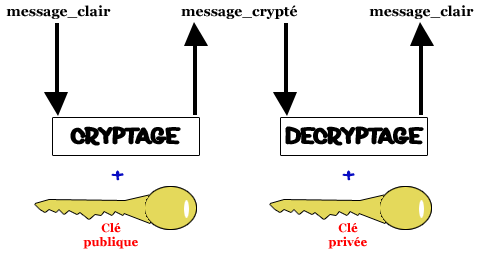

::: programme

+------------------------+-------------------------------------+----------------------------------------+
|        Contenus        |         Capacités attendues         |              Commentaires              |
+========================+=====================================+========================================+
| Sécurisation des       | Décrire les principes de            | Les protocoles symétriques et          |
| communications.        | chiffrement symétrique (clef        | asymétriques peuvent être              |
|                        | partagée) et asymétrique (avec      | illustrés en mode débranché,           |
|                        | clef privée/clef publique).         | éventuellement avec description        |
|                        |                                     | d’un chiffrement particulier.          |
|                        | Décrire l’échange d’une clef        |                                        |
|                        | symétrique en utilisant un          | La négociation de la méthode           |
|                        | protocole asymétrique pour          | chiffrement du protocole SSL           |
|                        | sécuriser une communication         | (Secure Sockets Layer) n’est pas       |
|                        | HTTPS.                              | abordée.                               |
+------------------------+-------------------------------------+----------------------------------------+

:::

&nbsp;

::: intro

<p><a href="https://commons.wikimedia.org/wiki/File:Internet2.jpg#/media/File:Internet2.jpg"></a><br>By Fabio Lanari - <a href="//commons.wikimedia.org/wiki/File:Internet1.jpg" title="File:Internet1.jpg">Internet1.jpg</a> by <a href="//commons.wikimedia.org/w/index.php?title=Rock1997aamp;action=editaamp;redlink=1" class="new" title="Rock1997 (page does not exist)">Rock1997</a> modified., <a href="https://creativecommons.org/licenses/by-sa/4.0" title="Creative Commons Attribution-Share Alike 4.0">CC BY-SA 4.0</a>, <a href="https://commons.wikimedia.org/w/index.php?curid=20995390">Link</a></p>

> Sécuriser l'échange de données est un aspect crucial lors de l'échange d'informations par exemple
> lors d'un paiement sur internet. Il existe deux principaux types de _chiffrement_ de données qui
permettent de rendre un message lisible uniquement par son destinataire:
> 
> - le chiffrement _symétrique_ à clé partagée,
> - le chiffrement _asymétrique_ avec une paire clé publique clé privée.

:::

## Cryptographie symétrique

> La cryptographie symétrique, également dite à clé secrète (par opposition à la cryptographie
> asymétrique), est la plus ancienne forme de chiffrement. Elle permet à la fois de chiffrer et de
> déchiffrer des messages à l'aide d'un même mot clé. On a des traces de son utilisation par les
> Égyptiens vers 2000 av. J.-C. 

*[Article Wikipédia sur la cryptographie symétrique](https://fr.wikipedia.org/wiki/Cryptographie_sym%C3%A9trique)*{.cite-source}

Cette technique repose sur l'utilisation d'une **clé unique** qui doit être connue par l'expéditeur et
le destinataire.

Il existe de nombreux chiffrements de ce type qui ont évolué en complexité au cours du temps.

### Le [chiffrement César](https://fr.wikipedia.org/wiki/Chiffrement_par_d%C3%A9calage)

On décale les lettres de $n$ rangs la clé est tout simplement $n$: le décalage.

Par exemple, César utilisait un décalage de 3 lettres:

<p><a href="https://commons.wikimedia.org/wiki/File:Caesar3.svg#/media/Fichier:Caesar3.svg"></a><br>Image par <a href="//commons.wikimedia.org/w/index.php?title=User:Cepheusaaction=editaredlink=1" class="new" title="User:Cepheus (page does not exist)">Cepheus</a> — <span class="int-own-work" lang="fr">Travail personnel</span>, Domaine public, <a href="https://commons.wikimedia.org/w/index.php?curid=1235339">Lien</a></p>

### [Chiffrement par substitution](https://fr.wikipedia.org/wiki/Chiffrement_par_substitution)

On remplace une lettre par une autre de l'alphabet, on a donc $26!\approx 4\times 10^{26}$ clés
possibles.

::: example

Avec la clé suivante:

```
ABCDEFGHIJKLMNOPQRSTUVWXYZ
AZERTYUIOPQSDFGHJKLMWXCVBN
```

le message SUBSTITUTION devient LWZLMOMWMOGF

:::

### [Chiffrement de Vigenère](https://fr.wikipedia.org/wiki/Chiffre_de_Vigen%C3%A8re) (XVIe siècle)

Cette méthode a été mise au point durant la renaissance pour contrer la cryptanalyse par la méthode
des fréquences de lettres qui permettait de "casser" les clés de cryptatge assez facilement.

On choisit une clé sous la forme d'un mot ou d'une phrase qui donne le décalage à appliquer qui
devient alors _variable_.

Supposons que la clé soit `ABC`, les décalages successifs seront 0, 1, 2, 0, 1, 2, 0...

::: example

Avec la clé `ABC`

Le message SUBSTITUTION devient: SVDSUKTVVIPP

```
SUBSTITUTION
ABCABCABCABC
------------
SVDSUKTVVIPP
```

:::


### [Chiffrement de Vernam](https://fr.wikipedia.org/wiki/Masque_jetable) (XXe siècle)

Il s'agit d'un système parfaitement sûr, le mathématicien C.Shannon a montré que si on respecte
bien les 3 règles de Vernam, ce système est inviolable.

- La clé doit être une suite de caractères au moins aussi longue que le message à chiffrer.
- Les caractères composant la clé doivent être choisis de façon totalement aléatoire.
- Chaque clé, ou « masque », ne doit être utilisée qu'une seule fois (d'où le nom de masque
  jetable).

Une méthode particulièrement efficace pour traiter le chiffrement et le déchiffrement de messages à
partir de la clé est d'utiliser la fonction logique `XOR`, le ou exclusif qui a une particularité
très intéressante dans notre cas.

On note $M$ le message et $S$ la clé secrète, `XOR` se note $\oplus$.

On obtient le message chiffré $C$ en faisant: $C = M \oplus S$.

Le déchiffrement se fait tout simplement en appliquant la même opération $C \oplus S = M$ car:

$$
(M \oplus S)\oplus S = M
$$

::: appli

Démontrer l'égalité à l'aide d'une table de vérité.

:::

## Cryptographie asymétrique

La cryptographie asymétrique permet de résoudre le problème de l'échange de la clé secrète.

Elle fut inventée par Whitfield Diffie et Martin Hellman en 1976, qui reçurent le prix Turing de
2015 pour cette découverte.

En cryptographie _asymétrique_ on a 2 clés:

- **la clé publique**: Celle-ci, tout le monde peut la posséder, il n'y a aucun risque, vous
pouvez la transmettre à n'importe qui. Elle sert à chiffrer le message.
- **la clé privée**: que seul le récepteur possède, en l'occurrence vous. Elle servira à déchiffrer le message chiffré
avec la clé publique. Pour clarifier mon charabia, une petite illustration :



*[Cours l'algorithme RSA sur OpenClassRoom](https://openclassrooms.com/fr/courses/477751-lalgorithme-rsa/477335-chiffrer-et-dechiffrer)*{.cite-source}

Pour que cela fonctionne, il faut que la paire clé publique/clé privée ait une propriété
particulière. 

Soit $F_P$ la fonction de chiffrement utilisée avec la clé publique, et $F_S$ la fonction relative
à la clé privée. Une relation particulière relie ces deux fonctions:

$$
m = F_S(F_P(m))
$$

Enfin pour que ce système fonctionne, il faut que:

- la fonction $F_P$ soit facile à calculer pour tout le monde,
- la fonction $F_S$ soit facile à calculer que pour le détenteur de la clé privée.

Un système qui satisfait ces deux critères est le système de chiffrement
[RSA](https://fr.wikipedia.org/wiki/Chiffrement_RSA) utilisé pour échanger des données
confidentielles sur Internet.

Cet algorithme fut inventé en 1977 par Ronald Rivest, Adi Shamir et Leonard Adleman breveté par le
MIT en 1983. Le brevet a expiré le 21 septembre 2000 ce qui permet de l'utiliser librement depuis.

### Principe original

<p><a href="https://commons.wikimedia.org/wiki/File:Diffie-Hellman-Schl%C3%BCsselaustausch.svg#/media/Fichier:Diffie-Hellman-Schlüsselaustausch.svg"></a><br>Par <a href="https://de.wikipedia.org/wiki/Benutzer:DaMutz" class="extiw" title="de:Benutzer:DaMutz">de:Benutzer:DaMutz</a> — <span class="int-own-work" lang="fr">Travail personnel</span>, <a href="https://creativecommons.org/licenses/by-sa/4.0" title="Creative Commons Attribution-Share Alike 4.0">CC BY-SA 4.0</a>, <a href="https://commons.wikimedia.org/w/index.php?curid=4265606">Lien</a></p>

1. Alice et Bob ont choisi un nombre premier $p$ et un nombre $g$ strictement plus petit que $p$ (ils
peuvent aussi, comme montré sur la figure, ne décider de ce choix qu'au moment de l'échange, et se
le communiquer en clair, ce qui n'améliore pas les chances d'Ève qui cherche à casser le code)

2. Alice choisit un nombre au hasard $a$, élève $g$ à la puissance $a$, et envoie à Bob le nombre
   $A = g^a [modulo\ p]$.
   
3. De même Bob choisit un nombre au hasard $b$, et fait de même; il transmet le nombre $B = g^b[modulo\ p]$ à Alice

4. En élevant le nombre $B$ reçu de Bob à la puissance $a$, obtient $g^{ba}[modulo\ p]$.

5. Bob fait le calcul analogue avec le nombre $A$ reçu d'Alice et obtient $^{gab}[modulo\ p]$, qui
   est le même résultat.
   
A la fin du protocole, Alice et Bob connaissent tous les deux le nombre $g^{ab}[modulo\ p]$ mais pas Ève
car elle ne peut pas calculer $g^{ab}[modulo\ p]$ facilement.

### Exemple

- Alice et Bob ont choisi un nombre premier $p$ et une base $g$. Dans notre exemple, $p=23$ et $g=5$
- Alice choisit un nombre secret $a=6$
- Elle envoie à Bob la valeur $A = g^a [modulo\ p] =  5^6 [23] = 8$
- Bob choisit à son tour un nombre secret $b=15$
- Bob envoie à Alice la valeur $B = g^b[modulo\ p] = 5^{15} [23] = 19$
- Alice peut maintenant calculer la clé secrète : $B^a [modulo\ p] = 19^6 [23] = 2$
- Bob fait de même et obtient la même clé qu'Alice : $A^b [modulo\ p] = 8^{15} [23] = 2$

*[Article Wikipédia](https://fr.wikipedia.org/wiki/%C3%89change_de_cl%C3%A9s_Diffie-Hellman#Exemple)*{.cite-source}

::: appli

- Créez une clé secrète sur ce principe avec votre voisin.
- Essayez de retrouver la clé à partir des informations échangées en clair: $g$, $p$, $A$ et $B$.

:::

## Cryptosystèmes hybrides

Bien que le système RSA à clé publique soit a priori _sûr_ et pratique puisqu'il n'est pas
nécessaire d'échanger la clé de chiffrement comme dans le cas du chiffrement symétrique. On utilise
en pratique plutôt un système hybride car le système à clé asymétrique est assez lourd à exécuter
et prend du temps.

Regardons par exemple le cas d'échange d'informations sécurisées grâce au protocole
[HTTPS](https://fr.wikipedia.org/wiki/HyperText_Transfer_Protocol_Secure#Principe_de_fonctionnement).

1. Le client — par exemple le navigateur Web — contacte un serveur — par exemple Wikipédia — et
   demande une connexion sécurisée.
2. Le serveur répond en produisant un certificat qui contient entre autres sa clé publique.
3. Cela permet au client d'envoyer de manière secrète une _clé symétrique_ qui sera utilisée à tous
   les échanges entre le serveur et le client de façon que tous les contenus de la communication
   — y compris l'adresse même du site web, l'URL — soient chiffrées.

<p><a href="https://commons.wikimedia.org/wiki/File:Public_key_shared_secret.svg#/media/File:Public_key_shared_secret.svg"></a><br>By <a href="//commons.wikimedia.org/wiki/User:Davidgothberg" title="User:Davidgothberg">Davidgothberg</a> - <span class="int-own-work" lang="en">Own work</span>, Public Domain, <a href="https://commons.wikimedia.org/w/index.php?curid=1028579">Link</a></p>

> Dans le schéma d'échange de clés Diffie-Hellman, chaque partie génère une paire de clés publique
> / privée et distribue la clé publique. Après avoir obtenu une copie authentique des clés
> publiques de chacun, Alice et Bob peuvent calculer une clé secrète partagée hors ligne. La clé
> secrète partagée peut être utilisée, comme clé pour un chiffrement symétrique.


::: ref

- [Algorithmes notions de base](https://www.dunod.com/sciences-techniques/algorithmes-notions-base)
- [Cours l'algorithme RSA sur OpenClassRoom](https://openclassrooms.com/fr/courses/477751-lalgorithme-rsa/477335-chiffrer-et-dechiffrer)
- [Informatique MP-PC-PT-PSI](https://editions.lavoisier.fr/etudes-superieures/informatique-mp-pc-pt-psi/preaux/tec-et-doc/le-tout-en-un/livre/9782743022976)
- [Article Wikipédia Échange de clés Diffie-Hellman](https://fr.wikipedia.org/wiki/%C3%89change_de_cl%C3%A9s_Diffie-Hellman)
:::