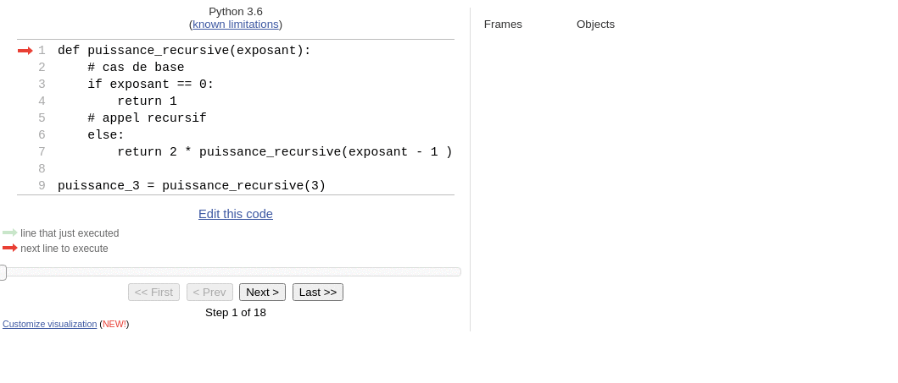

::: programme

+---------------------+----------------------------------+--------------------------------------+
|      Contenus       |       Capacités attendues        |             Commentaires             |
+=====================+==================================+======================================+
| Récursivité.        | Écrire un programme récursif.    | Des exemples relevant de             |
|                     |                                  | domaines variés sont à privilégier.  |
|                     | Analyser le fonctionnement d’un  |                                      |
|                     | programme récursif.              |                                      |
+---------------------+----------------------------------+--------------------------------------+

:::

> Dans ce chapitre, nous allons voir comment utiliser des fonctions _récursives_, des fonctions qui
s'appellent elles-mêmes. Ce type de fonction peut avantageusement remplacer la boucle pour écrire
des programmes courts et élégants. Ce type de construction est notamment utilisée en
**[programmation fonctionnelle](../5-paradigmes-de-programmation)**, un paradigme de programmation
centrée sur les fonctions.

## Définition et exemple

::: {.def terme="Fonction récursive"}

Une fonction récursive est une fonction qui s'appelle elle-même.
:::

Commençons par un exemple pour clarifier un peu les choses.

Vous voulez demander à un utilisateur une entrée par exemple son âge, et vous voulez vous
assurer que l'utilisateur vous donne bien une valeur entière positive.

On peut implémenter cela avec une boucle `while`.

```python
age = None
while not(age):
    age = int(input("Quel âge avez-vous?"))
    if age > 0:
        print("Merci pour votre réponse)
    else:
        print("L'age doit être un entier positif")
        age = None
        
```

Mais il est aussi tout à fait possible d'utiliser une fonction récursive comme ceci:

```python
def quel_age():
    """Demande à un utilisateur son âge
    
    et lui demande de façon récursive tant 
    qu'il n'a pas donné un entier supérieur à 0
    
    Returns
    -------
    int
    """
    age = int(input("Quel âge avez-vous?"))
    if age > 0:
        return age
    else:
        print("L'age doit être un entier positif")
        # on fait l'appel récursif en cas d'erreur
        quel_age()

age = quel_age() # appel de la fonction et assignation de la valeur retournée à la variable age
```

::: {.plus titre="Gestion des exceptions"}

Ce code ne traite que le problème du signe, si on voulait être complet il faudrait gérer les
problèmes de type(`str`, `float`...) avec les structures `try except`.

Vous pouvez l'implémenter en guise d'exercice.

:::

Comme vous le voyez cette fonction continuera de s'appeler _tant que_ nécessaire. On a donc bien
remplacé la boucle avec cette fonction.

## Comment définir une fonction récursive?

Pour écrire une fonction récursive il faut:
- Commencer par prévoir le _cas de base_ qui ne nécessite pas de rappel de la fonction.
- Traiter attentivement le _cas récursif_ du passage des valeurs renvoyées par l'appel précédent à
  l'appel suivant.

::: example

Nous allons utiliser l'exemple _classique_ de la fonction puissance qui retourne $2^n$.

Cette fonction peut-être définie par une fonction récursive car:

- $2^n = 2 * 2^{n-1}$
- Le cas de base étant: $2^0 = 1$

Voici donc la fonction récursive:

```python
def puissance_recursive(exposant):
    # cas de base
    if exposant == 0:
        return 1
    # appel recursif
    else:
        return 2 * puissance_recursive(exposant - 1 )

puissance_3 = puissance_recursive(3)
```

Pour bien comprendre la chaîne d'exécution de cette fonction on peut l'exécuter pas à pas sur [pythontutor](http://pythontutor.com/visualize.html#code=def%20puissance_recursive%28exposant%29%3A%0A%20%20%20%20%23%20cas%20de%20base%0A%20%20%20%20if%20exposant%20%3D%3D%200%3A%0A%20%20%20%20%20%20%20%20return%201%0A%20%20%20%20%23%20appel%20recursif%0A%20%20%20%20else%3A%0A%20%20%20%20%20%20%20%20return%202%20*%20puissance_recursive%28exposant%20-%201%20%29%0A%0Apuissance_3%20%3D%20puissance_recursive%283%29&cumulative=false&curInstr=0&heapPrimitives=nevernest&mode=display&origin=opt-frontend.js&py=3&rawInputLstJSON=%5B%5D&textReferences=false).



Nous pouvons démontrer la **correction**_(ou validité)_ de cet algorithme, pour cela nous allons
prouver par récurrence que $puissance recursive(n) = 2^n$.


- **Initialisation:** pour $exposant = 0$, `puissance_recursive(0)` vaut 1 qui est bien égal à
    $2^0$.
- **Conservation:** si $puissance recursive(n-1) = 2^{n-1}$ alors $puissance recursive(n) = 2
  \times puissance recursive(n-1) = 2\times2^{n-1}=2^n$.
- **Terminaison:** L'algorithme se termine car à chaque tour de boucle $n$ diminue de 1 et on fini
  par arriver au `return` du cas terminal lorsque $n=0$ **si on a fourni initialement un argument
  positif pour n.**

:::


::: ref

- [Informatique et sciences du numérique Spécialité ISN en terminale S - Avec des exercices
  corrigés et des idées de projets par Gilles
  Dowek](http://www.editions-eyrolles.com/Livre/9782212135435/)
- [Informatique pour tous en classes préparatoires aux grandes écoles de Benjamin
  Wack](http://www.editions-eyrolles.com/Livre/9782212137002/informatique-pour-tous-en-classes-preparatoires-aux-grandes-ecoles)

:::