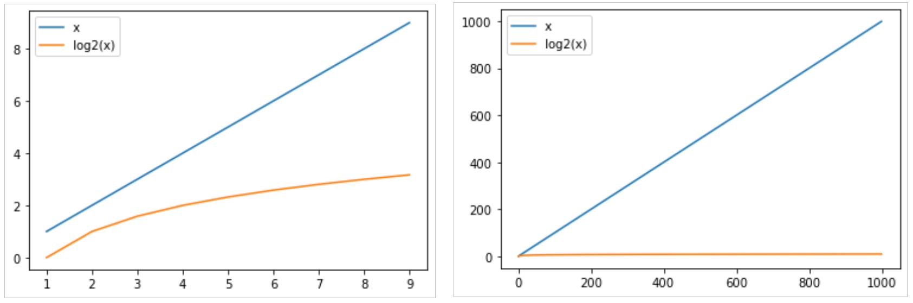

::: programme

Révisions de première.

:::

> Nous allons revoir quelques définitions importantes de première en s'appuyant sur les algorithmes
> classiques de recherche et de tris.

## Algorithme naïf de recherche: la recherche en table

Pour rechercher un élément dans une table on pourrait simplement parcourir tout simplement le
tableau jusqu'à rencontrer la valeur recherché. C'est ce que l'on appelle la [recherche en
table](/1g/nsi/8-algorithmique/1-parcours-sequentiel-dun-tableau/#la-recherche-en-table).

```python
def recherche(liste, élément):
    """Recherche d'un élément dans une liste
    
    Arguments
    ---------
    liste: liste d'entiers
    élément: entier
    
    Returns
    -------
    int: l'indice de l'élément si trouvé ou -1 sinon
    
    """
    i = 0
    while i < len(liste) and liste[i] != élément:
        i += 1
    if i < len(liste):
        return i
    else:
        return -1

# Quelques tests
assert recherche([1], 1) == 0
assert recherche([1,6,5], 5) == 2
assert recherche([1,6,5], 7) == -1
```

Même si cet algorithme simple semble faire le travail, il n'est en pratique pas du tout utiliser
car il n'est pas du tout efficace.

Pour mesurer l'efficacité d'un algorithme, on utilise la notion de **complexité**.

## Notion de complexité

Si je donne à mon programme une entrée de taille $N$, quel est l'ordre de grandeur, en fonction de
$N$, du nombre d'opérations qu'il va effectuer ?

::: {.def terme="Complexité"}

La complexité d'un algorithme est le nombre d'opérations élémentaires_(opération arithmétique,
comparaison, affectation...)_ effectuées pour obtenir un résultat.

:::

Si on prend l'exemple del'algorithme précédent, on se rend compte que cela dépend des cas.
Expliquez...

Pour pouvoir faire des comparaisons entre algorithmes, l'informaticien étudie souvent la
**complexité dans le pire des cas**.


::: {.appli titre="Complexité de la recherche linéaire"}

Regardons ce que cela donne dans le cas de notre recherche en table, le pire des cas correspond au
cas ou l'élément n'est pas dans le tableau.

Etudions chacune des étapes pour compter les opérations élémentaires effectuées.

```python
i = 0                                           # 1 opération
while i < len(liste) and liste[i] != élément:   # 2 opérations x N
    i += 1                                      # 1 opération  x N
if i < len(liste):                              # 1 opération
    return i                                    
else:
    return -1                                   # 1 opération
```

On obtient donc: $3N + 3$ opérations.
:::

Dans la pratique, on ne s'interresse pas au détail de la complexité, mais on utilise une **notation
asymptotique** dite _"grand O"_. Cette notation permet de comparer très simplement les algorithmes.

Les facteurs multiplicatifs et additifs sont négligés, on dit que notre algorithme a une complexité
grand O de n notée:

$$
O(N)
$$

On parle d'algorithme linéaire: son temps d'exécution croit linéairement avec la taille de l'entrée.


## Un algorithme efficace: la recherche dichotomique

Quand on cherche un mot dans le dictionnaire, on ne va pas le chercher en les lisant un par un, on
va utiliser la méthode de [recherche dichotomique vue en
première](/1g/nsi/8-algorithmique/4-recherche-dichotomique).

Cette méthode est possible dans le cas ou les données ont été au préalable trié, ce pour quoi il
existe également des [algorithmes](/1g/nsi/8-algorithmique/2-algorithmes-de-tri) efficaces.

<p>Cette image illustre la recherche de l'élément 4 dans tableau trié.</p>
<div><a title="By Tushe2000 (Template:LoStrangolatore) [Public domain], via Wikimedia Commons" href="https://commons.wikimedia.org/wiki/File:Binary_search_into_array.png"></a></div>
<h3 id="implémentation-en-python" style="position:relative;"><a href="#impl%C3%A9mentation-en-python" aria-label="implémentation en python permalink" class="anchor before"><svg aria-hidden="true" focusable="false" height="16" version="1.1" viewBox="0 0 16 16" width="16"><path fill-rule="evenodd" d="M4 9h1v1H4c-1.5 0-3-1.69-3-3.5S2.55 3 4 3h4c1.45 0 3 1.69 3 3.5 0 1.41-.91 2.72-2 3.25V8.59c.58-.45 1-1.27 1-2.09C10 5.22 8.98 4 8 4H4c-.98 0-2 1.22-2 2.5S3 9 4 9zm9-3h-1v1h1c1 0 2 1.22 2 2.5S13.98 12 13 12H9c-.98 0-2-1.22-2-2.5 0-.83.42-1.64 1-2.09V6.25c-1.09.53-2 1.84-2 3.25C6 11.31 7.55 13 9 13h4c1.45 0 3-1.69 3-3.5S14.5 6 13 6z"></path></svg></a>Implémentation en Python</h3>
<p>Voici un exemple d'implémentation en Python.</p>


Voici un exemple d'implémentation en Python:

```python
def recherche_dichotomique(liste, élément):
    # on initialise les indices début et fin aux extrémités de la liste
    début = 0
    fin = len(liste)
    
    while début <= fin:
        # On se place au milieu de la liste
        milieu = (début + fin) // 2 # il, s'agit d'une division entière
    
        if liste[milieu] == élément:
            print(élément, "trouvé à l'indice:", milieu , liste[milieu])
            return True
            # on arrête la boucle
            début = fin - 1
        elif liste[milieu] < élément:       
            début = milieu + 1
        else:
            fin = milieu - 1
    print(élément, "non trouvé")
    return False
```

Cet algorithme est beaucoup plus efficace, sa complexité (asymptotique dans le pire des cas) est
$O(log(N))$.

::: {.appli titre="Complexité de la recherche dichotomique"}

Calculer comme précédemment le nombre d'opérations élémentaires effectuées par cet algorithme dans
le pire des cas, et retrouver la complexité donnée.

```python
début = 0
fin = len(liste)
    
while début <= fin:
    # On se place au milieu de la liste
    milieu = (début + fin) // 2 
    
    if liste[milieu] == élément:

        return True
        # on arrête la boucle
        début = fin - 1
    elif liste[milieu] < élément:       
        début = milieu + 1
    else:
        fin = milieu - 1

return False
```
:::

Ceci fait une énorme différence notamment lorsque la taille des données augmente:



## Correction d'un algorithme

Pour rappel, un algorithme est une suite d'instructions permettant d'obtenir un résultat.

La **correction d'un algorithme** est une démonstration qui prouve que l'algorithme permet bien
d'obtenir le résultat souhaité.

Nous allons utiliser une méthode répandue semblable au _raisonnement par récurrence_ fondée sur la
recherche d'un **invariant de boucle**.

Pour prouver la correction nous devons montrer les trois points suivants:

1. **Initialisation:** L'invariant est vrai avant la première itération.
2. **Conservation:** si l'invariant est vrai avant une itération, il restera vrai après l'itération.
3. **Terminaison:** la boucle se termine et nous donne le résultat attendu.

Nous allons appliquer cette méthode aux algorithmes de tris vus en première. 

## Correction du tri par sélection

On rappelle le principe de l'algorithme.

> Sur un tableau de n éléments (numérotés de 0 à n), le principe du tri par sélection est le suivant :
>- rechercher le plus petit élément du tableau, et l'échanger avec l'élément d'indice 0 ;
>- rechercher le second plus petit élément du tableau, et l'échanger avec l'élément d'indice 1 ;
>- continuer de cette façon jusqu'à ce que le tableau soit entièrement trié.

En voici une implémentation en python.

```python
def tri_selection(t):
    n = len(t)
    for i in range(n-1):
        i_min = i
        for j in range(i+1, n):
            if t[j] < t[i_min]:
                i_min = j
        if i_min != i:
            # échanger t[i] et t[min]
            t[i], t[i_min] = t[i_min], t[i]
    return t
```

Voici les états successifs du tableau après chaque tour de boucle avec en entrée `[11, 25, 12, 22, 64]`:

```
[11, 25, 12, 22, 64]
[11, 12, 25, 22, 64]
[11, 12, 22, 25, 64]
[11, 12, 22, 25, 64]
```

On voit qu'avec un tableau à 5 valeurs, 4 tours de boucles (externe) suffisent à trier le tableau.

**Démonstration de la correction**

L'invariant de boucle consiste à montrer que si les $i$ premiers éléments du tableau sont triés
avant l'itération, alors les $i+1$ premiers éléments seront triés après une itération.

1. **Initialisation:** Au départ, $i = 0$, le sous-tableau trié de gauche ne contient aucun élément
   `[]`. Il est donc forcément trié.
2. **Conservation:** Lorsqu'on considère le tour de boucle $i$, le tableau est déjà trié pour les
   indices $0$ à $i-1$. Grâce à la boucle interne, on trouve le plus petit élément parmi les
   éléments d'indice $i$ à $n$ (tous plus grands que l'élément d'indice $i-1$), et on le place à
   l'indice $i$. Après le tour de boucle, le tableau sera donc trié pour les indices de $0$ à $i$.
3. **Terminaison:** la boucle se termine lorsqu'on arrive à l'avant dernier élément du tableau. Le
   tableau est trié pour les éléments d'indice $0$ à $n-2$, et le dernier élément d'indice $n-1$
   est forcément plus grand que l'élément d'indice $ $n-2$. Le tableau est donc entièrement trié.

::: {.appli titre="Étude du tri par insertion"}

La partie [exercice](./exo) propose une étude compléte de l'algorithme de tri par insertion vu
également en première.

> Dans l'algorithme, on parcourt le tableau à trier du début à la fin. Au moment où on considère le
> i-ème élément, les éléments qui le précèdent sont déjà triés. Pour faire l'analogie avec
> l'exemple du jeu de cartes, lorsqu'on est à la i-ème étape du parcours, le i-ème élément est la
> carte saisie, les éléments précédents sont la main triée et les éléments suivants correspondent
> aux cartes encore mélangées sur la table.

> L'objectif d'une étape est d'insérer le i-ème élément à sa place parmi ceux qui précèdent. Il
> faut pour cela trouver où l'élément doit être inséré en le comparant aux autres, puis décaler les
> éléments afin de pouvoir effectuer l'insertion. En pratique, ces deux actions sont fréquemment
> effectuées en une passe, qui consiste à faire « remonter » l'élément au fur et à mesure jusqu'à
> rencontrer un élément plus petit.

[Source Wikipedia](http://fr.wikipedia.org/wiki/Tri_par_insertion)

```python
def tri_insertion(t: list):
    n = len(t)
    for i in range(1, n):
        x = t[i]
        j = i
        while j > 0 and t[j-1] > x:
            t[j] = t[j-1]
            j = j - 1
        t[j] = x
    return t
```
:::


::: {.plus titre="Complexité des algorithmes de tri"}

Montrer que les deux algorithmes de tris précédents ont une complexité quadratique en $O(n^2)$.

:::