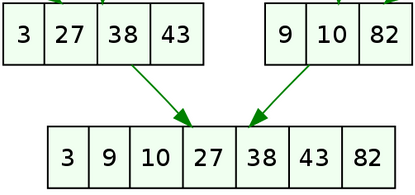

::: programme

+------------------------+-----------------------------------+------------------------------------+
|        Contenus        |        Capacités attendues        |            Commentaires            |
+========================+===================================+====================================+
| Méthode « diviser pour | Écrire un algorithme utilisant la | La rotation d’une image bitmap     |
| régner ».              | méthode « diviser pour régner ».  | d’un quart de tour avec un coût en |
|                        |                                   | mémoire constant est un bon        |
|                        |                                   | exemple.                           |
|                        |                                   |                                    |
|                        |                                   | L’exemple du tri fusion permet     |
|                        |                                   | également d’exploiter la           |
|                        |                                   | récursivité et d’exhiber un        |
|                        |                                   | algorithme de coût en n log 2 n    |
|                        |                                   | dans les pires des cas.            |
+------------------------+-----------------------------------+------------------------------------+

:::

::: intro clearfix

<p><a href="https://commons.wikimedia.org/wiki/File:Merge-sort-example-300px.gif#/media/Fichier:Merge-sort-example-300px.gif"></a><br>Par <a href="//commons.wikimedia.org/w/index.php?title=User:Swfung8&amp;action=edit&amp;redlink=1" class="new" title="User:Swfung8 (page does not exist)">Swfung8</a> — <span class="int-own-work" lang="fr">Travail personnel</span>, <a href="https://creativecommons.org/licenses/by-sa/3.0" title="Creative Commons Attribution-Share Alike 3.0">CC BY-SA 3.0</a>, <a href="https://commons.wikimedia.org/w/index.php?curid=14961648">Lien</a></p>

> Nous avons vu en première deux algorithmes de tris assez naturels, mais peu efficaces: le tri par
> insertion et le tri par sélection. Cette année, nous allons étudier un algorithme beaucoup plus
> efficace et très utilisé inventé par John Von Neumann en 1945: le tri par fusion. Cet algorithme
> nous permettra d'illustrer la méthode diviser pour régner que nous avions déjà vue lors de la
> recherche dichotomique.

:::
## Complexité des algorithmes de tri

En [première](../../..//1g/nsi/8-algorithmique/2-algorithmes-de-tri), nous avons vu deux algorithmes peu performants:

- le tri par sélection qui a une complexité _quadratique_ dans le pire des cas, le meilleur des cas
  et en moyenne.
- le tri par insertion qui a une complexité _linéaire_ dans le meilleur des cas, et _quadratique_
  dans le pire des cas et en moyenne.

Ces algorithmes ne sont pas utilisés en pratique car peu efficaces. En effet, il a été prouvé que
dans le pire des cas et en moyenne, on pouvait au mieux obtenir une complexité $O(n \log(n)$.

Cela fait une grande différence car $\log(n) \lll n$, en effet:

- $\log(n) = 10$ pour $n = 2^{10} = 1024$ 
- $\log(n) = 100$ pour $n = 2^{100} = 1267650600228229401496703205376$

On avait déjà rencontré ce type d'améliorations entre la recherche en table et la recherche
dichotomique qui utilisait le principe «Diviser pour régner».

## Le principe de diviser pour régner

Le principe de diviser pour régner consiste à ramener la résolution d'un problème sur N données à
la résolution d'un problème sur la moitié des données et poursuivre ce découpage jusqu'à ce que le
problème devienne évident(_par exemple trier un tableau d'une donnée_). Une fois que les solutions
des sous problèmes ont été trouvées, on les combine pour obtenir la solution du problème complet.

> - _Diviser_ : découper un problème initial en sous-problèmes ;
> - _Régner_ : résoudre les sous-problèmes (récursivement ou directement s'ils sont assez petits) ;
> - _Combiner_ : calculer une solution au problème initial à partir des solutions des sous-problèmes.

*[Article Wikipedia Diviser pour régner][wikipedia]*{.cite-source}

<p><a href="https://commons.wikimedia.org/wiki/File:Trois_%C3%A9tapes_illustr%C3%A9_avec_l%27algorithme_du_tri_fusion.svg#/media/Fichier:Trois_étapes_illustré_avec_l'algorithme_du_tri_fusion.svg"></a><br>Image par <a href="//commons.wikimedia.org/w/index.php?title=User:Fschwarzentruber&action=edit&redlink=1" class="new" title="User:Fschwarzentruber (page does not exist)">Fschwarzentruber</a> — <span class="int-own-work" lang="fr">Travail personnel</span>, <a href="https://creativecommons.org/licenses/by-sa/4.0" title="Creative Commons Attribution-Share Alike 4.0">CC BY-SA 4.0</a>, <a href="https://commons.wikimedia.org/w/index.php?curid=47869242">Lien</a></p>

## Le tri fusion

Le tri fusion s'appuie sur le fait que fusionner deux tableaux triés en un tableau trié se fait en
un temps linéaire $O(n)$.

::: example

Pour fusionner ces deux tableaux triés:



Il suffit d'une itération sur les deux listes en même temps donc $O(n)$ ici 5 itérations pour une
liste de 7 éléments:

1. On considère 3 et 9, on place 3, et on avance sur la 1ère liste.
2. On considère 27 et 9, on place 9, et on avance sur la 2e liste.
3. On considère 27 et 10, on place 10, ...
3. On considère 27 et 82, on place 27, ...
4. On considère 38 et 82, on place 38, ...
5. On considère 43 et 82, on place 43, et on voit qu'on est arrivé au bout de la première liste
On place maintenant tous les éléments restants de la deuxième liste.

:::

D'autres part, le découpage récursif d'un tableau jusqu'à arriver au cas terminal : tableau trié de
un élément est en $\log(n)$. Ce qui fait bien une complexité en $O n\log(n)$, on ne peut pas faire
mieux.

On va donc séparer notre algorithme en deux fonctions, une qui réalise la fusion et l'autre qui
réalise la récursion du tri(le découpage). Ces deux opérations sont symbolisées sur l'illustration
ci-dessous:

- rouge: division
- vert: fusion.

<p><a href="https://commons.wikimedia.org/wiki/File:Merge_sort_algorithm_diagram.svg#/media/File:Merge_sort_algorithm_diagram.svg"></a><br>By <a href="https://en.wikipedia.org/wiki/User:VineetKumar" class="extiw" title="wikipedia:User:VineetKumar">VineetKumar</a> at <a href="https://en.wikipedia.org/wiki/" class="extiw" title="wikipedia:">English Wikipedia</a> - Transferred from <span class="plainlinks"><a class="external text" href="https://en.wikipedia.org">en.wikipedia</a></span> to Commons by <a href="https://en.wikipedia.org/wiki/User:Eric_Bauman" class="extiw" title="en:User:Eric Bauman">Eric Bauman</a> using <a href="https://tools.wmflabs.org/commonshelper/" class="extiw" title="toollabs:commonshelper/">CommonsHelper</a>., Public Domain, <a href="https://commons.wikimedia.org/w/index.php?curid=8004317">Link</a></p>

### Algorithme de fusion

Voici l'algorithme de fusion de deux tableaux triés en un seul.

Tout d'abord en pseudo-code:

```
FUNCTION fusion(T1, T2)
    // T1 et T2 sont deux tableaux triés
    
    // Initialisation
    i1 <- 0   // indice du 1er tableau
    i2 <- 0   // indice du 2e tableau
    T <- []   // liste vide destinée à accueillir les éléments triés

    // Boucle
    TANT QUE l'on a pas atteint la fin d'un des tableaux
        SI T1[i1] <= T2[i2] ALORS
            Insérer T1[i1] à la fin de T
            incrémenter i1
        SINON
            Insérer T2[i2] à la fin de T
            incrémenter i2
        FIN SI
    FIN TANT QUE
    
    // Finalisation
    Insérer les éléments restants du tableau non vide à la fin de T
    
    RENVOYER T
```

Et voici une implémentation en python:

```python
def fusion (T1, T2):
    # Initialisation
    N1, N2 = len(T1), len(T2)
    i1 = 0
    i2 = 0
    T = []

    # Boucle
    while (i1 < N1) and (i2 < N2):
        x1, x2 = T1[i1], T2[i2]
        if x1 <= x2:
            T.append(x1)
            i1 += 1
        else:
            T.append(x2)
            i2 += 1

    # Finalisation
    if i1 < N1:
        T += T1[i1:]
    if i2 < N2:
        T += T2[i2:]
    return T
```
Un petit test dans la console `ipython` permet de vérifier sur un cas simple la fusion:

```
>>> fusion([3,6,8], [2,5,7,12])
[2, 3, 5, 6, 7, 8, 12]
```

### Algorithme de tri fusion

Voici l'algorithme récursif de tri fusion qui utilise la fonction `fusion` définie précédemment.

Tout d'abord en pseudo-code, on retrouve des techniques de découpage du tableau en deux avec des
divisions entières `//` vues dans la recherche dichotomique.

```
FONCTION tri_fusion (T)
    N <- Longueur de T

    // Cas terminal
    SI N == 1 ALORS
        RENVOYER T
    FIN SI

    // Recursion sur les deux demi-tableaux sinon
    T1 <- tri_fusion(T[0:N//2]
    T2 <- tri_fusion(T[N//2:N]

    // Renvoi des la fusion des deux tableaux
    RENVOYER fusion(T1, T2)

```

Et voici une implémentation en python:

```python
def tri_fusion (T):
    N = len(T)
    if N == 1:
        return T
    
    T1 = tri_fusion(T[:N//2])
    T2 = tri_fusion(T[N//2:])
    
    return fusion(T1, T2)
```

On fait un petit test sur une liste quelconque.

```
>>> tri_fusion([0, 25, 36, 41, 1, 465, 2, 3, 987])
[0, 1, 2, 3, 25, 36, 41, 465, 987]
```

### Conclusion 

Nous avons vu dans ce chapitre un algorithme particulièrement _élégant et efficace_ pour trier des
éléments. Bien sûr dans la pratique des contraintes de mémoire peuvent intervenir, et là au
contraire cet algorithme se révélera peu performant, car l'utilisation de la récursivité et de la
table $T$ intermédiaire le rend très gourmand en mémoire.

La méthode «diviser pour régner» est une méthode très efficace pour résoudre des problèmes complexes
en les _découpant en sous problèmes indépendants_. Par contre, on verra dans le prochain chapitre
qu'elle devient inefficace si les sous-problèmes se chevauchent, et il conviendra alors d'utiliser
une nouvelle technique appelée _« Programmation dynamique »_.

::: ref

- [Article Wikipedia Diviser pour régner][wikipedia]
- [Informatique MP-PC-PT-PSI](https://editions.lavoisier.fr/etudes-superieures/informatique-mp-pc-pt-psi/preaux/tec-et-doc/le-tout-en-un/livre/9782743022976)

[wikipedia]: https://fr.wikipedia.org/wiki/Diviser_pour_r%C3%A9gner_(informatique)

:::
